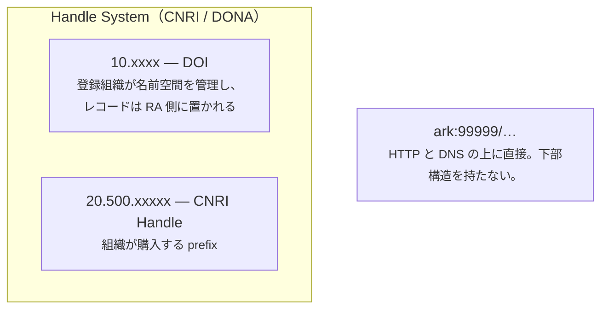

# ARK とは何か

ARK Alliance 自身の言葉では、**ARK（Archival Resource Key）識別子とは、情報への
長期的なアクセスを支える URL** である。発行するのは Name Assigning Authority として
登録した組織で、**作る権利に金はかからない**。

!!! info "このページは入口であって、仕様書ではない"
    体系そのもの、FAQ、shoulder の作法、発行組織の登録簿、現行のドラフトは
    すべて **<https://arks.org/>** にある。ここで短く書きすぎていると思ったら
    そちらを読むこと——以下はあくまで、**arkhe がなぜこの形なのか**を説明する
    ぶんだけである。

## ARK を構成するもの

```
     https://ark.example.ac.jp/ark:99999/x9abc1234/c3/s5.pdf
     \________________________/\__/\___/ \/\_____/\_/\_____/
                NMA           label NAAN    blade part variant
                                     shoulder

     https://ark.example.ac.jp/ark:99999/x9abc1234/c3/s5.pdf
                               \_________________/\________/
                                base compact name qualifiers
```

| | |
| --- | --- |
| **NMA** | Name Mapping Authority。**今日たまたま答えているリゾルバ**。ここだけが違う ARK は同じものを指す（identity inert）ので、組織やホストが変われば差し替えてよい |
| **label** | `ark:` から識別子本体が始まる。旧形式の `ark:/` も同じ意味で、**永久に認識しなければならない** |
| **NAAN** | 名前を割り当てた組織の番号。ARK Alliance に申請する。無料で、**二度と再登録されない** |
| **shoulder** | NAAN の内側の下位名前空間。部門や単位に委譲する |
| **blade** | 対象ごとに変わる部分。arkhe は乱数で採り、末尾に検査桁を置く |
| **part**（`/`） | その手前のものに**含まれる**ものを指す、と述べる |
| **variant**（`.`） | その手前のものの**変種**——形式・言語・版——を指す、と述べる |

shoulder と blade は錠前屋の言葉で、arks.org はこの比喩を文字列全体に通している。
NMA は鍵が入っていた**カバー**、`ark:99999` は手で持つ**弓（bow）**、shoulder と
blade が実際に働く部分である。**捨てられるのはカバーだけ。**

`/` と `.` があるおかげで、受け取った側は**文字列だけから構造を推測できる**。
`ark:99999/x9abc1234/c3/s5.pdf` を公開するということは、メタデータを引かなくても
「`s5.pdf` は `s5` の変種で、それは `x9abc1234` に含まれる」と述べたことになる。

**HTTP と DNS の上に直接建っている。** この一点が DOI や Handle との違いを生み、
以下のほとんどはそこから出てくる。

## ARK は DOI や Handle と横並びではない

ここが誤解されやすいので、はっきり書いておく。



**DOI は Handle の上に建っている。** `doi.org` は Handle のリゾルバであり、DOI は
Handle の `10.x` 名前空間の名前である。**ARK だけが別系統**で、購入したり加入したり
誰かに運用してもらったりする土台を、下に持たない。

## 効いてくる違いは 3 つ

**無償で、名前空間も無償。** NAAN は ARK Alliance から無償で交付される。支払う登録組織も、
維持する会員資格も無い。

**誰も代わりに永続性を保証しない。** DOI では登録組織が約束の一部だが、ARK では
**約束はあなたのもので、その中身も自分で述べる**。だからこそ**尋ねる手段**が用意されている。

```bash
curl "https://example.org/ark:99999/x9abc1234??"
```

```
erc:
who: 山田太郎
what: あるデータセット
when: 2026
where: ark:99999/x9abc1234
redirect: https://repo.example.ac.jp/records/1
policy: NP | NR, OP, CC | 2026 | https://example.org/policy
commitment-level: permanent-dynamic
```

何も名乗らない識別子より、**何を名乗っているかが言える識別子**のほうが価値がある。
ARK は、ロゴで匂わせるのではなく、**主張を明示して検証可能にする**。

**何でも、どの粒度でも指せる。** データセット、写本の 1 ページ、実物の標本、概念。
オンラインである必要も、**今も存在している必要もない**——対象が失われても、リゾルバは
記述を返せる（[FAIR A2](invariants.md)）。

**公開できない対象にも同じことが言える。** 到達できない理由が「失われた」ではなく
「閉じている」だけなら、識別子は先に配っておける——そして禁止期間が明けたときに
**行き先を付け替えるだけで公開になる**。閉じた識別子と公開の識別子を同じ形で持つ
組み方は[クローズド PID とオープン PID](../guides/federation.md#pid)にある。

## 設計の軸になっている約束

ARK は **NR（No Re-assignment、再割当てしない）** を宣言する。一度配った名前が、
別のものを指すようになることはない。

この 1 つの約束のために、arkhe は:

- ARK にも名前空間にも**削除を持たない**、
- `retired` にした shoulder を**元に戻さない**、
- 主キーの衝突を UPDATE に化けさせず**必ず失敗させる**、
- 統合・分割・離脱を跨いで**解決し続ける**。

それぞれを規律ではなくコードでどう守っているかは[壊さないもの](invariants.md)に書いた。

## もう 2 つの用語

文字列を構成するものは[上の表](#ark-を構成するもの)にある。この文書で何度も出てくる
のに、**文字列の一部ではない**語が 2 つある。

| | |
| --- | --- |
| **inflection** | `?` `??` `?info` の接尾。**対象へ行く**のではなく、**識別子について尋ねる**。仕様が必須としているのは `?info` |
| **suffix passthrough** | `…/x9abc1234/page/3` は `…/x9abc1234` のレコードで解決される。子に識別子を振らなくてよい——**1 レコード 1 採番**で足りる |

## この先を読む

- **<https://arks.org/>** — 体系、FAQ、shoulder の作法、発行組織の登録簿、
  NAAN の申請方法
- [The ARK Identifier Scheme](https://datatracker.ietf.org/doc/draft-kunze-ark/)
  — 現行のドラフト。arkhe はこれに合わせて書かれている
