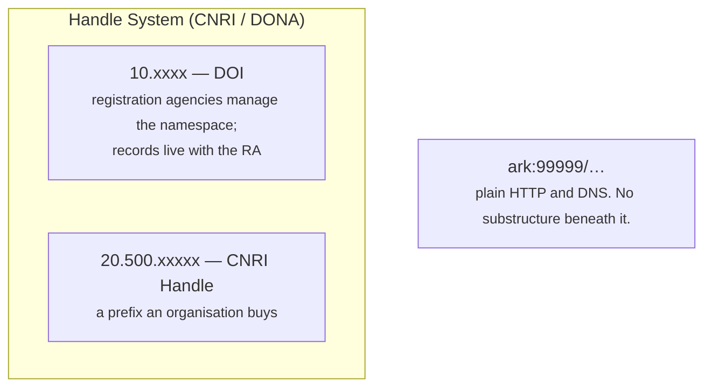

# What ARK is

In the ARK Alliance's own words, **Archival Resource Key (ARK) identifiers are URLs
that support long-term access to information**. They are issued by organisations that
register as Name Assigning Authorities, and **nobody pays for the right to create
them**.

!!! info "This page is an orientation, not the specification"
    The scheme itself, the FAQ, the shoulder conventions, the registry of assigning
    organisations and the current draft all live at **<https://arks.org/>**. Read it for
    anything this page states too briefly — everything below is only the part that
    explains why arkhe is shaped the way it is.

## The parts of an ARK

```
     https://ark.example.ac.jp/ark:99999/x9abc1234/c3/s5.pdf
     \________________________/\__/\___/ \/\_____/\_/\_____/
                NMA           label NAAN    blade part variant
                                     shoulder

     https://ark.example.ac.jp/ark:99999/x9abc1234/c3/s5.pdf
                               \_________________/\________/
                                base compact name qualifiers
```

| | |
| --- | --- |
| **NMA** | Name Mapping Authority — the resolver that happens to be answering today. **Identity inert**: ARKs that differ only here identify the same thing, so it can be replaced when an organisation or a host changes |
| **label** | `ark:` marks the start of the identifier proper. The older `ark:/` means the same thing and **must be recognised in perpetuity** |
| **NAAN** | The number of the organisation that assigned the name. Requested from the ARK Alliance, free, and **never re-registered** |
| **shoulder** | A sub-namespace inside a NAAN, delegated to a department or unit |
| **blade** | The part that varies per object. arkhe mints it at random, ending in a check digit |
| **part** (`/`) | Says this names something **contained in** what precedes it |
| **variant** (`.`) | Says this names a **variant form** — a format, a language, a version — of what precedes it |

The shoulder and blade come from locksmithing, and arks.org carries the metaphor
through the whole string: the NMA is the **cover** the key comes in, `ark:99999` is the
**bow** you hold, and the shoulder and blade are the parts that do the work. **Only the
cover is disposable.**

`/` and `.` are the reason a recipient can infer structure from the string alone.
Publishing `ark:99999/x9abc1234/c3/s5.pdf` says, without anyone having to fetch a
metadata record, that `s5.pdf` is a variant of `s5`, which is contained in `x9abc1234`.

It sits on plain HTTP and DNS. That single fact separates it from DOI and Handle, and
most of what follows comes from it.

## ARK is not a peer of DOI and Handle

This is the part people get wrong, so it is worth stating plainly.



**DOI is built on Handle.** `doi.org` is a Handle resolver, and a DOI is a name in
Handle's `10.x` namespace. **ARK alone is a separate lineage** — nothing sits beneath
it that has to be bought, joined or operated by someone else.

## The three differences that matter

**It is free, and the namespace is free.** A NAAN costs nothing and is granted by the
ARK Alliance. There is no registration agency to pay and no membership to maintain.

**Nobody guarantees persistence on your behalf.** With a DOI, the registration agency
is part of the promise. With an ARK, **the promise is yours and you say what it is**
— which is why the scheme has a way to *ask*:

```bash
curl "https://example.org/ark:99999/x9abc1234??"
```

```
erc:
who: 山田太郎
what: A dataset
when: 2026
where: ark:99999/x9abc1234
redirect: https://repo.example.ac.jp/records/1
policy: NP | NR, OP, CC | 2026 | https://example.org/policy
commitment-level: permanent-dynamic
```

An identifier that claims nothing is worth less than one that says exactly what it
claims. **ARK makes the claim explicit and checkable** rather than implied by a logo.

**It can name anything, at any granularity.** A dataset, a page of a manuscript, a
physical specimen, a concept. There is no requirement that the thing be online, or
even that it exist any more — the resolver can still return a description
([FAIR A2](invariants.md)).

**The same holds for things that cannot be published.** When the reason it is out of
reach is "closed" rather than "lost", the identifier can be handed out first — and when
the embargo lifts, **changing the target is all that publication takes**. Holding closed
and open identifiers in the same shape is covered in
[Closed PIDs and open PIDs](../guides/federation.md#pid).

## The promise the design turns on

ARK declares **NR — no re-assignment**. A name, once given out, never comes to mean
something else.

That one commitment is why arkhe:

- has **no delete** for an ARK or for a namespace,
- refuses to move a shoulder back out of `retired`,
- makes a primary key collision *fail* rather than quietly become an update,
- keeps resolving through mergers, splits and departures.

Read [Invariants](invariants.md) for how each of those is enforced in code rather
than left to discipline.

## Two more terms

The parts of the string are in [the table above](#the-parts-of-an-ark). Two words that
appear throughout this documentation are not parts of the string at all:

| | |
| --- | --- |
| **inflection** | A `?`, `??` or `?info` suffix that asks the resolver **about** the identifier instead of following it. `?info` is the one the specification requires |
| **suffix passthrough** | `…/x9abc1234/page/3` resolves through the record for `…/x9abc1234`, so children need no identifiers of their own — one record per minting is enough |

## Read on

- **<https://arks.org/>** — the scheme, the FAQ, shoulder conventions, the registry of
  assigning organisations, and how to request a NAAN
- [The ARK Identifier Scheme](https://datatracker.ietf.org/doc/draft-kunze-ark/) — the
  current draft, which is what arkhe is written against
