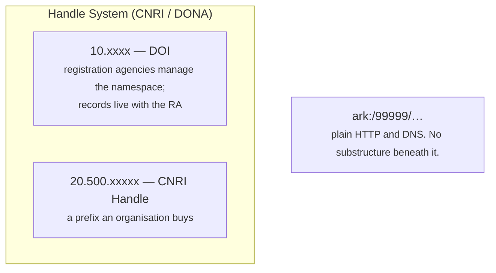

# What ARK is

An **ARK** (Archival Resource Key) is a persistent identifier that looks like this:

```
ark:/99999/x9abc1234
    └──┬─┘ └────┬───┘
     NAAN     name
```

It sits on plain HTTP and DNS. That single fact separates it from DOI and Handle, and
most of what follows comes from it.

## ARK is not a peer of DOI and Handle

This is the part people get wrong, so it is worth stating plainly.



**DOI is built on Handle.** `doi.org` is a Handle resolver, and a DOI is a name in
Handle's `10.x` namespace. **ARK alone is a separate lineage** — nothing sits beneath
it that has to be bought, joined or operated by someone else.

## The three differences that matter

**It is free, and the namespace is free.** A NAAN costs nothing and is granted by the
ARK Alliance. There is no registration agency to pay and no membership to maintain.

**Nobody guarantees persistence on your behalf.** With a DOI, the registration agency
is part of the promise. With an ARK, **the promise is yours and you say what it is**
— which is why the scheme has a way to *ask*:

```bash
curl "https://example.org/ark:/99999/x9abc1234??"
```

```
erc:
who: 山田太郎
what: A dataset
when: 2026
where: https://repo.example.ac.jp/records/1
policy: NP | NR, OP, CC | 2026 | https://example.org/policy
commitment-level: permanent-dynamic
```

An identifier that claims nothing is worth less than one that says exactly what it
claims. **ARK makes the claim explicit and checkable** rather than implied by a logo.

**It can name anything, at any granularity.** A dataset, a page of a manuscript, a
physical specimen, a concept. There is no requirement that the thing be online, or
even that it exist any more — the resolver can still return a description
([FAIR A2](invariants.md)).

## The promise the design turns on

ARK declares **NR — no re-assignment**. A name, once given out, never comes to mean
something else.

That one commitment is why arkhe:

- has **no delete** for an ARK or for a namespace,
- refuses to move a shoulder back out of `retired`,
- makes a primary key collision *fail* rather than quietly become an update,
- keeps resolving through mergers, splits and departures.

Read [Invariants](invariants.md) for how each of those is enforced in code rather
than left to discipline.

## Terms

| | |
| --- | --- |
| **NAAN** | Name Assigning Authority Number. The `99999` part. Granted to an organisation |
| **shoulder** | A sub-namespace within a NAAN, such as `/x9`. What gets delegated to an organisation |
| **blade** | What follows the shoulder — the part that identifies the object |
| **inflection** | A `?` or `??` suffix that asks the resolver about the identifier rather than following it |
| **suffix passthrough** | `…/x9abc/page/3` resolves through the record for `…/x9abc`, so children need no identifiers of their own |
| **NMA** | Name Mapping Authority — whoever answers when the identifier is resolved |
