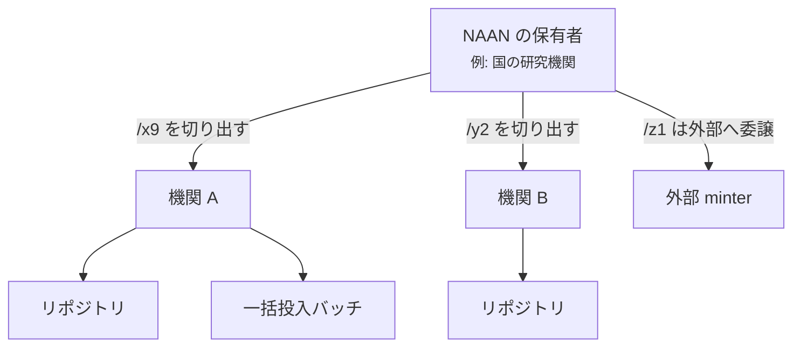
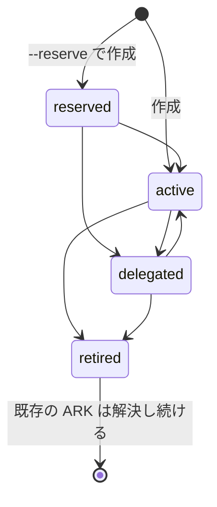

# 委譲の構造

ARK に、保証を配る中央の権威は無い。あるのは**受け渡される名前空間**で、受け取った側が
その都度、約束を引き受ける。arkhe の台帳は、その連鎖の記録である。

連鎖を降りていくものは 2 つあり、同じものではない。

- **名前空間** — どの名前を作ってよいか
- **約束** — 作ったものについて何を保つか

## 到達範囲

主体（ログインする人も、鍵を持つシステムも）は必ず**到達範囲**を持つ。これは
**登録の属性**であって、**リクエストやトークンでは広がらない**。

| | |
| --- | --- |
| `system` | 全 NAAN。名前空間を配る側の運用者 |
| `naan` | 1 つの NAAN の配下すべて。その NAAN を預かる組織 |
| `manager` | 1 機関ぶん。1 つの shoulder に固定することもできる |

**配られた側が、配った側より広く届くことはない。** NAAN 管理者はシステム管理者を
作れないし、機関管理者は他機関の主体を作れない。

!!! note "なぜ shoulder をリクエストで受け取らないか"
    arklet は `{naan, shoulder}` を本文で受けて NAAN 単位でしか認可しておらず、
    **設定ミスでも詐称でも他機関の名前空間に届いた**。arkhe は shoulder を
    **主体から引く**。これで越境が塞がり、同時に多数機関の振り分けも片づく。

## shoulder の状態

一度配った名前空間は取り戻せない。だから「押さえてあるが使わせない」「もう新規は
採らない」を、削除ではなく**状態**として持つ必要がある。

`retired` からは戻れない。引退した名前空間を再開すると、その間に外部が同じ名前を
使った可能性を否定できない。**他人が既に使った名前を配り直すこと**は、NR がまさに
禁じていることである。

`delegated` には行き先（minter）が要る。採番が外で行われるなら、採番要求には
**どこへ行けばよいか**を返さなければならない。arkhe は `307` に行き先を添えて返し、
**プロキシはしない**——代理で呼ぶと、応答が失われたときに「向こうでは採番されたが
こちらは知らない ARK」が生まれる。

## 機関は現れ、去る

- **承継** — 機関が別の機関に統合される。shoulder が移り、**ARK は何も変わらない**。
  変わるのは「今後誰が採番するか」だけ。
- **離脱** — 機関は存続するが、この基盤を離れる。**新規採番は止め、解決は永久に続ける。**
  転送先を機関自身のリゾルバへ向け直せば、以後こちらに作業を求めずに済む。

どちらも[承継と離脱](../guides/succession.md)で扱う。
