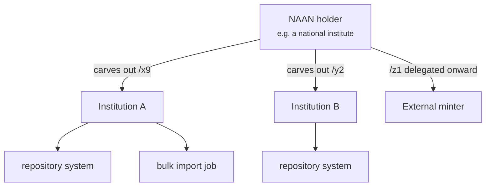
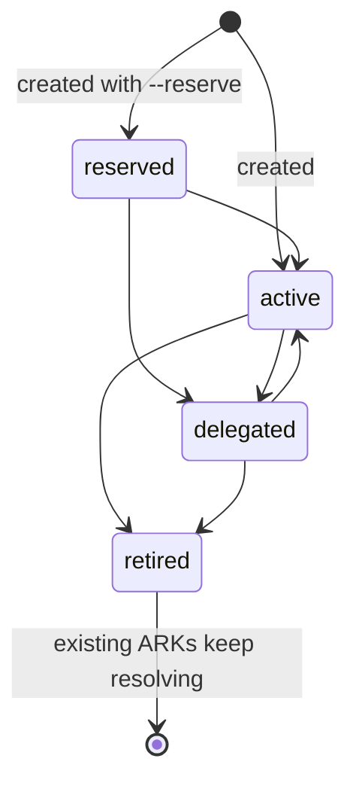

# Delegation

ARK has no central authority handing out guarantees. It has **namespaces handed
down**, and at each step the recipient takes on the promise. arkhe's ledger is a
record of that chain.

Two things travel down that chain, and they are not the same thing:

- **the namespace** — which names you may create, and
- **the commitment** — what you promise about what you created.

## Reach

Every principal — a person signing in, or a system holding a key — carries a
**reach**, and it is an attribute of the registration. **Nothing in a request or a
token can widen it.**

| | |
| --- | --- |
| `system` | Every NAAN. The operator of the registry — the side that hands namespaces out |
| `naan` | Everything under one NAAN. The organisation holding it |
| `manager` | One institution. Optionally pinned to a single shoulder |

**Nobody can grant more than they hold.** A NAAN administrator cannot create a system
administrator; an institution administrator cannot create a principal for another
institution.

!!! note "Why the shoulder is not in the request"
    arklet took `{naan, shoulder}` from the request body and authorised at NAAN level
    only, so a misconfiguration — or a lie — reached another institution's namespace.
    arkhe derives the shoulder **from the principal**, which closes that and handles
    routing among many institutions at the same time.

## Shoulder states

A namespace, once handed out, cannot be taken back. So "held but not usable" and "no
longer minting" have to be states rather than deletions.

`retired` has no way back. Reviving a retired namespace cannot rule out that
something outside used one of its names in the meantime — and re-issuing a name that
someone else already used is exactly what NR forbids.

`delegated` requires a minter to point at: if minting happens elsewhere, a request to
mint must be told **where to go**. arkhe answers `307` with the location and **does
not proxy** — proxying would mean that a lost response could leave an ARK minted over
there that nobody here knows about.

## Institutions come and go

- **Succession** — an institution merges into another. The shoulders move; the ARKs
  do not change at all. What changes is who mints next.
- **Departure** — an institution leaves but continues to exist. Minting stops;
  resolution continues forever, and the targets can be redirected to the
  institution's own resolver so that nothing further is asked of us.

Both are covered in [Succession and departure](../guides/succession.md).
