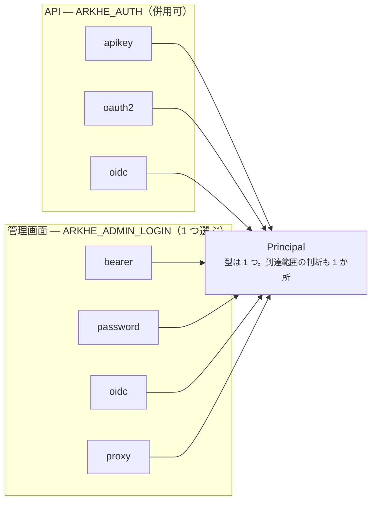

# 認証

ここには**別々の 2 つの仕組み**がある。混同が混乱の元になりやすい。



分かれている理由は **ブラウザが Authorization ヘッダを付けられない**こと。API 側の
問題は「このトークンをどう検証するか」、管理画面側の問題は「人をどうログインさせるか」
で、別物である。ただし**どの経路でも行き着く先は同じ `Principal`** で、到達範囲の
判断も 1 か所に集まる。

## API 側

| | 単体で成立 | 認可サーバが要る |
| --- | --- | --- |
| `apikey` | ○ | |
| `oauth2` | ○ | |
| `oidc` | | ○ |

**併用できる。** `ARKHE_AUTH=apikey,oidc` は移行期に普通に要る形で、組織ごとに好きな
時期に移れる（一斉切り替えを強いない）。

### apikey

Argon2 でハッシュした鍵を、**秘密ではない短い前置き**で 1 行に絞ってから照合する。
arklet の方式に 2 点だけ変更を加えている——前置きと、**鍵を NAAN ではなく主体に
結びつける**こと。arklet は NAAN 単位でしか認可できず、**同一 NAAN 内で他組織の
名前空間に採番できた**。

```bash
arkhe client add univ-repo 99999 --manager 1 --scopes "ark:mint"
arkhe client key univ-repo
```

### oauth2 — arkhe が自分で発行する

認可サーバを運用できない組織のための入口。**grant は client_credentials だけ**——
ARK の採番は機械同士のやりとりで、認可コードフローが解く「利用者が第三者アプリに
代理を許可する」構図が発生しない。

```bash
curl -X POST http://localhost:8000/oauth/token \
  -d grant_type=client_credentials -d client_id=univ-repo -d client_secret=…
```

意図的に持たないもの: `authorization_code` と PKCE、`refresh_token`、introspection、
revocation。**これらが要るようになったら、中途半端な認可サーバを育てるより、
本物に寄せるほうが安全。**

### oidc — 他所が発行したトークンを検証する

issuer の JWKS で署名を確かめ、`iss` / `aud` / `exp` を見て、**自分の台帳に突き合わせる**。
認可サーバが身元を保証しても、**配られていない名前空間に触ってよいことにはならない。**

主体は `azp` → `client_id` → `sub` の順で見る。`azp` を先にするのは、サービス
アカウントのトークンでは `sub` が UUID になり、読める名前は `azp` に入るため。

!!! tip "認可サーバがあるなら、こちらを選ぶ"
    RS256 で署名されるので **arkhe は公開鍵しか持たない**。鍵の入れ替えが全トークンの
    一斉失効にならず、失効は 1 か所で効き、監査も集まる。`oauth2` は HS256 の共有秘密で
    署名するので、単一サービスが自分のトークンを検証する用途なら十分だが、性質としては
    弱い。

## 管理画面側

| | |
| --- | --- |
| `bearer` | 既定。**ログイン画面を持たない**——ヘッダを付けられる相手専用 |
| `password` | arkhe が ID とパスワードを預かる。**IdP が無くても単体で建つ** |
| `oidc` | arkhe が **OIDC のクライアント**として認可コードフロー（PKCE つき）を回す |
| `proxy` | 前段の認証プロキシが立てたヘッダを信じる |

**クライアントになることと、認可サーバになることは別。** `oidc` で arkhe がやるのは、
人を認可サーバへ送り、戻ってきた JWT を確かめることだけ。トークンは発行せず、同意も
預からない。

セッションは**署名付き Cookie 1 枚**で、サーバ側に表を持たない（minter / resolver /
admin を別プロセスで動かす設計と噛み合わせるため）。Cookie に入るのは識別子と期限だけで、
**到達範囲は毎回台帳から引き直す**——鍵の失効や組織の統廃合が次のリクエストから効く。

## 人と機械

`person` の主体は API キーを持てない。`machine` の主体は外部ログインで名乗れない。

前段を正しく置けばなりすましは防げるが、**設定 1 つの誤りが「一括投入バッチとして
全件書き換え」に化ける**のは、放置してよい鋭さではない。
