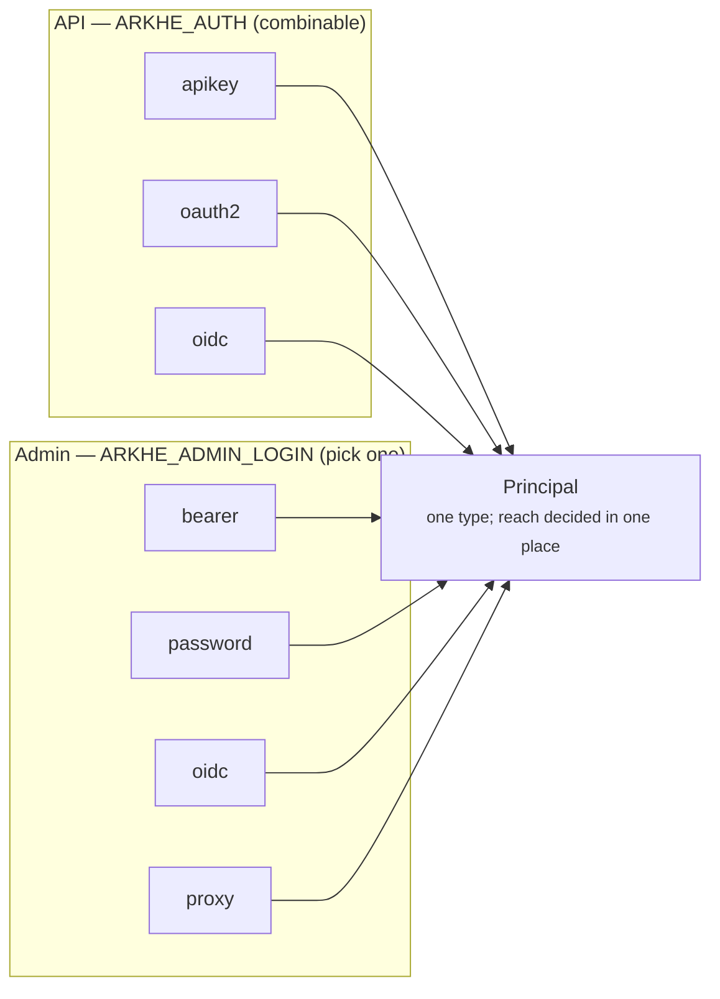

# Authentication

There are **two separate systems** here, and conflating them is the usual source of
confusion.



They differ because **a browser cannot set an Authorization header**. The API 側の問題 is
"how do I validate this token"; the admin problem is "how does a person sign in".
Whichever path, the result is the same `Principal`, and reach is judged in one place.

## For the API

| | Standalone | Needs an authorization server |
| --- | --- | --- |
| `apikey` | yes | |
| `oauth2` | yes | |
| `oidc` | | yes |

**They combine.** `ARKHE_AUTH=apikey,oidc` is a normal thing to want while migrating —
organisations move over one at a time instead of all at once.

### apikey

A key, hashed with Argon2, matched by a short non-secret prefix so a lookup does not
walk every row. This is arklet's approach, with two changes: the prefix, and binding
the key to a **client** rather than to a NAAN — arklet could only authorise at NAAN
level, so one organisation could mint into another's namespace.

```bash
arkhe client add univ-repo 99999 --manager 1 --scopes "ark:mint"
arkhe client key univ-repo
```

### oauth2 — arkhe issues its own

For an organisation that cannot run an authorization server. **Client credentials is
the only grant**: ARK minting is machine-to-machine, so the situation the
authorization code flow solves — a user letting a third-party app act for them —
never arises.

```bash
curl -X POST http://localhost:8000/oauth/token \
  -d grant_type=client_credentials -d client_id=univ-repo -d client_secret=…
```

Deliberately absent: `authorization_code` and PKCE, `refresh_token`, introspection,
revocation. **If you come to need them, moving to a real authorization server is safer
than growing half of one here.**

### oidc — validate someone else's tokens

arkhe verifies the signature against the issuer's JWKS, checks `iss`, `aud` and `exp`,
then **looks the subject up in its own ledger**. An identity the authorization server
vouches for is still not permitted to touch a namespace it was never granted.

The subject is taken from `azp`, then `client_id`, then `sub` — `azp` first because a
service-account token puts a UUID in `sub` and the readable client name in `azp`.

!!! tip "Prefer this where an authorization server exists"
    Tokens signed with RS256 mean arkhe holds only a public key, keys rotate without
    invalidating everything at once, revocation is in one place, and the audit trail
    is unified. `oauth2` mode signs with a shared HS256 secret, which is fine for one
    service verifying its own tokens but is a weaker property.

## For the admin interface

| | |
| --- | --- |
| `bearer` | Default. **No login screen** — for callers that can set a header |
| `password` | arkhe holds an ID and password. **Stands alone with no IdP** |
| `oidc` | arkhe acts as an **OIDC client** and runs the authorization code flow with PKCE |
| `proxy` | Trusts a header from an authenticating proxy in front |

**Being a client is not being an authorization server.** In `oidc` mode arkhe sends a
person to the authorization server and checks the JWT that comes back. It issues no
tokens and holds no consent.

The session is a single signed cookie — no server-side table, so minter, resolver and
admin can run as separate processes without a shared store. The cookie carries an
identifier and an expiry; **reach is read from the ledger on every request**, so a
revoked key or a merged organisation takes effect immediately.

## People and machines

A `person` subject cannot hold an API key. A `machine` subject cannot be named through
an external login.

A correctly placed proxy would prevent impersonation anyway, but **one
misconfiguration turning into "act as the bulk-import client and rewrite everything"**
is too sharp an edge to leave in place.
