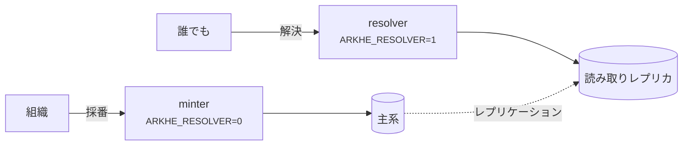
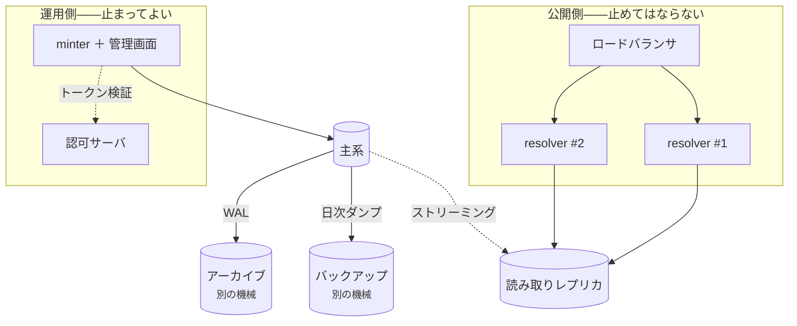

# デプロイ

## 2 つの役割



**別プロセスで動かす。** minter に解決の口は無く、resolver に採番の口も無いので、
解決だけを独立にスケールでき、読み取り専用ロールに向けられる。

この非対称は意図的である——**解決は止めてはならない。採番は止めてよい。**
認可サーバが落ちれば新しいトークンは出ず採番は止まるが、解決は影響を受けない
（そもそも認証を要さない）。

## 本番に出す前に

- [ ] `ARKHE_TOKEN_SECRET` と `ARKHE_SESSION_SECRET` を生成した（32 バイト以上、
      例のままではない）
- [ ] `ARKHE_SESSION_SECURE=true`、HTTPS で出している
- [ ] マイグレーションを **PostgreSQL で検証した**（SQLite は通してしまう）
- [ ] `ARKHE_ADMIN_LOGIN` を決めた。`proxy` なら**直接届く経路を塞いだ**
- [ ] 各 NAAN に `na_policy` を設定した——**永続性宣言はあなたの約束**であり、
      `??` で公開される
- [ ] **台帳のバックアップ。** 失うと**全識別子が壊れる**。NR の下では作り直せない
- [ ] `arkhe check` が通る

## コンテナ

イメージはリポジトリ直下。`compose/oidc` は Keycloak と PostgreSQL を含む実例。
**手本ではなく見本**として扱うこと——秘密値が平文で書いてあり、Keycloak は dev モード。

## 規模の見積もり

**以下はある 1 台での実測であって、保証値ではない。** 読むべきは**何が何に比例するか**
という形のほうで、数字は `scripts/bench.py` と下の SQL で自分の環境で取り直すこと。

測定環境: aarch64 20 コア、PostgreSQL 17（コンテナに CPU 4・メモリ 4 GB、
`shared_buffers=1GB`）、**台帳 100 万件（328 MB）**、uvicorn、負荷は同一ホストから。

### 解決——実際に届く負荷

| | 同時数 | rps | p50 | p95 | p99 |
| --- | --- | --- | --- | --- | --- |
| `302` で対象へ（1 worker） | 1 | 285 | 3.4 ms | 4.7 | 5.2 |
| `302` で対象へ（1 worker） | 8 | 372 | 19.8 ms | 34.8 | 53.5 |
| **`302` で対象へ（4 worker）** | 8 | **993** | 5.7 ms | 9.6 | 15.2 |
| `302` で対象へ（4 worker） | 32 | 1,078 | 18.3 ms | 37.1 | 56.8 |
| `?json` / `?info`（1 worker） | 8 | 304 | 24 ms | 41 | 60〜66 |
| suffix passthrough（1 worker） | 8 | 291 | 25 ms | 42 | 62 |
| 未知 NAAN の取次（1 worker） | 8 | 323 | 23 ms | 40 | 63 |

**処理量は worker 数に比例する**——1 から 4 で 2.9 倍。resolver は状態を持たず読み取り
しかしないので、**worker を増やす、次に resolver を増やす**が第一手と第二手になる。

**台帳の大きさはここに出てこない。** 解決は主キーの索引 1 回（0.03 ms、4 バッファ）で、
suffix passthrough は祖先を 1 回の `IN` でまとめて引くので 1 回増えるだけ。
**100 万件も 1000 件も同じ速さ**である。

比較のため `/healthz`（DB も認証も通らない）は 1 worker で 1,187 rps・p50 0.78 ms。
**残りの約 2.6 ms がアプリと DB の仕事**で、うち DB 層（セッションを開き、1 回引き、
閉じる）が 0.6 ms。

### 採番——一括が 20 倍速い理由

| | rps | p50 |
| --- | --- | --- |
| `POST /api/mint`（1 件ずつ） | **45** | 82 ms |
| `POST /api/mint/bulk`（1000 件を 1 要求） | **約 930 件/秒** | 1.06 秒 |

**1 件ずつが遅いのは DB ではなく Argon2 である。** API キーの検証 1 回が **53 ms** で、
82 ms のほとんどを占める。この遅さは意図されたもので、**盗んだ鍵の総当たりを高く
つかせる**ためにある。速くしてはいけない。

だから**規模のある投入では一括採番しか正気の選択肢が無い**——認証 1 回を 1000 件で
割る。1 万件なら、一括で 11 秒、1 件ずつで 4 分である。

`oauth2` も同じで、トークンの発行は `client_secret` を Argon2 で照合する。
**`expires_in` が尽きるまで保ち回す**こと（API 1 回ごとに取り直さない）。

### メモリ

arkhe のプロセスは役割によらず **常駐 100 MB 程度**。PostgreSQL は 100 万件・
`shared_buffers=1GB` で 486 MB を使っていた。

### 最小構成と、その先

**CPU とメモリの数字ではなく、構成の形で答えるのが正直なところである。**

**最小**——小さなホスト 1 台に minter・resolver・PostgreSQL を同居させる。**動く**が、
冗長性は無い。評価用と、まだ外に答えていない台帳ならこれで足りる。

**推奨**——コードが最初から前提にしている分け方。

- **resolver を複数 worker・複数ホストで。** 状態を持たない読み取り専用で、
  **minter や認可サーバが落ちても答え続けなければならない**のはこちら
- **minter は別に。** 採番は止まってよいが、解決は止められない
- **PostgreSQL はレプリカを持ち**、resolver は `ARKHE_READ_DATABASE_URL` でそちらへ
- DB は**主キーの索引がメモリに載る**ように——100 万件で 39 MB。ほかは順に読むので
  そこまで効かない

### 推奨構成の全体像



**非対称が要点である。** 上の段は誰でも叩け、認証を要さず、書き込みもしない。
下の段は認証を要し、書き、止まってよい。

### 落ちたとき何が続くか

**実際に確かめた**（読み取り専用ロールに向けた resolver で全経路を叩いた）。

| 落ちたもの | 解決 | 採番・管理 |
| --- | --- | --- |
| minter | **続く** | 止まる |
| 認可サーバ（OIDC） | **続く**——解決は認証を要さない | 止まる（新しいトークンが出ない） |
| 主系 DB | **続く**（レプリカで） | 止まる |
| 読み取りレプリカ | 主系に向け直せば続く | 続く |
| グローバルリゾルバ（n2t） | **続く**——未知 NAAN には `302` を返すだけで、**取りに行かない** | 続く |
| resolver 全部 | 止まる | 続く |

**resolver は認証の設定を一切持たずに起動する**（`ARKHE_AUTH` も `ARKHE_OIDC_ISSUER`
も不要）。管理画面も採番の口も**載っていない**——どちらも `404` になる。だから
**認可サーバと同じ障害で倒れない**し、攻撃面も小さい。

**書き込みを一切しないことも確かめた。** 保留の期限切れは解決のたびに時計で
判定するので、**戻すための書き込みが無い**（`SELECT` 権限だけのロールで
`?` `??` `?info` `?json`・検査桁・取次・`/.well-known/ark`・`/healthz` `/readyz` が
すべて通る）。レプリカに向けられるのは、この性質があるからである。

### 何台要るか

[測った値](#解決実際に届く負荷)から逆算する。

| | 目安 |
| --- | --- |
| resolver 1 プロセス（4 worker） | **約 1,000 rps**＝ 1 日 8,600 万回 |
| resolver 1 worker | 約 300 rps |
| minter（1 件ずつ） | 約 45 rps——**うち 53 ms は Argon2**。速くしてはいけない |
| minter（1 要求 1000 件） | 約 930 件/秒 |

**機関リポジトリの実際の解決数は、この桁に遠く届かない。** resolver を 2 台に
するのは負荷のためではなく、**1 台落ちても解決が続くため**である。台数は rps で
はなく**冗長性で決める**。

採番が重いなら、まず**一括採番に寄せる**（20 倍速い）。**1 件ずつが遅いのは DB
ではなく、要求ごとの Argon2 の照合である。**

### 置き場を分ける

- **WAL のアーカイブと日次ダンプは、DB と別の機械に置く。** 同じ機械にあるものは
  同じ事故で消える（[バックアップ](#バックアップ)）
- **resolver は状態を持たない。** 焼き直して入れ替えてよい
- **管理画面を外に出さないなら `ARKHE_ADMIN_LOGIN=bearer`**——ログイン画面ごと
  無くなる

### 自分の環境で測る

```bash
# 1 つの口へ 3000 要求、同時 8
python scripts/bench.py http://127.0.0.1:8000/ark:99999/x9tn1qkq2g7 -n 3000 -c 8

# 積み上げの上限: DB も認証も通らない口。
# ほかの数字がこれに近づいていたら、**測っているのはクライアント**である
python scripts/bench.py http://127.0.0.1:8000/healthz -n 3000 -c 8

# 採番（Argon2 の代金は要求ごとに掛かる）
python scripts/bench.py http://127.0.0.1:8000/api/mint -n 200 -c 4 --post --auth "$KEY"
```

バイト数の見積もりと、自分の台帳で測る方法は
[データモデル](../reference/data-model.md#容量について)にある。


## バックアップ

ここで取り返しがつかないのは台帳だけである。失った ARK は採り直せない——NR の下では
**同じ名前を配り直すことこそが禁じられている**——ので、1 行の消失が識別子の恒久的な
破損になる。

resolver は読み取りレプリカに向け、読み負荷が主系を脅かさないようにする。

### 毎日と毎月

**`pg_dump` のカスタム形式**（`-Fc`）で採る。圧縮され、`pg_restore` で表を選んで
戻せる。

```bash
# 日次。**別の機械に置く**——同じ機械の中にあるものは、同じ事故で消える。
pg_dump -Fc -d "$ARKHE_DATABASE_URL" -f "arkhe-$(date +%Y%m%d).dump"
```

保持は**日次 14 日・月次 12 か月**を出発点にする。月次は毎月 1 日の日次をそのまま
残せばよく、別に採る必要は無い。**台帳は増える一方**（ARK は消えない）なので、
置き場は線形に伸びると見ておく——1 億件で約 40 GB が上限の目安である
（[データモデル](../reference/data-model.md#容量について)）。

```cron
# 毎日 03:15。失敗を黙らせない——出力を捨てると、止まったことに気づけない。
15 3 * * *  pg_dump -Fc -d "$ARKHE_DATABASE_URL" -f /backup/arkhe-$(date +\%Y\%m\%d).dump
20 3 1 * *  cp /backup/arkhe-$(date +\%Y\%m01).dump /backup/monthly/
30 3 * * *  find /backup -name 'arkhe-*.dump' -mtime +14 -delete
```

### 日次の夜間バックアップでは足りない

**1 日 1 回では、最大 24 時間ぶんの識別子が消える。** ほかの多くの系ではそれは
「取り込み直せばよい」で済むが、**この体系では済まない**——消えた ARK を採り直すと、
`NR` を破ったのと外からは見分けがつかない。**配った名前は、こちらの都合とは無関係に
既に外に在る。**

だから、この台帳では**継続的アーカイブ（PITR）を贅沢と見なさない**:

```bash
# postgresql.conf
wal_level = replica
archive_mode = on
archive_command = 'test ! -f /archive/%f && cp %p /archive/%f'
```

基礎バックアップ（`pg_basebackup`）＋ WAL の連続保存で、**任意の時点まで戻せる**。
日次のダンプは、その上での**最後の砦**として残す（PITR は連鎖が切れると戻れない
——ダンプは 1 個で完結する）。

```bash
pg_basebackup -D /backup/base -Fp -Xstream -c fast     # 基礎バックアップ
```

戻すときは、基礎バックアップを置き直して**再生の指示を書き、`recovery.signal` を
置いて起動する**:

```bash
cp -a /backup/base /var/lib/postgresql/data
cat >> /var/lib/postgresql/data/postgresql.conf <<'CONF'
restore_command = 'cp /archive/%f %p'
recovery_target_action = 'promote'
CONF
touch /var/lib/postgresql/data/recovery.signal
pg_ctl -D /var/lib/postgresql/data start
```

**時点を指定しないのが既定である。** 何も書かなければ WAL の終わりまで再生する
——つまり**失う識別子が最も少ない**。時点を選ぶ `recovery_target_time` は、
**特定の誤った操作を取り消すときにだけ**使う。

### 時点を戻すと、識別子が台帳から消える

**ここが、この体系に固有の危険である。** `recovery_target_time` を過去に置くと、
その時点より後に採番した ARK は台帳から消える。**だが、それらは既に外に出ている。**

実際に通した結果（下記のリハーサル）で分かったのは、**台帳が「何を失ったか」を
知らない**ことである:

| | 戻した後 |
| --- | --- |
| `ark` の行 | 無い |
| `mint_receipt`（採番の控え） | **一緒に消える** |
| `ark_change`（行き先の履歴） | **一緒に消える** |
| `audit_event` | **一緒に消える** |
| `withdrawn_name`（二度と採らない台帳） | **入らない** |

つまり、**配った名前が永久に `404` になり、しかもその名前は「使われたことがない」
扱いに戻る**。`NR` を守る仕掛け（`ark` に在るか、`withdrawn_name` に在るか）の
どちらにも載っていないからである。tombstone も出せない——出す対象が台帳に無い。

だから:

- **既定は「WAL の終わりまで」。** 時点を選ぶのは、取り消したい操作があるときだけ
- **時点を戻したなら、その間に何を配ったかは台帳の外から突き合わせる。**
  呼び出し側の記録（リポジトリの登録履歴）か、前段のアクセスログにしか残っていない
- 突き合わせた名前は、**採り直すのではなく取り込む**（`POST /api/import`）
  ——同じ名前を同じ対象に戻すのは `NR` 違反ではない。**採り直しは違反である**

### 復元の手順

**戻せることは、戻して初めて分かる。** 手順は次のとおりで、**実測で通してある**
（PostgreSQL 17、`pg_dump -Fc` → `pg_restore`）。

```bash
createdb arkhe                                   # 空の入れ物を作る
pg_restore -d arkhe --no-owner --no-privileges arkhe-YYYYMMDD.dump
```

`--no-owner --no-privileges` を付けるのは、**戻す先の役割名が元と違うのが普通**
だから。付けないと所有者の付け替えで止まる。

### 復元できたことを、どう確かめるか

**件数が合うことは、確かめたことにならない。** 件数が同じでも行き先が入れ替わって
いれば、識別子は全部壊れている。見るのは **4 つ**:

```bash
# 1. 版が揃っている（古い版に戻したら upgrade する）
psql -d arkhe -tAc "SELECT version_num FROM alembic_version"
uv run alembic check

# 2. **ARK と行き先と公開状態の指紋。** ここが一致すれば、identifier は無傷である
psql -d arkhe -tAc "SELECT md5(string_agg(ark||'|'||url||'|'||
  coalesce(published_at::text,'-'), ',' ORDER BY ark)) FROM ark"

# 3. **実際に解決する。** resolver 役で起動して引く
#    （既定の起動は minter で、**解決の口を持たない**——ここで 404 を見て
#     「復元に失敗した」と誤解しないこと）
ARKHE_RESOLVER=1 uvicorn arkhe.app:app  # 別の端末で curl -sI localhost:8000/ark:/…

# 4. **書けること。** 連番が戻っていないと、次の採番で主キーが衝突する
arkhe stat && psql -d arkhe -tAc "SELECT last_value FROM shoulder_id_seq"
```

**2 と 4 が本体である。** 1 と 3 は落ちれば分かるが、**指紋のずれと連番のずれは、
黙って通る**——気づくのは、識別子が別のものを指した後になる。

## プロキシの後ろに置くとき

前段が生のリクエスト URI を渡せるなら `ARKHE_RAW_URI_HEADER` を設定する。無いと
裸の `?`（簡潔な記述の inflection）が、クエリ文字列なしと区別できない。これは
**プロトコルの制約**であって実装の都合ではない。

## 依存の固定

`uv.lock` に**実際に入れた版をそのまま記録**してある。`pyproject.toml` の宣言は
下限しか書いていないので、これが無いと**同じコミットから別のものができる**
——同じ Dockerfile で焼き直すたびにイメージの中身が変わり、「いつから壊れたか」が
追えなくなる。

```bash
uv sync --frozen --extra app --extra dev   # lock どおりに入れる
uv lock                                    # 更新する（意図したときだけ）
```

`--frozen` は**lock と `pyproject.toml` がずれていたらそこで落とす**。ずれたまま
緑になるほうが困るので、検査（`scripts/check.sh`）もイメージのビルドもこれを使う。

**上限（`<`）は書かない。** lock があれば要らないし、上限はライブラリとして
使われるときに他と共存しにくくする。「どの範囲なら動くか」を宣言が、「今どれで
動かしているか」を lock が持つ——答える問いが違うので、両方要る。

更新は Dependabot が毎週まとめて出す。**固定は「新しいものを見なくてよい」という
意味ではない**——放っておくと、直っている脆弱性を抱えたまま動き続けることになる。

## 複数の arkhe で分担する

拠点ごと・名前空間ごとに arkhe を分けるなら、守る規則が運用の側に移る（**同じ
shoulder を 2 か所が採番しない**、**権威を持つ台帳は NAAN あたり 1 つ**）。
構成の選び方と落とし穴は[分散して運用する](federation.md)にまとめてある。
