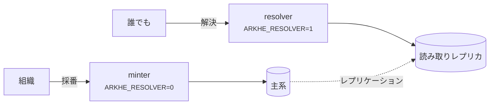
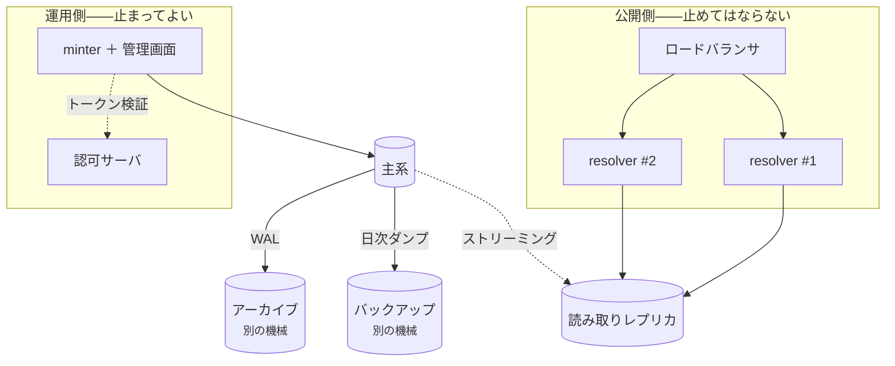

# デプロイ

## 2 つの役割



**別プロセスで動かす。** minter に解決の口は無く、resolver に採番の口も無いので、
解決だけを独立にスケールでき、読み取り専用ロールに向けられる。

この非対称は意図的である——**解決は止めてはならない。採番は止めてよい。**
認可サーバが落ちれば新しいトークンは出ず採番は止まるが、解決は影響を受けない
（そもそも認証を要さない）。

## 本番に出す前に

- [ ] `ARKHE_TOKEN_SECRET` と `ARKHE_SESSION_SECRET` を生成した（32 バイト以上、
      例のままではない）
- [ ] `ARKHE_SESSION_SECURE=true`、HTTPS で出している
- [ ] マイグレーションを **PostgreSQL で検証した**（SQLite は通してしまう）
- [ ] `ARKHE_ADMIN_LOGIN` を決めた。`proxy` なら**直接届く経路を塞いだ**
- [ ] 各 NAAN に `na_policy` を設定した——**永続性宣言はあなたの約束**であり、
      `??` で公開される
- [ ] **台帳のバックアップ。** 失うと**全識別子が壊れる**。NR の下では作り直せない
- [ ] `arkhe check` が通る

## コンテナ

イメージはリポジトリ直下。`compose/oidc` は Keycloak と PostgreSQL を含む実例。
**手本ではなく見本**として扱うこと——秘密値が平文で書いてあり、Keycloak は dev モード。

## 規模の見積もり

**以下はある 1 台での実測であって、保証値ではない。** 読むべきは**何が何に比例するか**
という形のほうで、数字は `scripts/bench.py` と下の SQL で自分の環境で取り直すこと。

測定環境: aarch64 20 コア、PostgreSQL 17（コンテナに CPU 4・メモリ 4 GB、
`shared_buffers=1GB`）、**台帳 100 万件（328 MB）**、uvicorn、負荷は同一ホストから。

### 解決——実際に届く負荷

| | 同時数 | rps | p50 | p95 | p99 |
| --- | --- | --- | --- | --- | --- |
| `302` で対象へ（1 worker） | 1 | 285 | 3.4 ms | 4.7 | 5.2 |
| `302` で対象へ（1 worker） | 8 | 372 | 19.8 ms | 34.8 | 53.5 |
| **`302` で対象へ（4 worker）** | 8 | **993** | 5.7 ms | 9.6 | 15.2 |
| `302` で対象へ（4 worker） | 32 | 1,078 | 18.3 ms | 37.1 | 56.8 |
| `?json` / `?info`（1 worker） | 8 | 304 | 24 ms | 41 | 60〜66 |
| suffix passthrough（1 worker） | 8 | 291 | 25 ms | 42 | 62 |
| 未知 NAAN の取次（1 worker） | 8 | 323 | 23 ms | 40 | 63 |

**処理量は worker 数に比例する**——1 から 4 で 2.9 倍。resolver は状態を持たず読み取り
しかしないので、**worker を増やす、次に resolver を増やす**が第一手と第二手になる。

**台帳の大きさはここに出てこない。** 解決は主キーの索引 1 回（0.03 ms、4 バッファ）で、
suffix passthrough は祖先を 1 回の `IN` でまとめて引くので 1 回増えるだけ。
**100 万件も 1000 件も同じ速さ**である。

比較のため `/healthz`（DB も認証も通らない）は 1 worker で 1,187 rps・p50 0.78 ms。
**残りの約 2.6 ms がアプリと DB の仕事**で、うち DB 層（セッションを開き、1 回引き、
閉じる）が 0.6 ms。

### 採番——一括が 20 倍速い理由

| | rps | p50 |
| --- | --- | --- |
| `POST /api/mint`（1 件ずつ） | **45** | 82 ms |
| `POST /api/mint/bulk`（1000 件を 1 要求） | **約 930 件/秒** | 1.06 秒 |

**1 件ずつが遅いのは DB ではなく Argon2 である。** API キーの検証 1 回が **53 ms** で、
82 ms のほとんどを占める。この遅さは意図されたもので、**盗んだ鍵の総当たりを高く
つかせる**ためにある。速くしてはいけない。

だから**規模のある投入では一括採番しか正気の選択肢が無い**——認証 1 回を 1000 件で
割る。1 万件なら、一括で 11 秒、1 件ずつで 4 分である。

`oauth2` も同じで、トークンの発行は `client_secret` を Argon2 で照合する。
**`expires_in` が尽きるまで保ち回す**こと（API 1 回ごとに取り直さない）。

### メモリ

arkhe のプロセスは役割によらず **常駐 100 MB 程度**。PostgreSQL は 100 万件・
`shared_buffers=1GB` で 486 MB を使っていた。

### 最小構成と、その先

**CPU とメモリの数字ではなく、構成の形で答えるのが正直なところである。**

**最小**——小さなホスト 1 台に minter・resolver・PostgreSQL を同居させる。**動く**が、
冗長性は無い。評価用と、まだ外に答えていない台帳ならこれで足りる。

**推奨**——コードが最初から前提にしている分け方。

- **resolver を複数 worker・複数ホストで。** 状態を持たない読み取り専用で、
  **minter や認可サーバが落ちても答え続けなければならない**のはこちら
- **minter は別に。** 採番は止まってよいが、解決は止められない
- **PostgreSQL はレプリカを持ち**、resolver は `ARKHE_READ_DATABASE_URL` でそちらへ
- DB は**主キーの索引がメモリに載る**ように——100 万件で 39 MB。ほかは順に読むので
  そこまで効かない

### 推奨構成の全体像



**非対称が要点である。** 上の段は誰でも叩け、認証を要さず、書き込みもしない。
下の段は認証を要し、書き、止まってよい。

### 落ちたとき何が続くか

**実際に確かめた**（読み取り専用ロールに向けた resolver で全経路を叩いた）。

| 落ちたもの | 解決 | 採番・管理 |
| --- | --- | --- |
| minter | **続く** | 止まる |
| 認可サーバ（OIDC） | **続く**——解決は認証を要さない | 止まる（新しいトークンが出ない） |
| 主系 DB | **続く**（レプリカで） | 止まる |
| 読み取りレプリカ | 主系に向け直せば続く | 続く |
| グローバルリゾルバ（n2t） | **続く**——未知 NAAN には `302` を返すだけで、**取りに行かない** | 続く |
| resolver 全部 | 止まる | 続く |

**resolver は認証の設定を一切持たずに起動する**（`ARKHE_AUTH` も `ARKHE_OIDC_ISSUER`
も不要）。管理画面も採番の口も**載っていない**——どちらも `404` になる。だから
**認可サーバと同じ障害で倒れない**し、攻撃面も小さい。

**書き込みを一切しないことも確かめた。** 保留の期限切れは解決のたびに時計で
判定するので、**戻すための書き込みが無い**（`SELECT` 権限だけのロールで
`?` `??` `?info` `?json`・検査桁・取次・`/.well-known/ark`・`/healthz` `/readyz` が
すべて通る）。レプリカに向けられるのは、この性質があるからである。

### 何台要るか

[測った値](#解決実際に届く負荷)から逆算する。

| | 目安 |
| --- | --- |
| resolver 1 プロセス（4 worker） | **約 1,000 rps**＝ 1 日 8,600 万回 |
| resolver 1 worker | 約 300 rps |
| minter（1 件ずつ） | 約 45 rps——**うち 53 ms は Argon2**。速くしてはいけない |
| minter（1 要求 1000 件） | 約 930 件/秒 |

**機関リポジトリの実際の解決数は、この桁に遠く届かない。** resolver を 2 台に
するのは負荷のためではなく、**1 台落ちても解決が続くため**である。台数は rps で
はなく**冗長性で決める**。

採番が重いなら、まず**一括採番に寄せる**（20 倍速い）。**1 件ずつが遅いのは DB
ではなく、要求ごとの Argon2 の照合である。**

### 冗長化——どこまで自動にするか

**resolver と minter で答えが逆になる。**

**resolver は好きなだけ並べてよい。** 状態を持たず、書かず、互いを知らない。
どれが答えても同じで、**取り違えようがない**。負荷分散は素朴なラウンドロビンでよく、
セッションの固定（sticky）も要らない。

**minter と主系 DB は違う。** ここで**自動フェイルオーバを入れると、
split-brain が識別子を壊す**——2 つの主系が同時に採番すれば、同じ名前が別の対象に
割り当てられうる。**それはこの体系が唯一守ると言っていることの違反**であり、
`NR` の下では取り返しがつかない。

一方、**採番は止めてよい**（[2 つの役割](#2-つの役割)）。止まっているあいだ解決は
続き、呼び出し側は待てる。**だから天秤は一方に傾いている**:

| | 採番が数分止まる | split-brain が起きる |
| --- | --- | --- |
| 影響 | 新規登録が待たされる | **配った名前が別のものを指しうる** |
| 戻せるか | 戻る | **戻らない** |

**手動で、フェンシングしてから昇格させる。** 旧主系を確実に落としてから新主系を
上げる——`pg_ctl promote` を自動で撃つ仕掛けは、この台帳には入れない。

### 死活の見方——DB に依存させない

**`/readyz` を負荷分散の健全性検査に使うと、DB の障害が「全台不健全」になる。**
resolver が全部外れれば、**残っていたはずの読み取りまで止まる**。

- **負荷分散の検査は `/healthz`**（プロセスが生きているか。DB を見ない）
- **`/readyz` は投入判定に**（起動直後、DB に繋がるまで入れない）

この 2 つを分けてあるのはそのためである（[観測性](#本番に出す前に)）。

### 複数の minter を並べてよいか——確かめた

**よい。** 同じ shoulder へ**8 並列 × 50 本 = 400 要求**を同時に投げて、
重複も失敗も 0 だった。衝突は握りつぶさずに数えて採り直すので、**並べても
名前は衝突しない**。

**再送は経路をまたいでも二重採番しない。** 同じ `request_id` を 8 経路から
**同時に**投げると、1 件だけ採番され、残りは同じ ARK を受け取る（`201` が 1 つ、
`200` が 7 つ）。

> **この検査で 1 つ直した。** 以前は**同時**の再送で `500` が返っていた
> （200 要求中 102）。台帳は壊れていなかった（控えの一意制約が効いていた）が、
> 呼び出し側から見ると「採番できたか分からない」——**別の `request_id` で
> 投げ直せば二重採番になる**。負けたほうは、勝ったほうが書いた ARK を返すように
> した。一括採番も同じ隙があり、そちらは**組み直して全件を再送ぶんとして返す**。

### 中身の設定——既定のままだと、推奨の形が動かない

**いちばん効くのは接続の数である。** SQLAlchemy の既定は 1 プロセスあたり
`pool_size 5 + max_overflow 10 = 15` 接続で、**これは worker 数と掛け算になる**:

```
resolver 2 台 × 4 worker × 15 = 120 接続
PostgreSQL の既定 max_connections = 100（予約 3 を除いて 97）
```

**推奨の形を既定のまま組むと、そこで詰まる**（minter のぶんはまだ数えていない）。
どちらかを動かす:

| | 目安 | 理由 |
| --- | --- | --- |
| `ARKHE_DB_POOL_SIZE` | **2〜3** | **解決は短い問い合わせ 1 回**（主キーの索引、0.03 ms）。溜め込む必要が無い |
| `ARKHE_DB_MAX_OVERFLOW` | **2〜5** | 山に備える。合計が `max_connections` を割るように |
| PostgreSQL `max_connections` | **200〜300** | 増やすなら、1 接続あたりの常駐メモリも増えることを見込む |

**接続を数える式を先に置く:**

```
(resolver の台数 × worker 数 + minter の台数 × worker 数) × (pool_size + max_overflow)
  + 運用の手元（psql・移行・バックアップ）に数本
  ≦ max_connections − superuser_reserved_connections
```

**前段が接続を黙って切る構成**（NAT・LB・ファイアウォール）では
`ARKHE_DB_POOL_RECYCLE` をその保持時間より短くする。`pool_pre_ping` が拾ってはいるが、
**拾うたびに 1 往復を捨てている。**

### PostgreSQL

**測った形（[規模の見積もり](#規模の見積もり)）から必要なものだけ:**

| | 目安 | 理由 |
| --- | --- | --- |
| `max_connections` | 上の式から決める | 既定 100 は推奨の形に足りない |
| `shared_buffers` | **メモリの 25%** | 既定 128 MB。**100 万件の主キー索引が 39 MB** なので、索引が載る大きさにする |
| `effective_cache_size` | メモリの 50〜75% | 実際に確保はしない。**索引を使う計画を選ばせるための申告** |
| `work_mem` | 既定 4 MB のまま | 解決は索引 1 回、統計も走査だけ。**並べ替えも結合もほとんど無い** |
| `wal_level` / `archive_mode` | [バックアップ](#バックアップ)のとおり | **日次だけでは 24 時間ぶんの識別子が消える** |

**`max_connections` を上げるより、プールを絞るほうが先である。** 接続は 1 本ごとに
常駐メモリを食うが、**この台帳が同時に必要とする接続は少ない。**

### アプリと前段

| | 目安 | 理由 |
| --- | --- | --- |
| worker 数（resolver） | **2〜4** | 4 で約 1,000 rps ＝ 1 日 8,600 万回。**それ以上は要らないことのほうが多い** |
| worker 数（minter） | 1〜2 | 採番は 45 rps で、**うち 53 ms は Argon2**。worker を増やしても縮まない |
| 要求の大きさ（前段） | **1 MB 以上** | `ARKHE_BULK_LIMIT` が 1000 行。**nginx の既定 `client_max_body_size 1m` が境目**になる |
| 上流のタイムアウト | **60 秒以上** | 一括採番 1000 件で約 1 秒だが、**統計は行数に比例**する |
| `ARKHE_RAW_URI_HEADER` | 前段が渡せるなら必ず | **無いと裸の `?`（簡潔な記述）が区別できない**——プロトコルの制約であって実装の都合ではない |
| `ARKHE_ALLOWED_HOSTS` | 前段で見ていないなら絞る | 既定 `*` では何も挟まない |

**arkhe 自身の値は、既定のままでよいものが多い:**

| | 既定 | 動かすとき |
| --- | --- | --- |
| `ARKHE_TOKEN_TTL` | 3600 | 短くすると採番の側が取り直す回数が増える |
| `ARKHE_SESSION_TTL` | 28800 | 管理画面の滞在に合わせる |
| `ARKHE_BULK_LIMIT` | 1000 | 上げるなら**前段の要求上限も一緒に**上げる |
| `ARKHE_HOLD_MAX_DAYS` | 90 | **上限であって既定ではない**。長くするほど「一時的」が薄れる |

### 置き場を分ける

- **WAL のアーカイブと日次ダンプは、DB と別の機械に置く。** 同じ機械にあるものは
  同じ事故で消える（[バックアップ](#バックアップ)）
- **resolver は状態を持たない。** 焼き直して入れ替えてよい
- **管理画面を外に出さないなら `ARKHE_ADMIN_LOGIN=bearer`**——ログイン画面ごと
  無くなる

### 推奨の値で測り直した（2026-09-18）

**上の推奨値どおりに組んで、実際に回した。** 100 万件の台帳、PostgreSQL 17
（`max_connections=200` / `shared_buffers=512MB`）、resolver 4 worker、
`ARKHE_DB_POOL_SIZE=3` ＋ `ARKHE_DB_MAX_OVERFLOW=2`、20 コアの 1 台に同居。

| 解決（302） | 同時 | rps | p50 | p95 | p99 |
| --- | --- | --- | --- | --- | --- |
| | 1 | 278 | 3.5 | 4.9 | 5.6 ms |
| | 4 | 777 | 4.1 | 6.4 | 7.5 ms |
| | **8** | **938** | **6.5** | 10.5 | 18.9 ms |
| | 16 | 938 | 10.6 | 20.5 | 37.7 ms |

**同時 8 で頭打ちになる**（4 worker に対して）。それ以上は rps が増えず、
**遅延だけが伸びる**——並列を上げても速くはならない。

| ほかの経路（同時 8） | rps | p50 |
| --- | --- | --- |
| `?info` | 789 | 6.5 ms |
| `?json` | 784 | 6.8 ms |
| `??` | 784 | 8.0 ms |
| 未知 NAAN の取次 | 689 | 8.7 ms |

**測れていることの確認**——`/healthz`（DB も認証も通らない）は同条件で
**2,192 rps**。解決の 938 はその半分以下なので、**測っているのはサーバである**。

**接続は 16 本**しか開かなかった（`pool_size 3 + overflow 2` × 4 worker ＝ 上限 20、
`max_connections=200` に対して余裕 179）。**推奨のプールは絞りすぎていない。**

| 採番（minter 2 worker） | 同時 | rps | p50 |
| --- | --- | --- | --- |
| 1 件ずつ | 1 | 17 | **59.7 ms** |
| | 4 | 53 | 70.3 ms |
| | 8 | 77 | 94.4 ms |
| **1 要求 1000 件** | — | **918 件/秒** | 1,089 ms |

**1 件ずつの p50 59.7 ms は、ほぼ Argon2 である**（照合 1 回に約 53 ms）。DB は
0.5 ms も使っていない。**一括は 55 倍**——速いのは DB が速いからではなく、
**認証 1 回を 1000 件で割っているから**である。

**この数字は「この機械では」以上のことを言わない。** 同居させているので、
分けた構成では往復が乗る。下の道具で自分の環境で取り直すこと。

### スケールアウトの推移と、詰まる順番（2026-09-18）

**増やして効くもの・効かないものを、振って確かめた。** 100 万件の台帳、
PostgreSQL 17（`max_connections=300` / `shared_buffers=512MB`）、20 コアの 1 台に同居。

#### ① まず、測っているのが本当にサーバかを確かめる

**`bench.py` は 1 プロセスあたり約 2,200 rps で頭打ちになる**（Python の GIL）。
同時数を上げても変わらない:

| `/healthz` を 1 プロセスで | 同時 8 | 同時 16 | 同時 32 |
| --- | --- | --- | --- |
| rps | 2,236 | 2,121 | 2,094 |

**プロセスを増やすと上がる**——2 つで 4,218、4 つで 9,017 rps。
**つまり 1 プロセスで測った 1,500 rps 以上の値は、サーバではなくこちらを見ている。**

```bash
# 4 並列で投げて合計する（同時数だけ上げても天井は動かない）
for i in 1 2 3 4; do python scripts/bench.py "$URL" -n 3000 -c 8 & done; wait
```

#### ② worker は 4 まで倍々、そこから鈍る

| worker | rps | 前の段からの伸び |
| --- | --- | --- |
| 1 | 352 | — |
| 2 | 718 | **2.0 倍** |
| 4 | **1,413** | **2.0 倍** |
| 8 | 1,682 | 1.2 倍 |
| 16 | 1,845 | 1.1 倍 |

**1 → 2 → 4 はきれいに倍**になり、**そこから先は増やしても 1 割程度**しか動かない。
**worker を増やすのは 4 までで、それ以上は別のところが詰まっている。**

#### ③ プールは接続数を決めるだけで、速さを決めない

4 worker で振った結果（同時 32）:

| プール | 理論上限 | 実際の接続 | rps |
| --- | --- | --- | --- |
| `1+0` | 4 | **5** | 約 1,700〜2,000 |
| `3+2` | 20 | **17** | 約 1,400〜1,900 |
| `10+20` | 120 | **40** | 約 1,500〜2,100 |

**30 倍に振っても rps は変わらない**（差は下の「ばらつき」の範囲）。変わるのは
**握る接続の数だけ**である——解決は短い問い合わせ 1 回で、**すぐ返すので溜め込む
意味が無い**。だから**プールは「詰まらない最小」でよい。**

#### ④ 次に詰まるのは PostgreSQL の CPU

8 worker で負荷をかけている最中の内訳:

| | CPU |
| --- | --- |
| uvicorn（8 worker、各 約 60%） | **約 470%** |
| PostgreSQL | **約 330%** |
| 測定クライアント | 約 200% |

**アプリと DB がおよそ 1.4 : 1 で CPU を食う。** つまり**アプリだけ増やしても、
同じ割合で DB の CPU を要求する**——worker を増やして効かなくなったら、
次に見るのは PostgreSQL 側である（レプリカを足す、resolver をそちらへ向ける）。

#### 増やす順番

1. **クライアントが天井でないことを確かめる**——ここを飛ばすと、以降の数字が全部嘘になる
2. **worker を 4 まで**——ここまでは素直に倍になる
3. **プールは 2〜3 のまま**——増やしても速くならない。**接続を食うだけ**
4. **それでも足りなければ PostgreSQL**——レプリカを足し、resolver を読み取り側へ
5. **最後に台数**——resolver は状態を持たないので、横に並べるのはいつでもできる

#### ばらつきについて

**同じ条件の測り直しで 1,413〜2,078 rps（±20%）まで振れた。** 同居させた 1 台で
測っているので、他の負荷を拾う。**この幅より小さい差は、意味のある差ではない**
——上の「1 → 2 → 4 の倍々」は幅の外だが、「8 → 16 の 1.1 倍」は幅の内である。

### 自分の環境で測る

```bash
# 1 つの口へ 3000 要求、同時 8
python scripts/bench.py http://127.0.0.1:8000/ark:99999/x9tn1qkq2g7 -n 3000 -c 8

# 積み上げの上限: DB も認証も通らない口。
# ほかの数字がこれに近づいていたら、**測っているのはクライアント**である
python scripts/bench.py http://127.0.0.1:8000/healthz -n 3000 -c 8

# 採番（Argon2 の代金は要求ごとに掛かる）
python scripts/bench.py http://127.0.0.1:8000/api/mint -n 200 -c 4 --post --auth "$KEY"
```

バイト数の見積もりと、自分の台帳で測る方法は
[データモデル](../reference/data-model.md#容量について)にある。


## 監視

**何を見るかは、何を約束したかで決まる。** この台帳が約束しているのは
「**配った名前が、別のものを指さない／引けなくならない**」の 1 つだけなので、
監視もそこから逆に引く。

arkhe が出すのは **JSON 1 行のアクセスログ**（`method` `path` `status` `ms`、
要求 ID つき）と `/healthz` `/readyz`、それに**衝突したときの `mint_collision`**
である。**メトリクスの口は持たない**——ログを取り込む仕掛けは既にあるはずで、
そこに 2 つ目の系統を増やすより、1 つに寄せるほうがよい。

### 約束が破れかけている兆し

| 見るもの | 信号 | なぜ |
| --- | --- | --- |
| **解決が止まっていないか** | `path` が `/ark:` の 5xx 率 | 約束そのもの。**ここだけは待てない** |
| **解決の 404 率が跳ねていないか** | 同上の 404 率 | 普段は外の古いリンクぶんで安定している。**跳ねたら、台帳か向き先を疑う**（レプリカが空・別の DB を見ている） |
| **レプリケーション遅延** | レプリカで `pg_last_xact_replay_timestamp()` | **下記** |
| **採番の衝突** | `mint_collision` の頻度 | **名前空間の枯渇が静かに進む唯一の兆し。** 率が上がれば桁を増やす合図 |
| **バックアップの古さ** | `pg_stat_archiver`、最新ダンプの更新時刻 | [バックアップ](#バックアップ)。**止まっていることに気づかないのがいちばん怖い** |
| **公開前の滞留** | `arkhe stat` の `reserved_oldest` | **数ではなく古さで見る**——10 件でも昨日なら普通、1 件でも 3 年前なら放置。`ark list --state reserved --older-than N` で拾う |
| **保留の数** | 同 `holds` | 期限つきでも、**見えないと恒久化する** |

`/healthz` `/readyz` の使い分けは[冗長化](#死活の見方db-に依存させない)にある。

### レプリケーション遅延は、この体系では正しさの問題である

**採番は主系、解決はレプリカ**という推奨構成には、固有の穴がある:

1. 呼び出し側が採番する（主系に書かれる）
2. **その ARK を論文や記録に載せて配る**
3. 誰かが引く → **レプリカにまだ届いていない → `404`**

ふつうの系なら「少し待てば出る」で済む。**ここでは済まない**——`404` を見た人は
**その識別子は存在しないと判断する**し、配った側は「壊れた PID を配った」ことに
なる。遅延は性能の話ではなく、**約束の話**である。

- レプリカの遅延を監視し、**秒の単位で警報する**
- 遅延が常態なら、**採番直後の確認だけ主系に向ける**か、resolver を主系に戻す
- **`?info` も同じ経路**なので、記述だけ返る形でも救われない

### 委譲先を、外から見る

**名前空間を委譲すると、その下の識別子の生死は他人の手に移る。** しかも
**arkhe はそれを知らない**——転送を返すだけで、**行き先を取りに行っていない**
（[落ちたとき何が続くか](#落ちたとき何が続くか)で確かめたとおり、それは長所でもある）。

壊れたときの重さは、2 つで逆である:

| 死んだもの | 何が起きる |
| --- | --- |
| `minter`（採番の委譲先） | その名前空間の**採番が止まる**。困るが、生き延びられる |
| `redirect`（解決の委譲先） | **その下の ARK が 1 本残らず引けなくなる**。約束が破れる |

**見るべき一覧は arkhe が出している。** `/.well-known/ark` に `Accept:
application/json` で聞くと、委譲した shoulder・解決を委ねた先・権威を持たない NAAN の
転送先が並ぶ:

```bash
curl -s -H 'Accept: application/json' https://ark.example.org/.well-known/ark \
  | jq -r '.delegated_shoulders[] | select(.redirect) | .redirect,
           .naans[] | select(.redirect) | .redirect'
```

**これを監視の入力にする**——一覧を定期的に引き直し、出てきた URL を外から叩く。
**arkhe 自身には叩かせない。** 今この台帳は**外向きの通信を一切しない**（未知の
NAAN にも `302` を返すだけで取りに行かない）。それは障害の切り分けを簡単にしている
性質で、**監視のために手放すには高すぎる**。

見つけたら止める手はある——[保留](../concepts/invariants.md)（`arkhe hold add`）で
shoulder ごと止め、**解決は続けたまま転送だけ止める**。気づく手立てが外にあり、
止める手立てが中にある、という分担である。

### 出さないもの

**解決した ARK そのものを、警報の材料にしない。** 誰が何を引いたかは利用の記録で
あり、**監視のために積み上げてよいものではない**。アクセスログには `path` が残る
（それは要る）が、**そこから利用統計を作るなら、それは監視ではなく別の判断**である
——保存期間も、見てよい人も違う。

## バックアップ

ここで取り返しがつかないのは台帳だけである。失った ARK は採り直せない——NR の下では
**同じ名前を配り直すことこそが禁じられている**——ので、1 行の消失が識別子の恒久的な
破損になる。

resolver は読み取りレプリカに向け、読み負荷が主系を脅かさないようにする。

### 毎日と毎月

**`pg_dump` のカスタム形式**（`-Fc`）で採る。圧縮され、`pg_restore` で表を選んで
戻せる。

```bash
# 日次。**別の機械に置く**——同じ機械の中にあるものは、同じ事故で消える。
pg_dump -Fc -d "$ARKHE_DATABASE_URL" -f "arkhe-$(date +%Y%m%d).dump"
```

保持は**日次 14 日・月次 12 か月**を出発点にする。月次は毎月 1 日の日次をそのまま
残せばよく、別に採る必要は無い。**台帳は増える一方**（ARK は消えない）なので、
置き場は線形に伸びると見ておく——1 億件で約 40 GB が上限の目安である
（[データモデル](../reference/data-model.md#容量について)）。

```cron
# 毎日 03:15。失敗を黙らせない——出力を捨てると、止まったことに気づけない。
15 3 * * *  pg_dump -Fc -d "$ARKHE_DATABASE_URL" -f /backup/arkhe-$(date +\%Y\%m\%d).dump
20 3 1 * *  cp /backup/arkhe-$(date +\%Y\%m01).dump /backup/monthly/
30 3 * * *  find /backup -name 'arkhe-*.dump' -mtime +14 -delete
```

### 日次の夜間バックアップでは足りない

**1 日 1 回では、最大 24 時間ぶんの識別子が消える。** ほかの多くの系ではそれは
「取り込み直せばよい」で済むが、**この体系では済まない**——消えた ARK を採り直すと、
`NR` を破ったのと外からは見分けがつかない。**配った名前は、こちらの都合とは無関係に
既に外に在る。**

だから、この台帳では**継続的アーカイブ（PITR）を贅沢と見なさない**:

```bash
# postgresql.conf
wal_level = replica
archive_mode = on
archive_command = 'test ! -f /archive/%f && cp %p /archive/%f'
```

基礎バックアップ（`pg_basebackup`）＋ WAL の連続保存で、**任意の時点まで戻せる**。
日次のダンプは、その上での**最後の砦**として残す（PITR は連鎖が切れると戻れない
——ダンプは 1 個で完結する）。

```bash
pg_basebackup -D /backup/base -Fp -Xstream -c fast     # 基礎バックアップ
```

戻すときは、基礎バックアップを置き直して**再生の指示を書き、`recovery.signal` を
置いて起動する**:

```bash
cp -a /backup/base /var/lib/postgresql/data
cat >> /var/lib/postgresql/data/postgresql.conf <<'CONF'
restore_command = 'cp /archive/%f %p'
recovery_target_action = 'promote'
CONF
touch /var/lib/postgresql/data/recovery.signal
pg_ctl -D /var/lib/postgresql/data start
```

**時点を指定しないのが既定である。** 何も書かなければ WAL の終わりまで再生する
——つまり**失う識別子が最も少ない**。時点を選ぶ `recovery_target_time` は、
**特定の誤った操作を取り消すときにだけ**使う。

### 時点を戻すと、識別子が台帳から消える

**ここが、この体系に固有の危険である。** `recovery_target_time` を過去に置くと、
その時点より後に採番した ARK は台帳から消える。**だが、それらは既に外に出ている。**

実際に通した結果（下記のリハーサル）で分かったのは、**台帳が「何を失ったか」を
知らない**ことである:

| | 戻した後 |
| --- | --- |
| `ark` の行 | 無い |
| `mint_receipt`（採番の控え） | **一緒に消える** |
| `ark_change`（行き先の履歴） | **一緒に消える** |
| `audit_event` | **一緒に消える** |
| `withdrawn_name`（二度と採らない台帳） | **入らない** |

つまり、**配った名前が永久に `404` になり、しかもその名前は「使われたことがない」
扱いに戻る**。`NR` を守る仕掛け（`ark` に在るか、`withdrawn_name` に在るか）の
どちらにも載っていないからである。tombstone も出せない——出す対象が台帳に無い。

だから:

- **既定は「WAL の終わりまで」。** 時点を選ぶのは、取り消したい操作があるときだけ
- **時点を戻したなら、その間に何を配ったかは台帳の外から突き合わせる。**
  呼び出し側の記録（リポジトリの登録履歴）か、前段のアクセスログにしか残っていない
- 突き合わせた名前は、**採り直すのではなく取り込む**（`POST /api/import`）
  ——同じ名前を同じ対象に戻すのは `NR` 違反ではない。**採り直しは違反である**

### 復元の手順

**戻せることは、戻して初めて分かる。** 手順は次のとおりで、**実測で通してある**
（PostgreSQL 17、`pg_dump -Fc` → `pg_restore`）。

```bash
createdb arkhe                                   # 空の入れ物を作る
pg_restore -d arkhe --no-owner --no-privileges arkhe-YYYYMMDD.dump
```

`--no-owner --no-privileges` を付けるのは、**戻す先の役割名が元と違うのが普通**
だから。付けないと所有者の付け替えで止まる。

### 復元できたことを、どう確かめるか

**件数が合うことは、確かめたことにならない。** 件数が同じでも行き先が入れ替わって
いれば、識別子は全部壊れている。見るのは **4 つ**:

```bash
# 1. 版が揃っている（古い版に戻したら upgrade する）
psql -d arkhe -tAc "SELECT version_num FROM alembic_version"
uv run alembic check

# 2. **指紋。** ここが一致すれば、identifier は無傷である
#    （SQL を貼り付けない——**貼り間違えても静かに「一致」と読める**）
arkhe fingerprint

# 3. **実際に解決する。** resolver 役で起動して引く
#    （既定の起動は minter で、**解決の口を持たない**——ここで 404 を見て
#     「復元に失敗した」と誤解しないこと）
ARKHE_RESOLVER=1 uvicorn arkhe.app:create_app --factory  # 別の端末で curl -sI localhost:8000/ark:/…

# 4. **書けること。** 連番が戻っていないと、次の採番で主キーが衝突する
arkhe stat && psql -d arkhe -tAc "SELECT last_value FROM shoulder_id_seq"
```

**2 と 4 が本体である。** 1 と 3 は落ちれば分かるが、**指紋のずれと連番のずれは、
黙って通る**——気づくのは、識別子が別のものを指した後になる。

`arkhe fingerprint` は 2 行を出す:

```
arks       c5e54e5af778420832800a7dc9104eee  53 rows
withdrawn  e3b0c44298fc1c149afbf4c8996fb924  0 rows
```

**分けてあるのは、潰すと「どこが違うか」が消えるからである。** とくに
`withdrawn`（二度と採らない名前）が落ちても**採番は動き続ける**ので、合わせて
出さなければ黙って通る——`NR` を守る仕掛けの片側が欠けたまま、何事も無く動く。

**保留は入れていない。** 期限で勝手に変わるので、差が出ても「壊れた」と読めない
——**鳴りっぱなしの警報は、誰も見なくなる。**

### 戻せることを、毎月証明する

**手順書に「復元を試すこと」と書いても、誰も試さない。** 検証を仕事にする:

```bash
# 昨夜のダンプを使い捨ての DB に戻して、指紋を突き合わせる
createdb arkhe_verify
pg_restore -d arkhe_verify --no-owner --no-privileges "$LATEST_DUMP"
ARKHE_DATABASE_URL=postgresql://…/arkhe_verify arkhe fingerprint > restored.txt
diff expected.txt restored.txt && echo OK    # 落ちたら鳴る
dropdb arkhe_verify
```

`expected.txt` は**ダンプを取った時点の本番で出しておく**（日次のジョブで
ダンプの隣に置く）。**取った時点と戻した後を比べるのでなければ、意味が無い。**

### バックアップが止まっていることに、どう気づくか

**取得の失敗より、止まっていることに気づかないほうが怖い。** 成否ではなく
**古さ**を見る:

```sql
-- PostgreSQL が自分で持っている。外から作らなくてよい
SELECT last_archived_time, last_failed_time, failed_count, last_failed_wal
FROM pg_stat_archiver;
```

- `last_archived_time` が **N 分より古い** → 警報
- `last_failed_time > last_archived_time` → **即警報**
- 最新ダンプのファイル更新時刻が **26 時間より古い** → 警報

**2 つ目は可用性の問題でもある。** `archive_command` が失敗し続けると WAL は
再利用されず、`pg_wal` が膨らんで**ディスクを食い潰し、主系が止まる**
——バックアップが壊れているだけでは済まない。

## プロキシの後ろに置くとき

前段が生のリクエスト URI を渡せるなら `ARKHE_RAW_URI_HEADER` を設定する。無いと
裸の `?`（簡潔な記述の inflection）が、クエリ文字列なしと区別できない。これは
**プロトコルの制約**であって実装の都合ではない。

## 依存の固定

`uv.lock` に**実際に入れた版をそのまま記録**してある。`pyproject.toml` の宣言は
下限しか書いていないので、これが無いと**同じコミットから別のものができる**
——同じ Dockerfile で焼き直すたびにイメージの中身が変わり、「いつから壊れたか」が
追えなくなる。

```bash
uv sync --frozen --extra app --extra dev   # lock どおりに入れる
uv lock                                    # 更新する（意図したときだけ）
```

`--frozen` は**lock と `pyproject.toml` がずれていたらそこで落とす**。ずれたまま
緑になるほうが困るので、検査（`scripts/check.sh`）もイメージのビルドもこれを使う。

**上限（`<`）は書かない。** lock があれば要らないし、上限はライブラリとして
使われるときに他と共存しにくくする。「どの範囲なら動くか」を宣言が、「今どれで
動かしているか」を lock が持つ——答える問いが違うので、両方要る。

更新は Dependabot が毎週まとめて出す。**固定は「新しいものを見なくてよい」という
意味ではない**——放っておくと、直っている脆弱性を抱えたまま動き続けることになる。

## 複数の arkhe で分担する

拠点ごと・名前空間ごとに arkhe を分けるなら、守る規則が運用の側に移る（**同じ
shoulder を 2 か所が採番しない**、**権威を持つ台帳は NAAN あたり 1 つ**）。
構成の選び方と落とし穴は[分散して運用する](federation.md)にまとめてある。
