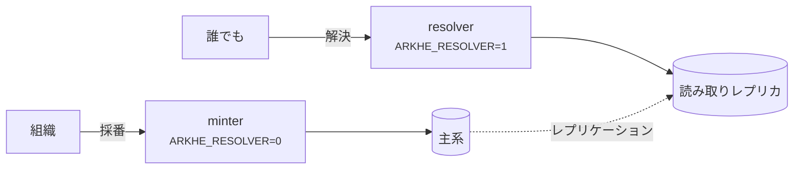

# デプロイ

## 2 つの役割



**別プロセスで動かす。** minter に解決の口は無く、resolver に採番の口も無いので、
解決だけを独立にスケールでき、読み取り専用ロールに向けられる。

この非対称は意図的である——**解決は止めてはならない。採番は止めてよい。**
認可サーバが落ちれば新しいトークンは出ず採番は止まるが、解決は影響を受けない
（そもそも認証を要さない）。

## 本番に出す前に

- [ ] `ARKHE_TOKEN_SECRET` と `ARKHE_SESSION_SECRET` を生成した（32 バイト以上、
      例のままではない）
- [ ] `ARKHE_SESSION_SECURE=true`、HTTPS で出している
- [ ] マイグレーションを **PostgreSQL で検証した**（SQLite は通してしまう）
- [ ] `ARKHE_ADMIN_LOGIN` を決めた。`proxy` なら**直接届く経路を塞いだ**
- [ ] 各 NAAN に `na_policy` を設定した——**永続性宣言はあなたの約束**であり、
      `??` で公開される
- [ ] **台帳のバックアップ。** 失うと**全識別子が壊れる**。NR の下では作り直せない
- [ ] `arkhe check` が通る

## コンテナ

イメージはリポジトリ直下。`compose/oidc` は Keycloak と PostgreSQL を含む実例。
**手本ではなく見本**として扱うこと——秘密値が平文で書いてあり、Keycloak は dev モード。

## 規模の見積もり

**以下はある 1 台での実測であって、保証値ではない。** 読むべきは**何が何に比例するか**
という形のほうで、数字は `scripts/bench.py` と下の SQL で自分の環境で取り直すこと。

測定環境: aarch64 20 コア、PostgreSQL 17（コンテナに CPU 4・メモリ 4 GB、
`shared_buffers=1GB`）、**台帳 100 万件（328 MB）**、uvicorn、負荷は同一ホストから。

### 解決——実際に届く負荷

| | 同時数 | rps | p50 | p95 | p99 |
| --- | --- | --- | --- | --- | --- |
| `302` で対象へ（1 worker） | 1 | 285 | 3.4 ms | 4.7 | 5.2 |
| `302` で対象へ（1 worker） | 8 | 372 | 19.8 ms | 34.8 | 53.5 |
| **`302` で対象へ（4 worker）** | 8 | **993** | 5.7 ms | 9.6 | 15.2 |
| `302` で対象へ（4 worker） | 32 | 1,078 | 18.3 ms | 37.1 | 56.8 |
| `?json` / `?info`（1 worker） | 8 | 304 | 24 ms | 41 | 60〜66 |
| suffix passthrough（1 worker） | 8 | 291 | 25 ms | 42 | 62 |
| 未知 NAAN の取次（1 worker） | 8 | 323 | 23 ms | 40 | 63 |

**処理量は worker 数に比例する**——1 から 4 で 2.9 倍。resolver は状態を持たず読み取り
しかしないので、**worker を増やす、次に resolver を増やす**が第一手と第二手になる。

**台帳の大きさはここに出てこない。** 解決は主キーの索引 1 回（0.03 ms、4 バッファ）で、
suffix passthrough は祖先を 1 回の `IN` でまとめて引くので 1 回増えるだけ。
**100 万件も 1000 件も同じ速さ**である。

比較のため `/healthz`（DB も認証も通らない）は 1 worker で 1,187 rps・p50 0.78 ms。
**残りの約 2.6 ms がアプリと DB の仕事**で、うち DB 層（セッションを開き、1 回引き、
閉じる）が 0.6 ms。

### 採番——一括が 20 倍速い理由

| | rps | p50 |
| --- | --- | --- |
| `POST /api/mint`（1 件ずつ） | **45** | 82 ms |
| `POST /api/mint/bulk`（1000 件を 1 要求） | **約 930 件/秒** | 1.06 秒 |

**1 件ずつが遅いのは DB ではなく Argon2 である。** API キーの検証 1 回が **53 ms** で、
82 ms のほとんどを占める。この遅さは意図されたもので、**盗んだ鍵の総当たりを高く
つかせる**ためにある。速くしてはいけない。

だから**規模のある投入では一括採番しか正気の選択肢が無い**——認証 1 回を 1000 件で
割る。1 万件なら、一括で 11 秒、1 件ずつで 4 分である。

`oauth2` も同じで、トークンの発行は `client_secret` を Argon2 で照合する。
**`expires_in` が尽きるまで保ち回す**こと（API 1 回ごとに取り直さない）。

### メモリ

arkhe のプロセスは役割によらず **常駐 100 MB 程度**。PostgreSQL は 100 万件・
`shared_buffers=1GB` で 486 MB を使っていた。

### 最小構成と、その先

**CPU とメモリの数字ではなく、構成の形で答えるのが正直なところである。**

**最小**——小さなホスト 1 台に minter・resolver・PostgreSQL を同居させる。**動く**が、
冗長性は無い。評価用と、まだ外に答えていない台帳ならこれで足りる。

**推奨**——コードが最初から前提にしている分け方。

- **resolver を複数 worker・複数ホストで。** 状態を持たない読み取り専用で、
  **minter や認可サーバが落ちても答え続けなければならない**のはこちら
- **minter は別に。** 採番は止まってよいが、解決は止められない
- **PostgreSQL はレプリカを持ち**、resolver は `ARKHE_READ_DATABASE_URL` でそちらへ
- DB は**主キーの索引がメモリに載る**ように——100 万件で 39 MB。ほかは順に読むので
  そこまで効かない

### 自分の環境で測る

```bash
# 1 つの口へ 3000 要求、同時 8
python scripts/bench.py http://127.0.0.1:8000/ark:99999/x9tn1qkq2g7 -n 3000 -c 8

# 積み上げの上限: DB も認証も通らない口。
# ほかの数字がこれに近づいていたら、**測っているのはクライアント**である
python scripts/bench.py http://127.0.0.1:8000/healthz -n 3000 -c 8

# 採番（Argon2 の代金は要求ごとに掛かる）
python scripts/bench.py http://127.0.0.1:8000/api/mint -n 200 -c 4 --post --auth "$KEY"
```

バイト数の見積もりと、自分の台帳で測る方法は
[データモデル](../reference/data-model.md#容量について)にある。


## バックアップ

ここで取り返しがつかないのは台帳だけである。失った ARK は採り直せない——NR の下では
**同じ名前を配り直すことこそが禁じられている**——ので、1 行の消失が識別子の恒久的な
破損になる。

DB をバックアップし、**復元を試すこと**。resolver は読み取りレプリカに向け、読み負荷が
主系を脅かさないようにする。

## プロキシの後ろに置くとき

前段が生のリクエスト URI を渡せるなら `ARKHE_RAW_URI_HEADER` を設定する。無いと
裸の `?`（簡潔な記述の inflection）が、クエリ文字列なしと区別できない。これは
**プロトコルの制約**であって実装の都合ではない。

## 依存の固定

`uv.lock` に**実際に入れた版をそのまま記録**してある。`pyproject.toml` の宣言は
下限しか書いていないので、これが無いと**同じコミットから別のものができる**
——同じ Dockerfile で焼き直すたびにイメージの中身が変わり、「いつから壊れたか」が
追えなくなる。

```bash
uv sync --frozen --extra app --extra dev   # lock どおりに入れる
uv lock                                    # 更新する（意図したときだけ）
```

`--frozen` は**lock と `pyproject.toml` がずれていたらそこで落とす**。ずれたまま
緑になるほうが困るので、検査（`scripts/check.sh`）もイメージのビルドもこれを使う。

**上限（`<`）は書かない。** lock があれば要らないし、上限はライブラリとして
使われるときに他と共存しにくくする。「どの範囲なら動くか」を宣言が、「今どれで
動かしているか」を lock が持つ——答える問いが違うので、両方要る。

更新は Dependabot が毎週まとめて出す。**固定は「新しいものを見なくてよい」という
意味ではない**——放っておくと、直っている脆弱性を抱えたまま動き続けることになる。

## 複数の arkhe で分担する

拠点ごと・名前空間ごとに arkhe を分けるなら、守る規則が運用の側に移る（**同じ
shoulder を 2 か所が採番しない**、**権威を持つ台帳は NAAN あたり 1 つ**）。
構成の選び方と落とし穴は[分散して運用する](federation.md)にまとめてある。
