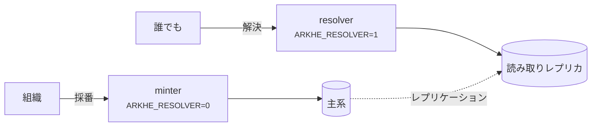

# デプロイ

## 2 つの役割



**別プロセスで動かす。** minter に解決の口は無く、resolver に採番の口も無いので、
解決だけを独立にスケールでき、読み取り専用ロールに向けられる。

この非対称は意図的である——**解決は止めてはならない。採番は止めてよい。**
認可サーバが落ちれば新しいトークンは出ず採番は止まるが、解決は影響を受けない
（そもそも認証を要さない）。

## 本番に出す前に

- [ ] `ARKHE_TOKEN_SECRET` と `ARKHE_SESSION_SECRET` を生成した（32 バイト以上、
      例のままではない）
- [ ] `ARKHE_SESSION_SECURE=true`、HTTPS で出している
- [ ] マイグレーションを **PostgreSQL で検証した**（SQLite は通してしまう）
- [ ] `ARKHE_ADMIN_LOGIN` を決めた。`proxy` なら**直接届く経路を塞いだ**
- [ ] 各 NAAN に `na_policy` を設定した——**永続性宣言はあなたの約束**であり、
      `??` で公開される
- [ ] **台帳のバックアップ。** 失うと**全識別子が壊れる**。NR の下では作り直せない
- [ ] `arkhe check` が通る

## コンテナ

イメージはリポジトリ直下。`compose/oidc` は Keycloak と PostgreSQL を含む実例。
**手本ではなく見本**として扱うこと——秘密値が平文で書いてあり、Keycloak は dev モード。

## バックアップ

ここで取り返しがつかないのは台帳だけである。失った ARK は採り直せない——NR の下では
**同じ名前を配り直すことこそが禁じられている**——ので、1 行の消失が識別子の恒久的な
破損になる。

DB をバックアップし、**復元を試すこと**。resolver は読み取りレプリカに向け、読み負荷が
主系を脅かさないようにする。

## プロキシの後ろに置くとき

前段が生のリクエスト URI を渡せるなら `ARKHE_RAW_URI_HEADER` を設定する。無いと
裸の `?`（簡潔な記述の inflection）が、クエリ文字列なしと区別できない。これは
**プロトコルの制約**であって実装の都合ではない。

## 依存の固定

`uv.lock` に**実際に入れた版をそのまま記録**してある。`pyproject.toml` の宣言は
下限しか書いていないので、これが無いと**同じコミットから別のものができる**
——同じ Dockerfile で焼き直すたびにイメージの中身が変わり、「いつから壊れたか」が
追えなくなる。

```bash
uv sync --frozen --extra app --extra dev   # lock どおりに入れる
uv lock                                    # 更新する（意図したときだけ）
```

`--frozen` は**lock と `pyproject.toml` がずれていたらそこで落とす**。ずれたまま
緑になるほうが困るので、CI もイメージのビルドもこれを使う。

**上限（`<`）は書かない。** lock があれば要らないし、上限はライブラリとして
使われるときに他と共存しにくくする。「どの範囲なら動くか」を宣言が、「今どれで
動かしているか」を lock が持つ——答える問いが違うので、両方要る。

更新は Dependabot が毎週まとめて出す。**固定は「新しいものを見なくてよい」という
意味ではない**——放っておくと、直っている脆弱性を抱えたまま動き続けることになる。

## 複数の arkhe で分担する

拠点ごと・名前空間ごとに arkhe を分けるなら、守る規則が運用の側に移る（**同じ
shoulder を 2 か所が採番しない**、**権威を持つ台帳は NAAN あたり 1 つ**）。
構成の選び方と落とし穴は[分散して運用する](federation.md)にまとめてある。
