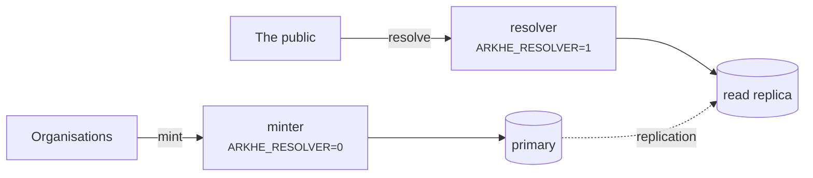

# Deployment

## The two roles



Run them as separate processes. **A minter has no resolution endpoint and a resolver
has no minting endpoint**, so you can scale resolution independently and point it at a
read-only role.

The asymmetry is deliberate: **resolution must never stop, minting may.** If the
authorization server is unavailable, no new tokens are issued and minting pauses —
resolution is unaffected, because it needs no authentication at all.

## Before going live

- [ ] `ARKHE_TOKEN_SECRET` and `ARKHE_SESSION_SECRET` generated, 32 bytes or more, not
      the ones in any example
- [ ] `ARKHE_SESSION_SECURE=true`, served over HTTPS
- [ ] Migrations **verified against PostgreSQL** — SQLite tolerates schemas it will reject
- [ ] `ARKHE_ADMIN_LOGIN` chosen; for `proxy`, the direct path to arkhe closed off
- [ ] `na_policy` set on each NAAN — the persistence statement is the promise you are
      making, and `??` publishes it
- [ ] Backups of the ledger. **Losing it breaks every identifier**, and NR means they
      cannot be recreated
- [ ] `arkhe check` passes

## Containers

The image is at the repository root; `compose/oidc` is a worked example with Keycloak
and PostgreSQL. Treat it as a demonstration, not a template: its secrets are in the
file in the clear and Keycloak runs in dev mode.

## Sizing

**These are measurements from one machine, not guarantees.** Take them as the shape of
the thing — what scales with what — and measure your own with `scripts/bench.py` and the
queries below.

Measured on: aarch64, 20 cores, PostgreSQL 17 in a container limited to 4 CPUs / 4 GB
with `shared_buffers=1GB`, **a ledger of one million ARKs (328 MB)**, uvicorn, load
generated on the same host.

### Resolution — the load that actually arrives

| | concurrency | rps | p50 | p95 | p99 |
| --- | --- | --- | --- | --- | --- |
| `302` to the target, 1 worker | 1 | 285 | 3.4 ms | 4.7 | 5.2 |
| `302` to the target, 1 worker | 8 | 372 | 19.8 ms | 34.8 | 53.5 |
| **`302` to the target, 4 workers** | 8 | **993** | 5.7 ms | 9.6 | 15.2 |
| `302` to the target, 4 workers | 32 | 1,078 | 18.3 ms | 37.1 | 56.8 |
| `?json` / `?info`, 1 worker | 8 | 304 | 24 ms | 41 | 60–66 |
| suffix passthrough, 1 worker | 8 | 291 | 25 ms | 42 | 62 |
| unknown NAAN → forwarded, 1 worker | 8 | 323 | 23 ms | 40 | 63 |

**Throughput follows the worker count** — 2.9× from one to four. The resolver holds no
state and only reads, so adding workers, then adding resolvers, is the first and second
lever.

**The size of the ledger does not show up here.** A resolution is one index scan on the
primary key (0.03 ms, 4 buffers); suffix passthrough asks for every ancestor in a single
`IN` and costs one more. A million rows resolve like a thousand.

For reference, `/healthz` — no database, no authentication — runs at 1,187 rps and
p50 0.78 ms on one worker. The remaining ~2.6 ms per resolution is application and
database work, of which the database layer (open a session, one query, close) is 0.6 ms.

### Minting — and why bulk is twenty times faster

| | rps | p50 |
| --- | --- | --- |
| `POST /api/mint`, one at a time | **45** | 82 ms |
| `POST /api/mint/bulk`, 1000 rows in one request | **~930 rows/s** | 1.06 s |

**What makes single minting slow is not the database — it is Argon2.** Verifying one API
key takes **53 ms**, which is most of the 82. That slowness is deliberate: it is what
makes a stolen-key search expensive, and it should not be tuned away.

It is also why **bulk minting is the only sane way to ingest at scale**: one
authentication amortised across a thousand rows. Ten thousand objects is eleven seconds
in bulk and four minutes one at a time.

The same applies to `oauth2`: issuing a token verifies `client_secret` with Argon2, so
fetch a token and **hold it until `expires_in` runs out** rather than per call.

### Memory

An arkhe process is about **100 MB resident**, whichever role it runs. PostgreSQL used
486 MB with a million ARKs and `shared_buffers=1GB`.

### What to run, at minimum and beyond

**Rather than a CPU and memory figure, the honest answer is a shape.**

**Minimum** — one small host: minter, resolver and PostgreSQL side by side. Everything
works; nothing is redundant. Fine for evaluation and for a ledger that is not yet
answering the public.

**Recommended** — the split the code already assumes:

- **the resolver, several workers and more than one host.** It is stateless and read-only,
  and it must keep answering when the minter or the authorisation server does not
- **the minter, separately.** Minting may stop; resolution may not
- **PostgreSQL with a replica**, and the resolver pointed at it with
  `ARKHE_READ_DATABASE_URL`
- Size the database so that **the primary-key index stays in memory** — 39 MB per million
  ARKs. Everything else is sequential enough not to matter

### Measuring your own

```bash
# One endpoint, 3000 requests, 8 at a time
python scripts/bench.py http://127.0.0.1:8000/ark:99999/x9tn1qkq2g7 -n 3000 -c 8

# The ceiling of the stack: no database, no authentication.
# If your other numbers approach this, you are measuring the client
python scripts/bench.py http://127.0.0.1:8000/healthz -n 3000 -c 8

# Minting (the Argon2 cost is per request)
python scripts/bench.py http://127.0.0.1:8000/api/mint -n 200 -c 4 --post --auth "$KEY"
```

Capacity in bytes, and how to measure it against your own ledger, is in
[the data model](../reference/data-model.md#on-capacity).


## Backups

The ledger is the only irreplaceable thing here. An ARK that is lost cannot be minted
again — under NR, re-issuing the same name is precisely what is forbidden — so a lost
row is a permanently broken identifier.

Back up the database, verify a restore, and prefer a read replica for the resolver so
that a heavy read load never threatens the primary.

## Behind a proxy

Set `ARKHE_RAW_URI_HEADER` if the front end can pass the raw request URI. Without it a
bare `?` — the brief-metadata inflection — cannot be distinguished from no query
string at all. That is a protocol-level limitation, not an implementation one.

## Pinned dependencies

`uv.lock` records **the versions actually installed**. The declarations in
`pyproject.toml` carry only lower bounds, so without the lock **the same commit builds
into something different** each time — the image changes under a rebuild, and "when did
this break" becomes unanswerable.

```bash
uv sync --frozen --extra app --extra dev   # install exactly what the lock says
uv lock                                    # update it, deliberately
```

`--frozen` **fails if the lock and `pyproject.toml` disagree**, which is what you want:
passing while they disagree is worse. The checks (`scripts/check.sh`) and the image
build both use it.

**No upper bounds.** With a lock they are unnecessary, and they make the package harder
to live with as a dependency. The declaration answers "what range does this work
with"; the lock answers "what is it running on now" — different questions, so both are
kept.

Dependabot proposes updates weekly, grouped. **Pinning is not permission to stop
looking**: left alone, a pinned tree keeps running with vulnerabilities that have
already been fixed elsewhere.

## Sharing the work across several arkhe

Once instances are split per site or per namespace, the rules move from the code into
the hands of the operators — **no shoulder minted in two places**, **one authoritative
ledger per NAAN**. How to choose an arrangement, and what goes wrong, is in
[Running several arkhe](federation.md).
