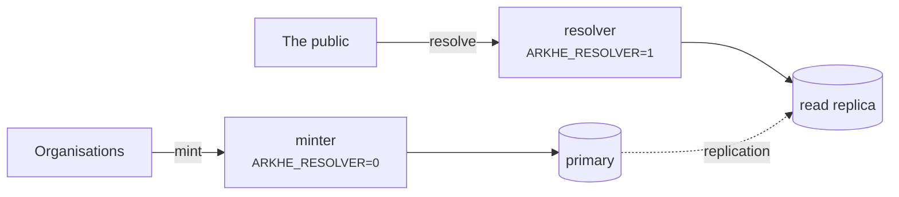
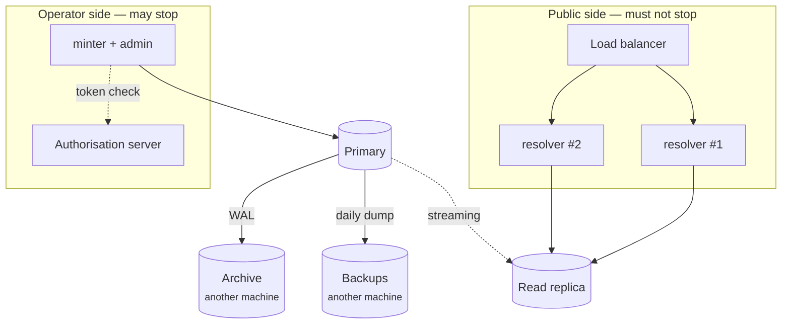

# Deployment

## The two roles



Run them as separate processes. **A minter has no resolution endpoint and a resolver
has no minting endpoint**, so you can scale resolution independently and point it at a
read-only role.

The asymmetry is deliberate: **resolution must never stop, minting may.** If the
authorization server is unavailable, no new tokens are issued and minting pauses —
resolution is unaffected, because it needs no authentication at all.

## Before going live

- [ ] `ARKHE_TOKEN_SECRET` and `ARKHE_SESSION_SECRET` generated, 32 bytes or more, not
      the ones in any example
- [ ] `ARKHE_SESSION_SECURE=true`, served over HTTPS
- [ ] Migrations **verified against PostgreSQL** — SQLite tolerates schemas it will reject
- [ ] `ARKHE_ADMIN_LOGIN` chosen; for `proxy`, the direct path to arkhe closed off
- [ ] `na_policy` set on each NAAN — the persistence statement is the promise you are
      making, and `??` publishes it
- [ ] Backups of the ledger. **Losing it breaks every identifier**, and NR means they
      cannot be recreated
- [ ] `arkhe check` passes

## Containers

The image is at the repository root; `compose/oidc` is a worked example with Keycloak
and PostgreSQL. Treat it as a demonstration, not a template: its secrets are in the
file in the clear and Keycloak runs in dev mode.

## Sizing

**These are measurements from one machine, not guarantees.** Take them as the shape of
the thing — what scales with what — and measure your own with `scripts/bench.py` and the
queries below.

Measured on: aarch64, 20 cores, PostgreSQL 17 in a container limited to 4 CPUs / 4 GB
with `shared_buffers=1GB`, **a ledger of one million ARKs (328 MB)**, uvicorn, load
generated on the same host.

### Resolution — the load that actually arrives

| | concurrency | rps | p50 | p95 | p99 |
| --- | --- | --- | --- | --- | --- |
| `302` to the target, 1 worker | 1 | 285 | 3.4 ms | 4.7 | 5.2 |
| `302` to the target, 1 worker | 8 | 372 | 19.8 ms | 34.8 | 53.5 |
| **`302` to the target, 4 workers** | 8 | **993** | 5.7 ms | 9.6 | 15.2 |
| `302` to the target, 4 workers | 32 | 1,078 | 18.3 ms | 37.1 | 56.8 |
| `?json` / `?info`, 1 worker | 8 | 304 | 24 ms | 41 | 60–66 |
| suffix passthrough, 1 worker | 8 | 291 | 25 ms | 42 | 62 |
| unknown NAAN → forwarded, 1 worker | 8 | 323 | 23 ms | 40 | 63 |

**Throughput follows the worker count** — 2.9× from one to four. The resolver holds no
state and only reads, so adding workers, then adding resolvers, is the first and second
lever.

**The size of the ledger does not show up here.** A resolution is one index scan on the
primary key (0.03 ms, 4 buffers); suffix passthrough asks for every ancestor in a single
`IN` and costs one more. A million rows resolve like a thousand.

For reference, `/healthz` — no database, no authentication — runs at 1,187 rps and
p50 0.78 ms on one worker. The remaining ~2.6 ms per resolution is application and
database work, of which the database layer (open a session, one query, close) is 0.6 ms.

### Minting — and why bulk is twenty times faster

| | rps | p50 |
| --- | --- | --- |
| `POST /api/mint`, one at a time | **45** | 82 ms |
| `POST /api/mint/bulk`, 1000 rows in one request | **~930 rows/s** | 1.06 s |

**What makes single minting slow is not the database — it is Argon2.** Verifying one API
key takes **53 ms**, which is most of the 82. That slowness is deliberate: it is what
makes a stolen-key search expensive, and it should not be tuned away.

It is also why **bulk minting is the only sane way to ingest at scale**: one
authentication amortised across a thousand rows. Ten thousand objects is eleven seconds
in bulk and four minutes one at a time.

The same applies to `oauth2`: issuing a token verifies `client_secret` with Argon2, so
fetch a token and **hold it until `expires_in` runs out** rather than per call.

### Memory

An arkhe process is about **100 MB resident**, whichever role it runs. PostgreSQL used
486 MB with a million ARKs and `shared_buffers=1GB`.

### What to run, at minimum and beyond

**Rather than a CPU and memory figure, the honest answer is a shape.**

**Minimum** — one small host: minter, resolver and PostgreSQL side by side. Everything
works; nothing is redundant. Fine for evaluation and for a ledger that is not yet
answering the public.

**Recommended** — the split the code already assumes:

- **the resolver, several workers and more than one host.** It is stateless and read-only,
  and it must keep answering when the minter or the authorisation server does not
- **the minter, separately.** Minting may stop; resolution may not
- **PostgreSQL with a replica**, and the resolver pointed at it with
  `ARKHE_READ_DATABASE_URL`
- Size the database so that **the primary-key index stays in memory** — 39 MB per million
  ARKs. Everything else is sequential enough not to matter

### The recommended shape, whole



**The asymmetry is the point.** The top half is open to anyone, needs no authentication
and writes nothing. The bottom half needs authentication, writes, and may stop.

### What keeps working when something fails

**Exercised**, by pointing a resolver at a `SELECT`-only role and driving every path.

| What failed | Resolution | Minting and admin |
| --- | --- | --- |
| minter | **continues** | stops |
| authorisation server (OIDC) | **continues** — resolution needs no authentication | stops (no new tokens) |
| primary database | **continues** (on the replica) | stops |
| read replica | continues once pointed at the primary | continues |
| global resolver (n2t) | **continues** — an unknown NAAN just gets a `302`; **nothing is fetched** | continues |
| every resolver | stops | continues |

**A resolver starts with no authentication configuration at all** — neither `ARKHE_AUTH`
nor `ARKHE_OIDC_ISSUER`. The admin interface and the minting endpoints **are not mounted**:
both answer `404`. So it cannot fall over with the authorisation server, and its attack
surface is small.

**It was also confirmed to write nothing.** An expired hold is decided against the clock
on each resolution, so **there is no write to lift it** — with only `SELECT` granted, the
inflections `?` `??` `?info` `?json`, the check digit, the forwarding, `/.well-known/ark`
and both health probes all work. That property is what makes pointing it at a replica
sound.

### How many to run

Working back from [the measurements](#resolution--the-load-that-actually-arrives):

| | Rough figure |
| --- | --- |
| one resolver process (4 workers) | **~1,000 rps** = 86 million a day |
| one resolver worker | ~300 rps |
| minter, one at a time | ~45 rps — **53 ms of which is Argon2**, and must stay slow |
| minter, 1000 in one request | ~930 a second |

**A repository's real resolution volume is nowhere near that.** You run two resolvers not
for throughput but so that **losing one does not stop resolution**. Decide the count from
redundancy, not from rps.

If minting is the bottleneck, **move callers to bulk** (twenty times faster). **What makes
one-at-a-time slow is not the database — it is one Argon2 verification per request.**

### Redundancy — how much to automate

**The answer is opposite for resolvers and for the minter.**

**Run as many resolvers as you like.** They hold no state, write nothing, and know
nothing of one another. Any of them gives the same answer, so **there is nothing to get
wrong**. Plain round-robin is enough; no sticky sessions.

**The minter and the primary database are different.** **Automatic failover here risks
split-brain, and split-brain breaks identifiers** — two primaries minting at once can
hand the same name to different objects. That is a violation of the one thing this
service promises, and under `NR` there is no way back.

Minting, on the other hand, **may stop** (see [The two roles](#the-two-roles)). Resolution
continues while it is down and callers can wait. **So the scales are not level:**

| | Minting stops for minutes | Split-brain |
| --- | --- | --- |
| Effect | new deposits wait | **a name you handed out can point at something else** |
| Reversible | yes | **no** |

**Promote by hand, after fencing.** Make certain the old primary is down before bringing
up the new one — nothing in this ledger should fire `pg_ctl promote` on its own.

### Health checks that do not depend on the database

**Point your load balancer at `/readyz` and a database outage becomes "no healthy
backends".** Every resolver drops out at once, and **reads that would still have worked
stop too.**

- **Load-balancer check: `/healthz`** — is the process alive? It does not touch the database.
- **`/readyz` is for admission** — hold a freshly started process out until it can reach
  the database.

That is why they are two endpoints and not one.

### Can you run several minters? — exercised

**Yes.** Eight workers minting fifty ARKs each into the same shoulder — **400 concurrent
requests** — produced no duplicates and no failures. Collisions are counted and retried
rather than swallowed, so **running several does not collide names**.

**A resend is not double-minted, even across instances.** The same `request_id` sent from
eight paths **simultaneously** mints once and gives everyone the same ARK (one `201`,
seven `200`s).

> **This exercise found one thing to fix.** A *simultaneous* resend used to return `500`
> (102 of 200 requests). The ledger was never corrupted — the uniqueness constraint on the
> receipt held — but to the caller it reads as "I do not know whether it minted", and
> **resending under a fresh `request_id` would then double-mint**. The loser now returns
> the ARK the winner recorded. Bulk minting had the same gap and now **rebuilds the batch
> once**, so every row comes back as a replay.

### Settings — the defaults do not fit the recommended shape

**Connection count matters most.** SQLAlchemy's default is `pool_size 5 + max_overflow
10 = 15` per process, and **that multiplies by the worker count**:

```
2 resolvers × 4 workers × 15 = 120 connections
PostgreSQL default max_connections = 100 (97 once the superuser reserve is taken)
```

**Build the recommended shape on defaults and it jams there** — and that is before
counting the minter. Move one side or the other:

| | Suggested | Why |
| --- | --- | --- |
| `ARKHE_DB_POOL_SIZE` | **2–3** | **Resolution is one short query** (a primary-key index lookup, 0.03 ms). Nothing to hoard |
| `ARKHE_DB_MAX_OVERFLOW` | **2–5** | Room for a spike, while the total stays under `max_connections` |
| PostgreSQL `max_connections` | **200–300** | If you raise it, budget the per-connection memory |

**Do the arithmetic first:**

```
(resolvers × workers + minters × workers) × (pool_size + max_overflow)
  + a few for operators (psql, migrations, backups)
  ≤ max_connections − superuser_reserved_connections
```

Where something upstream **drops idle connections** (NAT, load balancer, firewall), set
`ARKHE_DB_POOL_RECYCLE` below that idle timeout. `pool_pre_ping` does catch it, **but it
spends a round trip every time it does**.

### PostgreSQL

**Only what the [measurements](#sizing) call for:**

| | Suggested | Why |
| --- | --- | --- |
| `max_connections` | from the arithmetic above | The default 100 does not cover the recommended shape |
| `shared_buffers` | **25% of RAM** | Default 128 MB. **A million ARKs index in 39 MB**, so size it to hold the indexes |
| `effective_cache_size` | 50–75% of RAM | Nothing is allocated; **it is a declaration, so the planner picks the index** |
| `work_mem` | leave at 4 MB | Resolution is one index lookup and the statistics only scan. **Almost nothing sorts or joins** |
| `wal_level` / `archive_mode` | as in [Backups](#backups) | **A nightly dump alone loses a day of identifiers** |

**Tighten the pool before raising `max_connections`.** Each connection costs resident
memory, and **this ledger needs few of them at once.**

### The app and what sits in front

| | Suggested | Why |
| --- | --- | --- |
| Workers (resolver) | **2–4** | Four gives ~1,000 rps = 86 million a day. **More is usually unnecessary** |
| Workers (minter) | 1–2 | Minting runs at 45 rps, **53 ms of which is Argon2**. More workers do not shorten that |
| Request size limit | **1 MB or more** | `ARKHE_BULK_LIMIT` is 1000 rows; **nginx's default `client_max_body_size 1m` is the edge** |
| Upstream timeout | **60 s or more** | A 1000-row bulk mint takes about a second, but **statistics scale with row count** |
| `ARKHE_RAW_URI_HEADER` | set it if the front end can | **Without it a bare `?` cannot be told apart** — a constraint of the protocol, not of this implementation |
| `ARKHE_ALLOWED_HOSTS` | narrow it unless the proxy checks | The default `*` installs nothing |

**Most of arkhe's own values can stay as they are:**

| | Default | When to move it |
| --- | --- | --- |
| `ARKHE_TOKEN_TTL` | 3600 | Shorter means callers fetch tokens more often |
| `ARKHE_SESSION_TTL` | 28800 | Match how long people stay in the admin interface |
| `ARKHE_BULK_LIMIT` | 1000 | Raise the upstream request limit with it |
| `ARKHE_HOLD_MAX_DAYS` | 90 | **A ceiling, not a default.** The longer it is, the less "temporary" means |

### Keep things apart

- **The WAL archive and the daily dumps belong on a different machine** from the database.
  What sits on the same one dies in the same accident (see [Backups](#backups)).
- **Resolvers hold no state.** Rebuild and replace them freely.
- If the admin interface should not be reachable from outside, `ARKHE_ADMIN_LOGIN=bearer`
  removes the login screen altogether.

### Re-measured on the recommended settings (2026-09-18)

**Built exactly as recommended above, and run.** A ledger of one million ARKs,
PostgreSQL 17 (`max_connections=200`, `shared_buffers=512MB`), four resolver workers,
`ARKHE_DB_POOL_SIZE=3` and `ARKHE_DB_MAX_OVERFLOW=2`, all on one 20-core host.

| Resolution (302) | Concurrency | rps | p50 | p95 | p99 |
| --- | --- | --- | --- | --- | --- |
| | 1 | 278 | 3.5 | 4.9 | 5.6 ms |
| | 4 | 777 | 4.1 | 6.4 | 7.5 ms |
| | **8** | **938** | **6.5** | 10.5 | 18.9 ms |
| | 16 | 938 | 10.6 | 20.5 | 37.7 ms |

**It flattens at a concurrency of eight** for four workers. Beyond that the rps does not
move and **only the latency grows** — more parallelism does not make it faster.

| Other paths (concurrency 8) | rps | p50 |
| --- | --- | --- |
| `?info` | 789 | 6.5 ms |
| `?json` | 784 | 6.8 ms |
| `??` | 784 | 8.0 ms |
| Forwarding an unknown NAAN | 689 | 8.7 ms |

**Checking that the server is what was measured**: `/healthz` (no database, no
authentication) reached **2,192 rps** under the same conditions. Resolution at 938 is well
under half of that, so **the server is what the numbers describe.**

**Only 16 connections were ever open** (`pool_size 3 + overflow 2` × 4 workers = 20
available; 179 still free of `max_connections=200`). **The recommended pool is not too
tight.**

| Minting (2 minter workers) | Concurrency | rps | p50 |
| --- | --- | --- | --- |
| One at a time | 1 | 17 | **59.7 ms** |
| | 4 | 53 | 70.3 ms |
| | 8 | 77 | 94.4 ms |
| **1000 in one request** | — | **918 a second** | 1,089 ms |

**That 59.7 ms is almost entirely Argon2** (about 53 ms per verification); the database
does not spend half a millisecond. **Bulk is 55 times faster** — not because the database
is quick, but because **one authentication is divided across a thousand rows.**

**These numbers say nothing beyond "on this machine".** Everything shared one host, so a
split deployment adds a round trip. Take your own with the tool below.

### Measuring your own

```bash
# One endpoint, 3000 requests, 8 at a time
python scripts/bench.py http://127.0.0.1:8000/ark:99999/x9tn1qkq2g7 -n 3000 -c 8

# The ceiling of the stack: no database, no authentication.
# If your other numbers approach this, you are measuring the client
python scripts/bench.py http://127.0.0.1:8000/healthz -n 3000 -c 8

# Minting (the Argon2 cost is per request)
python scripts/bench.py http://127.0.0.1:8000/api/mint -n 200 -c 4 --post --auth "$KEY"
```

Capacity in bytes, and how to measure it against your own ledger, is in
[the data model](../reference/data-model.md#on-capacity).


## Monitoring

**What to watch follows from what was promised.** This ledger promises one thing — **a
name you handed out never points at something else, and never stops being resolvable** —
so the monitoring is derived backwards from that.

What arkhe emits is **a one-line JSON access log** (`method`, `path`, `status`, `ms`, with
a request id), `/healthz` and `/readyz`, and **`mint_collision` when minting collides**.
**There is no metrics endpoint** — you already have somewhere logs go, and one pipeline is
better than two.

### Signs the promise is starting to break

| Watch | Signal | Why |
| --- | --- | --- |
| **Resolution still answering** | 5xx rate on `path` starting `/ark:` | The promise itself. **This is the one thing that cannot wait.** |
| **A jump in 404s** | 404 rate on the same paths | Normally steady, made of stale links out in the world. **A jump means suspect the ledger or what it is pointed at** (empty replica, wrong database). |
| **Replication lag** | `pg_last_xact_replay_timestamp()` on the replica | **See below.** |
| **Minting collisions** | frequency of `mint_collision` | **The only sign that the namespace is quietly filling up.** A rising rate says add digits. |
| **Backup age** | `pg_stat_archiver`, mtime of the newest dump | [Backups](#backups). **Not noticing is the worst case.** |
| **Reserved ARKs piling up** | `reserved_oldest` in `arkhe stat` | **Watch the age, not the count** — ten from yesterday is normal, one from three years ago is abandoned. Pull them with `ark list --state reserved --older-than N`. |
| **Holds in force** | `holds`, same command | Even with deadlines, **what is not visible becomes permanent**. |

For `/healthz` versus `/readyz`, see
[health checks](#health-checks-that-do-not-depend-on-the-database).

### Here, replication lag is a correctness problem

The recommended split — **mint on the primary, resolve from a replica** — has a hazard of
its own:

1. A caller mints; the row lands on the primary.
2. **They put that ARK in a paper, a record, an email.**
3. Someone resolves it → **the replica has not got it yet → `404`.**

In most systems that is "wait a moment and it appears". **Not here**: whoever saw the
`404` concludes the identifier does not exist, and the person who handed it out has handed
out a broken PID. Lag is not a performance matter; **it is a matter of the promise.**

- Monitor replica lag and **alert in seconds, not minutes**.
- If lag is routine, **send the just-after-minting check to the primary**, or point the
  resolver back at it.
- **`?info` travels the same path**, so answering with the description only does not save
  you.

### Watching a delegate from outside

**Delegating a namespace hands the life of the identifiers under it to someone else** —
and **arkhe does not know how they are doing**: it answers with a redirect and **never
fetches the target** (as verified in [what keeps working](#what-keeps-working-when-something-fails);
that is a strength, not an oversight).

The two failures are not equally bad:

| What died | What happens |
| --- | --- |
| `minter` (delegated minting) | minting stops for that namespace. Bad, survivable |
| `redirect` (delegated resolution) | **every ARK beneath it stops resolving**. The promise breaks |

**arkhe publishes the list to watch.** Ask `/.well-known/ark` with
`Accept: application/json` and you get the delegated shoulders, where resolution was
delegated, and the redirect of any NAAN it is not authoritative for:

```bash
curl -s -H 'Accept: application/json' https://ark.example.org/.well-known/ark \
  | jq -r '.delegated_shoulders[] | select(.redirect) | .redirect,
           .naans[] | select(.redirect) | .redirect'
```

**Feed that into your monitoring** — re-read the list on a schedule and probe the URLs
from outside. **Do not make arkhe do the probing.** As it stands this ledger makes **no
outbound calls at all** (even an unknown NAAN just gets a `302`; nothing is fetched). That
property makes failures easy to attribute, and **it is too expensive to trade away for
monitoring.**

There is a way to act once you know: a [hold](../concepts/invariants.md)
(`arkhe hold add`) stops the whole shoulder, **stopping redirection while resolution keeps
answering**. Noticing lives outside; stopping lives inside.

### What not to collect

**Do not build alerts out of which ARKs were resolved.** Who looked up what is usage data,
and **not something to accumulate for the sake of monitoring**. The access log keeps
`path`, which you need — but **turning that into usage statistics is a different decision,
not monitoring**: different retention, different people allowed to look.

## Backups

The ledger is the only irreplaceable thing here. An ARK that is lost cannot be minted
again — under NR, re-issuing the same name is precisely what is forbidden — so a lost
row is a permanently broken identifier.

Prefer a read replica for the resolver, so that a heavy read load never threatens the
primary.

### Daily and monthly

Take the dump in `pg_dump`'s custom format (`-Fc`): it is compressed, and `pg_restore`
can pick tables out of it.

```bash
# Daily. **Put it on another machine** — what sits on the same one dies in the same accident.
pg_dump -Fc -d "$ARKHE_DATABASE_URL" -f "arkhe-$(date +%Y%m%d).dump"
```

Start from **14 daily and 12 monthly**. A monthly copy is just the daily one taken on the
first of the month, so there is no second job to run. **A ledger only grows** — ARKs do
not go away — so plan for linear growth: around 40 GB at a hundred million, as an upper
marker (see [Data model](../reference/data-model.md#capacity)).

```cron
# 03:15 every day. Do not silence failures — discard the output and you never learn it stopped.
15 3 * * *  pg_dump -Fc -d "$ARKHE_DATABASE_URL" -f /backup/arkhe-$(date +\%Y\%m\%d).dump
20 3 1 * *  cp /backup/arkhe-$(date +\%Y\%m01).dump /backup/monthly/
30 3 * * *  find /backup -name 'arkhe-*.dump' -mtime +14 -delete
```

### A nightly dump is not enough here

**Once a day means losing up to 24 hours of identifiers.** In most systems that is an
ingest you re-run. **Not in this one**: minting the lost ARKs again is, from outside,
indistinguishable from breaking `NR`. **The names you handed out are already in the world,
whatever your database thinks.**

So for this ledger, continuous archiving is not a luxury:

```bash
# postgresql.conf
wal_level = replica
archive_mode = on
archive_command = 'test ! -f /archive/%f && cp %p /archive/%f'
```

A base backup (`pg_basebackup`) plus continuous WAL gets you **back to any point in time**.
Keep the daily dump underneath it as the floor — PITR cannot recover across a broken chain,
while a dump stands on its own.

```bash
pg_basebackup -D /backup/base -Fp -Xstream -c fast
```

To come back, put the base backup in place, **write the recovery settings, drop
`recovery.signal` and start**:

```bash
cp -a /backup/base /var/lib/postgresql/data
cat >> /var/lib/postgresql/data/postgresql.conf <<'CONF'
restore_command = 'cp /archive/%f %p'
recovery_target_action = 'promote'
CONF
touch /var/lib/postgresql/data/recovery.signal
pg_ctl -D /var/lib/postgresql/data start
```

**Naming no target is the default, and the right one.** With nothing set, recovery replays
to the end of the WAL — **the fewest identifiers lost**. `recovery_target_time` is for
undoing one specific bad operation, nothing else.

### Rewinding loses identifiers out of the ledger

**This is the hazard peculiar to this system.** Put `recovery_target_time` in the past and
every ARK minted after it leaves the ledger. **They did not leave the world.**

What the rehearsal below showed is that **the ledger does not know what it lost**:

| | After rewinding |
| --- | --- |
| the `ark` row | gone |
| `mint_receipt` | **rolls back with it** |
| `ark_change` | **rolls back with it** |
| `audit_event` | **rolls back with it** |
| `withdrawn_name` (never assigned again) | **not written** |

So a name you handed out answers `404` forever, and it also **reverts to looking as though
it was never used** — it is in neither of the two places that make `NR` hold. You cannot
even tombstone it: there is nothing left to tombstone.

Therefore:

- **Default to the end of the WAL.** Pick a target only when there is an operation to undo.
- **If you did rewind, reconcile what was handed out from outside the ledger** — the
  caller's own records, or the front-end access log. Nothing inside survived.
- Put those names back with **import, not minting** (`POST /api/import`). Returning a name
  to the same object is not an NR violation; **minting it afresh is.**

### Restoring

**You only know it comes back when you bring it back.** These steps are **exercised**, on
PostgreSQL 17 with `pg_dump -Fc` and `pg_restore`.

```bash
createdb arkhe
pg_restore -d arkhe --no-owner --no-privileges arkhe-YYYYMMDD.dump
```

`--no-owner --no-privileges` is there because **the role names on the far side are usually
not the ones you dumped from**; without it the restore stops trying to reassign ownership.

### Proving the restore worked

**Matching row counts prove nothing.** The counts can agree while every target has moved,
and then every identifier is broken. Check **four** things:

```bash
# 1. The schema version agrees (upgrade if you restored an older dump)
psql -d arkhe -tAc "SELECT version_num FROM alembic_version"
uv run alembic check

# 2. **The fingerprint.** If it matches, the identifiers survived.
#    (Do not paste SQL — **a mis-paste still reads as "they match".**)
arkhe fingerprint

# 3. **It actually resolves.** Start a resolver and ask it.
#    (The default process is the minter and **has no resolution endpoint** — do not read
#     that 404 as a failed restore.)
ARKHE_RESOLVER=1 uvicorn arkhe.app:create_app --factory   # then: curl -sI localhost:8000/ark:/…

# 4. **It can still be written to.** If the sequences did not come back, the next mint
#    collides on the primary key.
arkhe stat && psql -d arkhe -tAc "SELECT last_value FROM shoulder_id_seq"
```

**Two and four are the real ones.** One and three announce themselves when they fail; **a
drifted fingerprint and a reset sequence pass quietly** — you find out after an identifier
has pointed at something else.

`arkhe fingerprint` prints two lines:

```
arks       c5e54e5af778420832800a7dc9104eee  53 rows
withdrawn  e3b0c44298fc1c149afbf4c8996fb924  0 rows
```

**They are separate because blending them hides where the difference is.** In particular,
losing `withdrawn` (the names never to be assigned again) **does not stop minting**: with
one number you would never see it, and half of what makes `NR` hold would be missing while
everything appeared to work.

**Holds are deliberately excluded.** They change on their own as deadlines pass, so a
difference would not mean "broken" — **an alarm that is always ringing stops being read.**

### Prove every month that it comes back

**A runbook that says "verify a restore" is never acted on.** Make the verification a job:

```bash
# Restore last night's dump into a throwaway database and compare fingerprints
createdb arkhe_verify
pg_restore -d arkhe_verify --no-owner --no-privileges "$LATEST_DUMP"
ARKHE_DATABASE_URL=postgresql://…/arkhe_verify arkhe fingerprint > restored.txt
diff expected.txt restored.txt && echo OK    # it rings when it fails
dropdb arkhe_verify
```

Write `expected.txt` **on production at the moment the dump is taken** (the daily job can
leave it beside the dump). **Comparing anything other than "at dump time" against "after
restore" proves nothing.**

### Noticing that backups have stopped

**Not noticing is worse than failing.** Watch **age**, not success:

```sql
-- PostgreSQL keeps this itself; nothing to build
SELECT last_archived_time, last_failed_time, failed_count, last_failed_wal
FROM pg_stat_archiver;
```

- `last_archived_time` older than **N minutes** → alert
- `last_failed_time > last_archived_time` → **alert immediately**
- newest dump file older than **26 hours** → alert

**The second one is an availability problem too.** While `archive_command` keeps failing,
WAL cannot be recycled: `pg_wal` grows, **fills the disk, and the primary stops**. A broken
archive does not merely mean broken backups.

## Behind a proxy

Set `ARKHE_RAW_URI_HEADER` if the front end can pass the raw request URI. Without it a
bare `?` — the brief-metadata inflection — cannot be distinguished from no query
string at all. That is a protocol-level limitation, not an implementation one.

## Pinned dependencies

`uv.lock` records **the versions actually installed**. The declarations in
`pyproject.toml` carry only lower bounds, so without the lock **the same commit builds
into something different** each time — the image changes under a rebuild, and "when did
this break" becomes unanswerable.

```bash
uv sync --frozen --extra app --extra dev   # install exactly what the lock says
uv lock                                    # update it, deliberately
```

`--frozen` **fails if the lock and `pyproject.toml` disagree**, which is what you want:
passing while they disagree is worse. The checks (`scripts/check.sh`) and the image
build both use it.

**No upper bounds.** With a lock they are unnecessary, and they make the package harder
to live with as a dependency. The declaration answers "what range does this work
with"; the lock answers "what is it running on now" — different questions, so both are
kept.

Dependabot proposes updates weekly, grouped. **Pinning is not permission to stop
looking**: left alone, a pinned tree keeps running with vulnerabilities that have
already been fixed elsewhere.

## Sharing the work across several arkhe

Once instances are split per site or per namespace, the rules move from the code into
the hands of the operators — **no shoulder minted in two places**, **one authoritative
ledger per NAAN**. How to choose an arrangement, and what goes wrong, is in
[Running several arkhe](federation.md).
