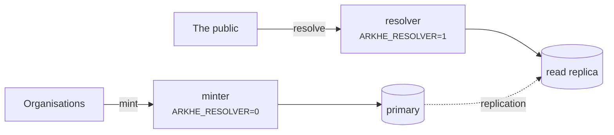
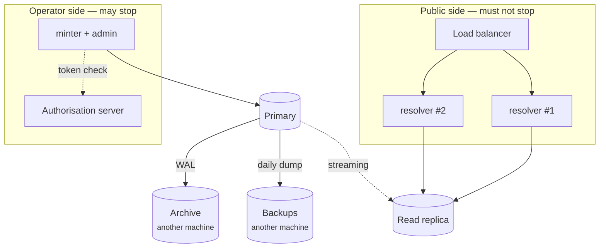

# Deployment

## The two roles



Run them as separate processes. **A minter has no resolution endpoint and a resolver
has no minting endpoint**, so you can scale resolution independently and point it at a
read-only role.

The asymmetry is deliberate: **resolution must never stop, minting may.** If the
authorization server is unavailable, no new tokens are issued and minting pauses —
resolution is unaffected, because it needs no authentication at all.

## Before going live

- [ ] `ARKHE_TOKEN_SECRET` and `ARKHE_SESSION_SECRET` generated, 32 bytes or more, not
      the ones in any example
- [ ] `ARKHE_SESSION_SECURE=true`, served over HTTPS
- [ ] Migrations **verified against PostgreSQL** — SQLite tolerates schemas it will reject
- [ ] `ARKHE_ADMIN_LOGIN` chosen; for `proxy`, the direct path to arkhe closed off
- [ ] `na_policy` set on each NAAN — the persistence statement is the promise you are
      making, and `??` publishes it
- [ ] Backups of the ledger. **Losing it breaks every identifier**, and NR means they
      cannot be recreated
- [ ] `arkhe check` passes

## Containers

The image is at the repository root; `compose/oidc` is a worked example with Keycloak
and PostgreSQL. Treat it as a demonstration, not a template: its secrets are in the
file in the clear and Keycloak runs in dev mode.

## Sizing

**These are measurements from one machine, not guarantees.** Take them as the shape of
the thing — what scales with what — and measure your own with `scripts/bench.py` and the
queries below.

Measured on: aarch64, 20 cores, PostgreSQL 17 in a container limited to 4 CPUs / 4 GB
with `shared_buffers=1GB`, **a ledger of one million ARKs (328 MB)**, uvicorn, load
generated on the same host.

### Resolution — the load that actually arrives

| | concurrency | rps | p50 | p95 | p99 |
| --- | --- | --- | --- | --- | --- |
| `302` to the target, 1 worker | 1 | 285 | 3.4 ms | 4.7 | 5.2 |
| `302` to the target, 1 worker | 8 | 372 | 19.8 ms | 34.8 | 53.5 |
| **`302` to the target, 4 workers** | 8 | **993** | 5.7 ms | 9.6 | 15.2 |
| `302` to the target, 4 workers | 32 | 1,078 | 18.3 ms | 37.1 | 56.8 |
| `?json` / `?info`, 1 worker | 8 | 304 | 24 ms | 41 | 60–66 |
| suffix passthrough, 1 worker | 8 | 291 | 25 ms | 42 | 62 |
| unknown NAAN → forwarded, 1 worker | 8 | 323 | 23 ms | 40 | 63 |

**Throughput follows the worker count** — 2.9× from one to four. The resolver holds no
state and only reads, so adding workers, then adding resolvers, is the first and second
lever.

**The size of the ledger does not show up here.** A resolution is one index scan on the
primary key (0.03 ms, 4 buffers); suffix passthrough asks for every ancestor in a single
`IN` and costs one more. A million rows resolve like a thousand.

For reference, `/healthz` — no database, no authentication — runs at 1,187 rps and
p50 0.78 ms on one worker. The remaining ~2.6 ms per resolution is application and
database work, of which the database layer (open a session, one query, close) is 0.6 ms.

### Minting — and why bulk is twenty times faster

| | rps | p50 |
| --- | --- | --- |
| `POST /api/mint`, one at a time | **45** | 82 ms |
| `POST /api/mint/bulk`, 1000 rows in one request | **~930 rows/s** | 1.06 s |

**What makes single minting slow is not the database — it is Argon2.** Verifying one API
key takes **53 ms**, which is most of the 82. That slowness is deliberate: it is what
makes a stolen-key search expensive, and it should not be tuned away.

It is also why **bulk minting is the only sane way to ingest at scale**: one
authentication amortised across a thousand rows. Ten thousand objects is eleven seconds
in bulk and four minutes one at a time.

The same applies to `oauth2`: issuing a token verifies `client_secret` with Argon2, so
fetch a token and **hold it until `expires_in` runs out** rather than per call.

### Memory

An arkhe process is about **100 MB resident**, whichever role it runs. PostgreSQL used
486 MB with a million ARKs and `shared_buffers=1GB`.

### What to run, at minimum and beyond

**Rather than a CPU and memory figure, the honest answer is a shape.**

**Minimum** — one small host: minter, resolver and PostgreSQL side by side. Everything
works; nothing is redundant. Fine for evaluation and for a ledger that is not yet
answering the public.

**Recommended** — the split the code already assumes:

- **the resolver, several workers and more than one host.** It is stateless and read-only,
  and it must keep answering when the minter or the authorisation server does not
- **the minter, separately.** Minting may stop; resolution may not
- **PostgreSQL with a replica**, and the resolver pointed at it with
  `ARKHE_READ_DATABASE_URL`
- Size the database so that **the primary-key index stays in memory** — 39 MB per million
  ARKs. Everything else is sequential enough not to matter

### The recommended shape, whole



**The asymmetry is the point.** The top half is open to anyone, needs no authentication
and writes nothing. The bottom half needs authentication, writes, and may stop.

### What keeps working when something fails

**Exercised**, by pointing a resolver at a `SELECT`-only role and driving every path.

| What failed | Resolution | Minting and admin |
| --- | --- | --- |
| minter | **continues** | stops |
| authorisation server (OIDC) | **continues** — resolution needs no authentication | stops (no new tokens) |
| primary database | **continues** (on the replica) | stops |
| read replica | continues once pointed at the primary | continues |
| global resolver (n2t) | **continues** — an unknown NAAN just gets a `302`; **nothing is fetched** | continues |
| every resolver | stops | continues |

**A resolver starts with no authentication configuration at all** — neither `ARKHE_AUTH`
nor `ARKHE_OIDC_ISSUER`. The admin interface and the minting endpoints **are not mounted**:
both answer `404`. So it cannot fall over with the authorisation server, and its attack
surface is small.

**It was also confirmed to write nothing.** An expired hold is decided against the clock
on each resolution, so **there is no write to lift it** — with only `SELECT` granted, the
inflections `?` `??` `?info` `?json`, the check digit, the forwarding, `/.well-known/ark`
and both health probes all work. That property is what makes pointing it at a replica
sound.

### How many to run

Working back from [the measurements](#resolution--the-load-that-actually-arrives):

| | Rough figure |
| --- | --- |
| one resolver process (4 workers) | **~1,000 rps** = 86 million a day |
| one resolver worker | ~300 rps |
| minter, one at a time | ~45 rps — **53 ms of which is Argon2**, and must stay slow |
| minter, 1000 in one request | ~930 a second |

**A repository's real resolution volume is nowhere near that.** You run two resolvers not
for throughput but so that **losing one does not stop resolution**. Decide the count from
redundancy, not from rps.

If minting is the bottleneck, **move callers to bulk** (twenty times faster). **What makes
one-at-a-time slow is not the database — it is one Argon2 verification per request.**

### Keep things apart

- **The WAL archive and the daily dumps belong on a different machine** from the database.
  What sits on the same one dies in the same accident (see [Backups](#backups)).
- **Resolvers hold no state.** Rebuild and replace them freely.
- If the admin interface should not be reachable from outside, `ARKHE_ADMIN_LOGIN=bearer`
  removes the login screen altogether.

### Measuring your own

```bash
# One endpoint, 3000 requests, 8 at a time
python scripts/bench.py http://127.0.0.1:8000/ark:99999/x9tn1qkq2g7 -n 3000 -c 8

# The ceiling of the stack: no database, no authentication.
# If your other numbers approach this, you are measuring the client
python scripts/bench.py http://127.0.0.1:8000/healthz -n 3000 -c 8

# Minting (the Argon2 cost is per request)
python scripts/bench.py http://127.0.0.1:8000/api/mint -n 200 -c 4 --post --auth "$KEY"
```

Capacity in bytes, and how to measure it against your own ledger, is in
[the data model](../reference/data-model.md#on-capacity).


## Backups

The ledger is the only irreplaceable thing here. An ARK that is lost cannot be minted
again — under NR, re-issuing the same name is precisely what is forbidden — so a lost
row is a permanently broken identifier.

Prefer a read replica for the resolver, so that a heavy read load never threatens the
primary.

### Daily and monthly

Take the dump in `pg_dump`'s custom format (`-Fc`): it is compressed, and `pg_restore`
can pick tables out of it.

```bash
# Daily. **Put it on another machine** — what sits on the same one dies in the same accident.
pg_dump -Fc -d "$ARKHE_DATABASE_URL" -f "arkhe-$(date +%Y%m%d).dump"
```

Start from **14 daily and 12 monthly**. A monthly copy is just the daily one taken on the
first of the month, so there is no second job to run. **A ledger only grows** — ARKs do
not go away — so plan for linear growth: around 40 GB at a hundred million, as an upper
marker (see [Data model](../reference/data-model.md#capacity)).

```cron
# 03:15 every day. Do not silence failures — discard the output and you never learn it stopped.
15 3 * * *  pg_dump -Fc -d "$ARKHE_DATABASE_URL" -f /backup/arkhe-$(date +\%Y\%m\%d).dump
20 3 1 * *  cp /backup/arkhe-$(date +\%Y\%m01).dump /backup/monthly/
30 3 * * *  find /backup -name 'arkhe-*.dump' -mtime +14 -delete
```

### A nightly dump is not enough here

**Once a day means losing up to 24 hours of identifiers.** In most systems that is an
ingest you re-run. **Not in this one**: minting the lost ARKs again is, from outside,
indistinguishable from breaking `NR`. **The names you handed out are already in the world,
whatever your database thinks.**

So for this ledger, continuous archiving is not a luxury:

```bash
# postgresql.conf
wal_level = replica
archive_mode = on
archive_command = 'test ! -f /archive/%f && cp %p /archive/%f'
```

A base backup (`pg_basebackup`) plus continuous WAL gets you **back to any point in time**.
Keep the daily dump underneath it as the floor — PITR cannot recover across a broken chain,
while a dump stands on its own.

```bash
pg_basebackup -D /backup/base -Fp -Xstream -c fast
```

To come back, put the base backup in place, **write the recovery settings, drop
`recovery.signal` and start**:

```bash
cp -a /backup/base /var/lib/postgresql/data
cat >> /var/lib/postgresql/data/postgresql.conf <<'CONF'
restore_command = 'cp /archive/%f %p'
recovery_target_action = 'promote'
CONF
touch /var/lib/postgresql/data/recovery.signal
pg_ctl -D /var/lib/postgresql/data start
```

**Naming no target is the default, and the right one.** With nothing set, recovery replays
to the end of the WAL — **the fewest identifiers lost**. `recovery_target_time` is for
undoing one specific bad operation, nothing else.

### Rewinding loses identifiers out of the ledger

**This is the hazard peculiar to this system.** Put `recovery_target_time` in the past and
every ARK minted after it leaves the ledger. **They did not leave the world.**

What the rehearsal below showed is that **the ledger does not know what it lost**:

| | After rewinding |
| --- | --- |
| the `ark` row | gone |
| `mint_receipt` | **rolls back with it** |
| `ark_change` | **rolls back with it** |
| `audit_event` | **rolls back with it** |
| `withdrawn_name` (never assigned again) | **not written** |

So a name you handed out answers `404` forever, and it also **reverts to looking as though
it was never used** — it is in neither of the two places that make `NR` hold. You cannot
even tombstone it: there is nothing left to tombstone.

Therefore:

- **Default to the end of the WAL.** Pick a target only when there is an operation to undo.
- **If you did rewind, reconcile what was handed out from outside the ledger** — the
  caller's own records, or the front-end access log. Nothing inside survived.
- Put those names back with **import, not minting** (`POST /api/import`). Returning a name
  to the same object is not an NR violation; **minting it afresh is.**

### Restoring

**You only know it comes back when you bring it back.** These steps are **exercised**, on
PostgreSQL 17 with `pg_dump -Fc` and `pg_restore`.

```bash
createdb arkhe
pg_restore -d arkhe --no-owner --no-privileges arkhe-YYYYMMDD.dump
```

`--no-owner --no-privileges` is there because **the role names on the far side are usually
not the ones you dumped from**; without it the restore stops trying to reassign ownership.

### Proving the restore worked

**Matching row counts prove nothing.** The counts can agree while every target has moved,
and then every identifier is broken. Check **four** things:

```bash
# 1. The schema version agrees (upgrade if you restored an older dump)
psql -d arkhe -tAc "SELECT version_num FROM alembic_version"
uv run alembic check

# 2. **A fingerprint over ARK, target and publication state.** If this matches, the
#    identifiers survived.
psql -d arkhe -tAc "SELECT md5(string_agg(ark||'|'||url||'|'||
  coalesce(published_at::text,'-'), ',' ORDER BY ark)) FROM ark"

# 3. **It actually resolves.** Start a resolver and ask it.
#    (The default process is the minter and **has no resolution endpoint** — do not read
#     that 404 as a failed restore.)
ARKHE_RESOLVER=1 uvicorn arkhe.app:app   # then: curl -sI localhost:8000/ark:/…

# 4. **It can still be written to.** If the sequences did not come back, the next mint
#    collides on the primary key.
arkhe stat && psql -d arkhe -tAc "SELECT last_value FROM shoulder_id_seq"
```

**Two and four are the real ones.** One and three announce themselves when they fail; **a
drifted fingerprint and a reset sequence pass quietly** — you find out after an identifier
has pointed at something else.

## Behind a proxy

Set `ARKHE_RAW_URI_HEADER` if the front end can pass the raw request URI. Without it a
bare `?` — the brief-metadata inflection — cannot be distinguished from no query
string at all. That is a protocol-level limitation, not an implementation one.

## Pinned dependencies

`uv.lock` records **the versions actually installed**. The declarations in
`pyproject.toml` carry only lower bounds, so without the lock **the same commit builds
into something different** each time — the image changes under a rebuild, and "when did
this break" becomes unanswerable.

```bash
uv sync --frozen --extra app --extra dev   # install exactly what the lock says
uv lock                                    # update it, deliberately
```

`--frozen` **fails if the lock and `pyproject.toml` disagree**, which is what you want:
passing while they disagree is worse. The checks (`scripts/check.sh`) and the image
build both use it.

**No upper bounds.** With a lock they are unnecessary, and they make the package harder
to live with as a dependency. The declaration answers "what range does this work
with"; the lock answers "what is it running on now" — different questions, so both are
kept.

Dependabot proposes updates weekly, grouped. **Pinning is not permission to stop
looking**: left alone, a pinned tree keeps running with vulnerabilities that have
already been fixed elsewhere.

## Sharing the work across several arkhe

Once instances are split per site or per namespace, the rules move from the code into
the hands of the operators — **no shoulder minted in two places**, **one authoritative
ledger per NAAN**. How to choose an arrangement, and what goes wrong, is in
[Running several arkhe](federation.md).
