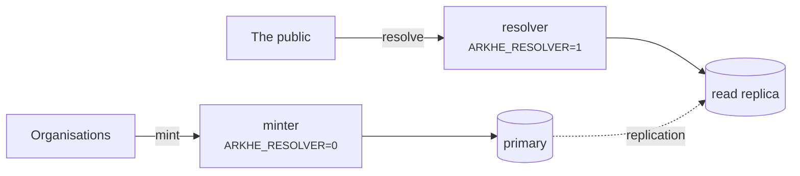

# Deployment

## The two roles



Run them as separate processes. **A minter has no resolution endpoint and a resolver
has no minting endpoint**, so you can scale resolution independently and point it at a
read-only role.

The asymmetry is deliberate: **resolution must never stop, minting may.** If the
authorization server is unavailable, no new tokens are issued and minting pauses —
resolution is unaffected, because it needs no authentication at all.

## Before going live

- [ ] `ARKHE_TOKEN_SECRET` and `ARKHE_SESSION_SECRET` generated, 32 bytes or more, not
      the ones in any example
- [ ] `ARKHE_SESSION_SECURE=true`, served over HTTPS
- [ ] Migrations **verified against PostgreSQL** — SQLite tolerates schemas it will reject
- [ ] `ARKHE_ADMIN_LOGIN` chosen; for `proxy`, the direct path to arkhe closed off
- [ ] `na_policy` set on each NAAN — the persistence statement is the promise you are
      making, and `??` publishes it
- [ ] Backups of the ledger. **Losing it breaks every identifier**, and NR means they
      cannot be recreated
- [ ] `arkhe check` passes

## Containers

The image is at the repository root; `compose/oidc` is a worked example with Keycloak
and PostgreSQL. Treat it as a demonstration, not a template: its secrets are in the
file in the clear and Keycloak runs in dev mode.

## Backups

The ledger is the only irreplaceable thing here. An ARK that is lost cannot be minted
again — under NR, re-issuing the same name is precisely what is forbidden — so a lost
row is a permanently broken identifier.

Back up the database, verify a restore, and prefer a read replica for the resolver so
that a heavy read load never threatens the primary.

## Behind a proxy

Set `ARKHE_RAW_URI_HEADER` if the front end can pass the raw request URI. Without it a
bare `?` — the brief-metadata inflection — cannot be distinguished from no query
string at all. That is a protocol-level limitation, not an implementation one.

## Pinned dependencies

`uv.lock` records **the versions actually installed**. The declarations in
`pyproject.toml` carry only lower bounds, so without the lock **the same commit builds
into something different** each time — the image changes under a rebuild, and "when did
this break" becomes unanswerable.

```bash
uv sync --frozen --extra app --extra dev   # install exactly what the lock says
uv lock                                    # update it, deliberately
```

`--frozen` **fails if the lock and `pyproject.toml` disagree**, which is what you want:
passing while they disagree is worse. The checks (`scripts/check.sh`) and the image
build both use it.

**No upper bounds.** With a lock they are unnecessary, and they make the package harder
to live with as a dependency. The declaration answers "what range does this work
with"; the lock answers "what is it running on now" — different questions, so both are
kept.

Dependabot proposes updates weekly, grouped. **Pinning is not permission to stop
looking**: left alone, a pinned tree keeps running with vulnerabilities that have
already been fixed elsewhere.

## Sharing the work across several arkhe

Once instances are split per site or per namespace, the rules move from the code into
the hands of the operators — **no shoulder minted in two places**, **one authoritative
ledger per NAAN**. How to choose an arrangement, and what goes wrong, is in
[Running several arkhe](federation.md).
