# 分散して運用する

複数の arkhe を並べて、1 つの体系を分担する構成。**分けてよいのは名前空間であって、
1 つの名前空間の権威ではない。** 同じ名前を 2 か所が採番できる形にした時点で、この基盤が
守っている唯一の約束——**一度配った名前が別のものを指さない**——が壊れる。

**公開できないデータに識別子を付ける構成も、ここに含まれる。** 閉じた環境に置いた arkhe と、
外から見える上位の arkhe をどう組むか——[クローズド PID とオープン PID](#pid) は、その
実装のかたちを台帳とコマンドの形で書いてある。

arkhe は台帳をまたいだ調整をしない。合意も、レプリケーションによる多重書き込みも
持たない。**分散は「排他的に切り分けた名前空間」だけで作る。** これは実装の手抜きでは
なく、分散合意で採番の一意性を守る設計よりも、切り分けのほうが**壊れ方が浅い**からである
——切り分けは設定の誤りが見えるが、合意の失敗は静かに二重採番になる。

## 四つの形

**先に全体を見ておく。** 詳しくは下で 1 つずつ扱う。

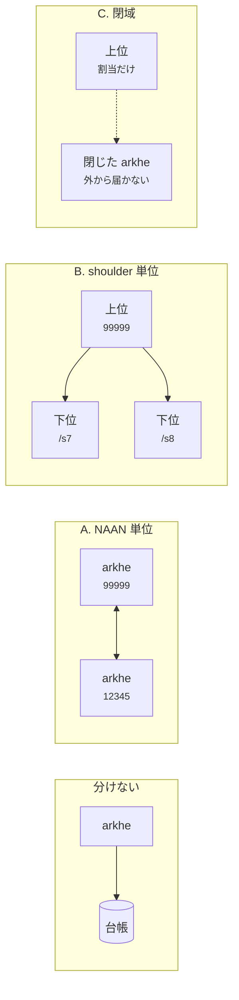

**縦に並ぶ（B・C）か、横に並ぶ（A）か。** 縦は NAAN を 1 つに保てるが上位が単一障害点になり、
横は互いに独立だが識別子の見た目が拠点で変わる。C は縦のうち、**下位に届かない**場合である。

## 分ける理由から決める

| 分けたい理由 | 取る構成 |
| --- | --- |
| 解決の読み負荷が重い | **分けない。** resolver を増やして読み取りレプリカに向ける |
| 障害を分けたい／運用主体が別 | [A. NAAN 単位](#a-naan)。台帳が完全に独立する |
| 識別子の見た目を揃えたい／NAAN を増やせない | [B. shoulder 単位](#b-shoulder-naan-1) |
| ネットワークが閉じている（機微なデータ） | [C. 閉域の arkhe を下に置く](#c-arkhe) |
| 相手と関係を持たない | [D. 何も繋がない](#d-n2t)。未知 NAAN は n2t に任せる |

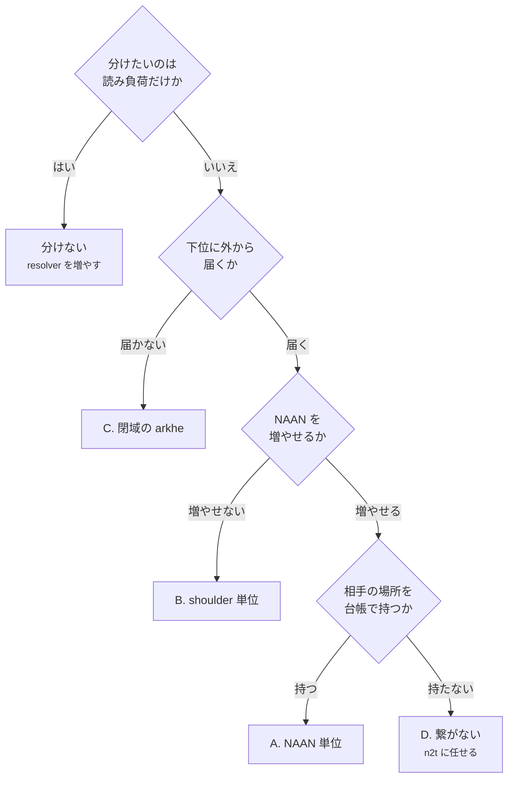

**最初に確かめるのは「分けないで済むか」である。** 台帳が 1 つなら、一覧も監査も
`?info` も 1 か所で答えられる。分けた瞬間に、それらは分かれたまま戻らない。

```mermaid
flowchart LR
    U[誰でも] --> R1["resolver ×n<br/><small>ARKHE_RESOLVER=1</small>"]
    O[組織] --> M1["minter<br/><small>ARKHE_RESOLVER=0</small>"]
    M1 --> DB[(台帳)]
    R1 --> RO[(レプリカ)]
    DB -.-> RO
```

読み負荷は[デプロイ](deployment.md)の範囲で片づく。以下は**運用の主体を分けたいとき**の話。

## A. NAAN 単位で分ける {#a-naan}

拠点ごとに NAAN を持ち、それぞれが自分の NAAN に権威を持つ。互いは
`is_authoritative=false` の NAAN として登録し合う。

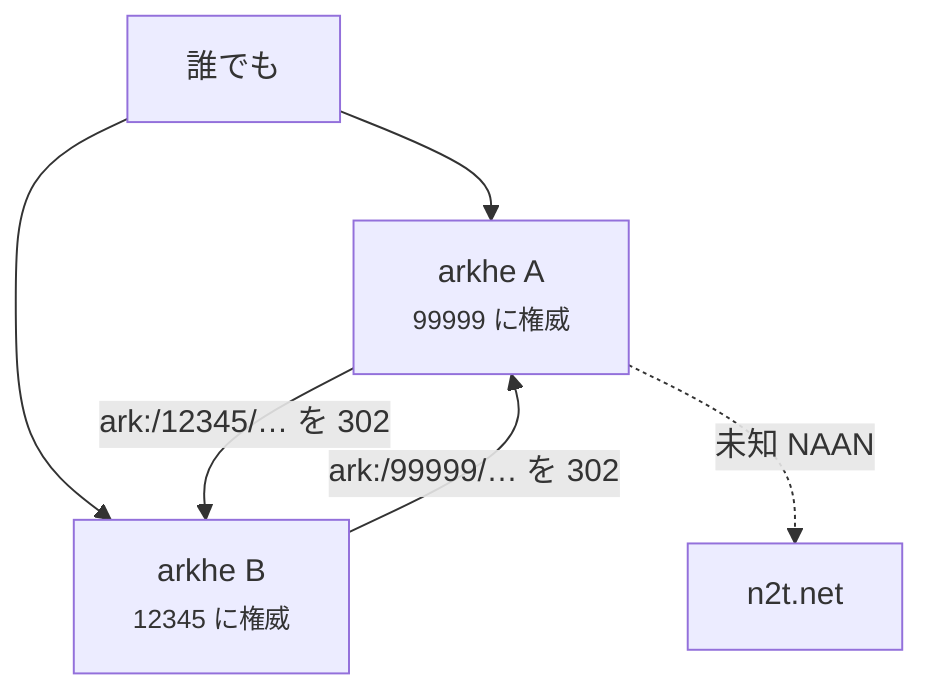

```bash
# A 側。B の NAAN を「権威は持たないが行き先は知っている」として登録する
arkhe naan add 12345 "拠点 B" --no-authoritative --redirect https://ark.b.example.ac.jp
```

**利点。** 台帳も権限も障害も完全に分かれる。相手が落ちても自分の NAAN は答え続ける
（相手の NAAN は 302 の先が死ぬだけで、こちらの解決は成立している）。

**代償。**

- **NAAN の取得が要る。** これは arkhe の外の手続きで、[はじめて立ち上げるとき](onboarding.md)にある。
- **識別子の見た目が拠点で変わる。** そして[承継は NAAN を跨げない](succession.md)
  ——組織が拠点 A から B へ移っても、既存の ARK は A の NAAN のまま A が解決し続ける。
  拠点をまたぐ組織の移動は、承継ではなく**離脱と受け入れ**になる。
- **相手の登録は手で保つ。** 相手のリゾルバの URL が変わったら、こちらの台帳を直す人が要る。
  登録しない選択（[D](#d-n2t)）もあり、そのときは n2t が引き受ける。

## B. shoulder 単位で分ける（NAAN は 1 つ） {#b-shoulder-naan-1}

**NAAN は上位が 1 つ保有し、shoulder を切り出して下位の arkhe に渡す。** 委譲の構造を
組織ではなく**別の arkhe**に対して行う、というだけのことである
（[委譲の構造](../concepts/delegation.md)）。

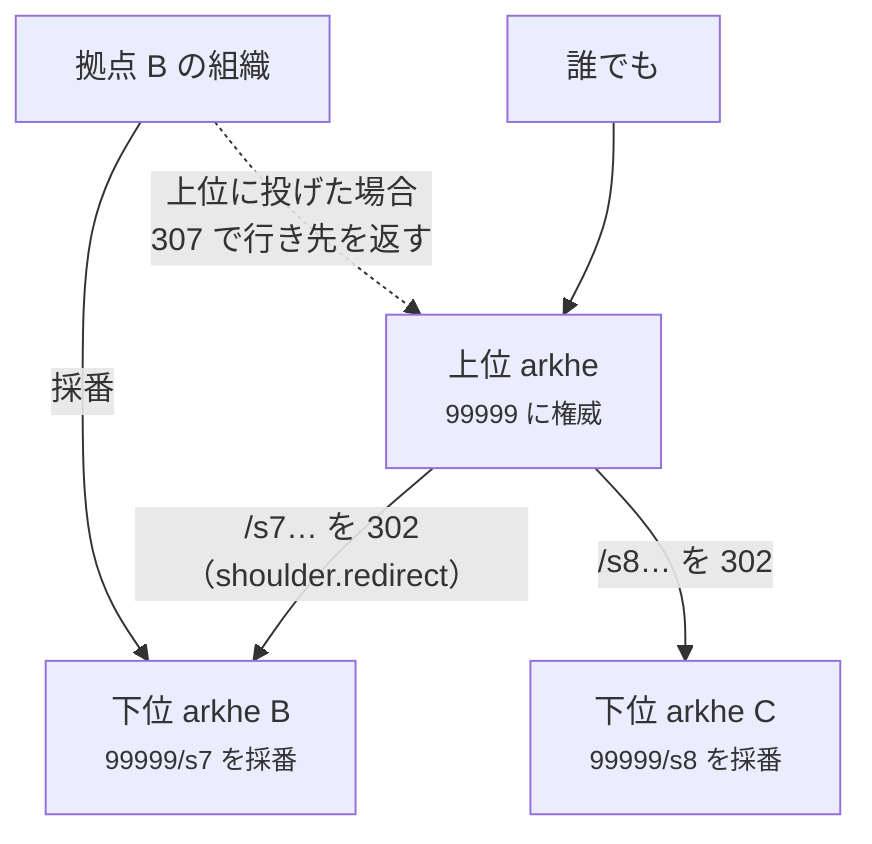

上位の台帳:

```bash
arkhe shoulder add 99999 /s7 --note "拠点 B へ委譲"
arkhe shoulder status <id> delegated --minter https://ark.b.example.ac.jp
# 解決の委譲（shoulder.redirect）は管理画面から設定する。CLI にはまだ無い
#   → 台帳 › shoulder › 解決の委譲: 303 https://ark.b.example.ac.jp/ark:/$id
```

下位の台帳:

```bash
arkhe naan add 99999 "（上位と同じ NAAN）"      # 権威を持つ側として登録する
arkhe onboard 99999 "拠点 B の組織" --shoulder /s7
```

採番と解決は、**別のホップの数**になる。

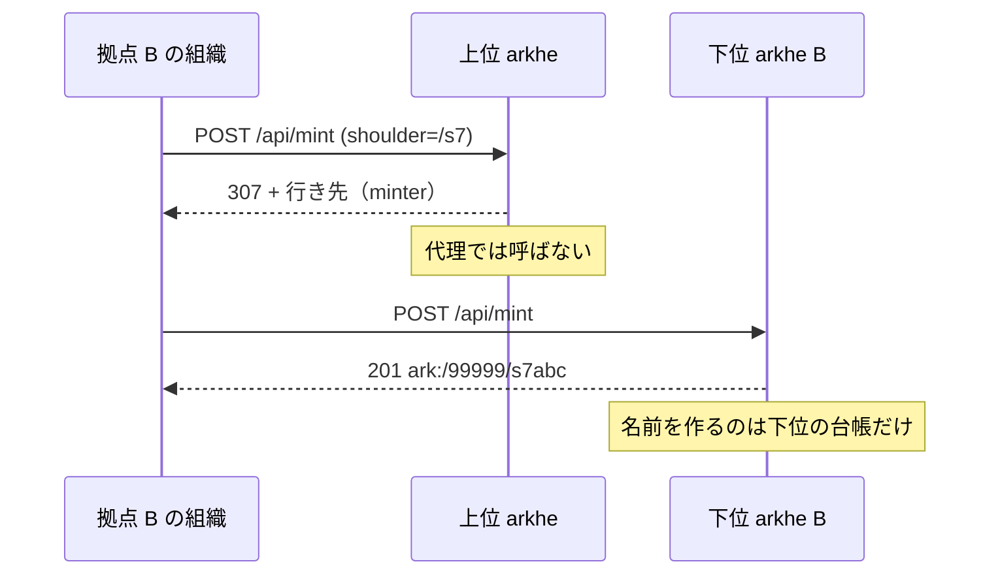

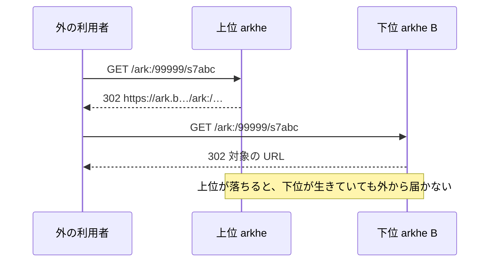

**採番はプロキシしない。** 上位に来た採番要求は `307` と行き先だけを返す
（`ShoulderDelegated`）。代理で呼ぶと、応答が失われたときに**どちらの台帳にも
持ち主のいない ARK** が残りうる。NR を宣言する体系でそれは取り返しがつかない。

### 上位を通る解決が、どこで落ちるか

上位のリゾルバは[この順](../reference/data-model.md)で判断する。**順序が結論を決める**ので、
委譲を組む前に見ておく価値がある。

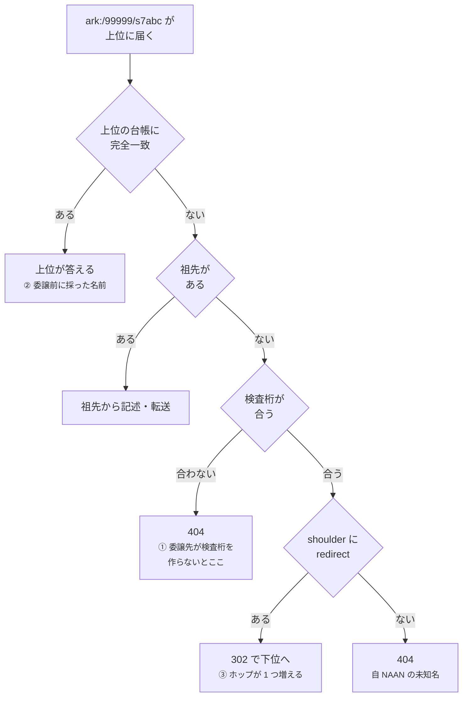

1. 完全一致 — **上位の台帳にその名前があれば、上位が答える**
2. 祖先 passthrough
3. `is_authoritative` なら**検査桁の検証**。合わなければ `404`
4. shoulder の `redirect` があれば `302` で下位へ
5. 無ければ `404`（自 NAAN の未知名は「無い」と言える）

ここから 3 つ出てくる。

**① 委譲先も検査桁を作らなければならない。** 3 が 4 より先にあるので、下位が
NOID＋検査桁でない名前を採ると、**上位経由の解決だけが 404 になる**（下位に直接来た
要求は通る——いちばん見つけにくい壊れ方である）。arkhe 同士なら採番規則が同じなので
自動的に満たす。**他実装に委譲するときだけ**問題になり、そのときの選択肢は
「相手に検査桁を作らせる」か「上位の NAAN の `is_authoritative` を落とす」の 2 つ。
後者は NAAN 全体の属性なので、**その NAAN について「無い」と言う力を全部失う**
——shoulder ごとには落とせない。

**② 途中から委譲すると、名前が 2 か所に分かれる。** 1 が 4 より先なので、委譲前に
上位で採った名前は上位が答え、それ以降の名前は下位へ流れる。解決は正しく続くが、
**一覧と監査はその日を境に割れる**。分けるのは未来の名前だけで、既に配った名前は
移せない。

**③ ホップは増える。** 上位が落ちれば、下位が生きていても外からは解決できない。
**深さは 2 まで**にする。A→B→A のような循環はループになり、arkhe は検知しない。

### 何が上位に残り、何が下位に移るか

| | |
| --- | --- |
| NAAN・`na_policy`（`??` の答え） | **上位。** 永続性の宣言は NAAN の保有者の約束である |
| 名前空間の割当（どの shoulder を誰に） | **上位。** 排他はここでしか作れない |
| 個々の ARK・行き先・記述 | **下位。** 上位は知らない |
| 主体と資格情報 | **各台帳。** 到達範囲は登録の属性なので共有されない |
| 監査 | **各台帳。** 全体を辿るには集める |

主体が共有されないのは意図的である。到達範囲を台帳の外から持ち込めるようにすると、
[「リクエストで広がらない」](../concepts/invariants.md)が成立しなくなる。共通の認可サーバを
置けば**身元**は共有できるが、**届く範囲**は各台帳への登録で決まる。

## C. 閉域の arkhe を下に置く {#c-arkhe}

下位の arkhe が閉じた環境にあり、外から届かない構成。**上位が把握するのは名前空間の
割当と、外に見せてよい行き先だけ**で、中の名前も対象も知らない。

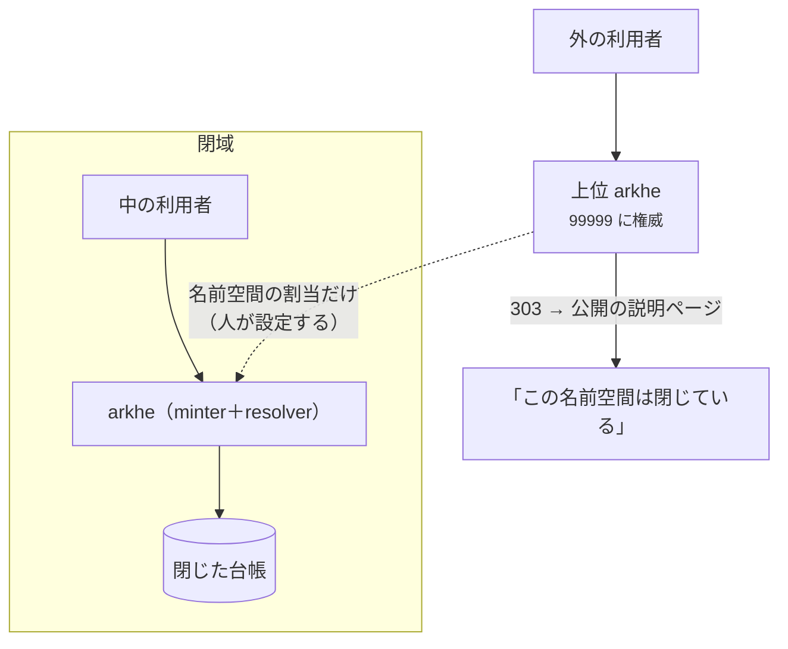

**閉域では、行き先そのものが機密になりうる。** ここが他のパターンと違う。

- **上位の `redirect` に内部 URL を書かない。** `302` で内部ホスト名を返すと、
  到達できない相手にもホスト名は届く。`303 https://…/closed-namespace` のように
  **公開の説明ページ**へ向ける（`shoulder.redirect` は先頭にステータスコードを書ける）。
- **`minter` も公開される。** `/.well-known/ark` は委譲した shoulder とその `minter` を
  機械可読で出す。閉域の minter URL をそのまま書けば、それも外に出る。
  外から使えない案内でもあるので、書くなら**説明ページの URL**にする。
- **上位からの `307` 委譲は成立しない。** 外の利用者が閉域の minter に到達できないため。
  閉域の利用者は閉域の arkhe を直接叩く。上位の shoulder を `delegated` にする意味は、
  **上位でその名前空間が採番されないこと**を台帳と制約で保証する点にある。

### 上位が「その識別子は存在する」と言えるか

言えるのは、**上位で採番した場合だけ**である。arkhe には**外で採番された名前を取り込む
口が無い**——`/api/mint` は名前を生成し（呼び出し側は名前を選べない）、`/api/register` は
**既存 base の修飾子**を足すためのものだから。したがって選択肢は 2 つ。

**C-1. 上位で先に採り、閉域に払い出す。** 上位で `ark:mint` して `url` を空のままにする。
上位は名前と記述を持ち、行き先は持たない——リゾルバは転送ではなく**記述を返す**（D6）。
対象に到達できなくても記述は答えられるという形は、tombstone や FAIR A2 と同じで、
**制限公開そのものを表現できる**。閉域側は台帳を持たず、払い出された名前と中の対象の
対応だけを持つ。

- 外に出る情報は、**運用者が明示的に選んで上位に入れた記述だけ**になる。
- 閉域から上位への自動同期を作らないこと。作れば、いつか機微な行き先が上位の
  `?info` に出る。**出ない仕組みではなく、出す道が無い状態**を保つほうが強い。

**C-2. 上位は名前を知らない。** shoulder ごと委譲し、外からは「その名前空間は閉じている」
以上のことは分からない。**上位が持つのは割当の事実だけ**で、いちばん漏れない。
代わりに、外からは正当な識別子と誤記の区別がつかない（どちらも同じ説明ページに着く）。

外から同じ識別子を引いたとき、**返るものが違う**。

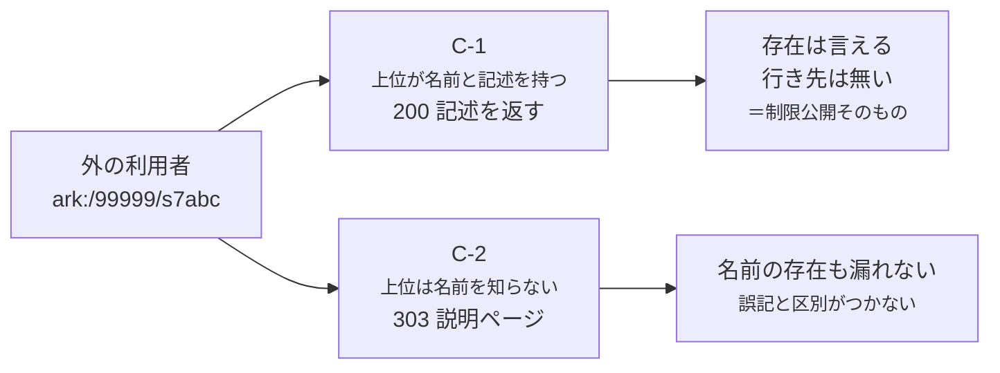

境界を越えるものも違う。**C-1 で上へ渡るのは、運用者が手で入れた記述だけ**である。

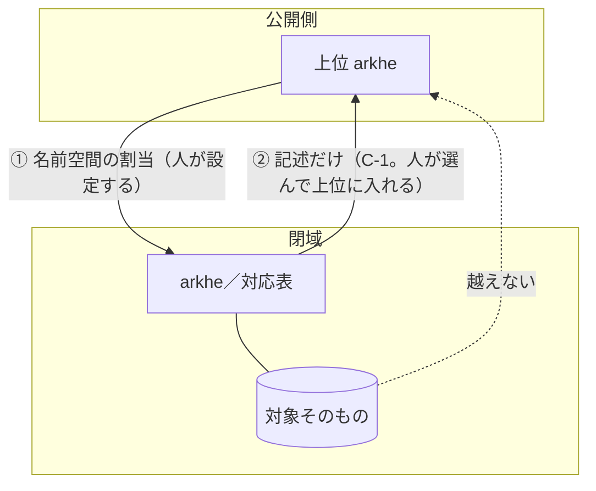

**機微さが「対象」にあるなら C-1、「名前が存在すること」にもあるなら C-2。**
迷ったら C-2 から始める——後から C-1 に寄せることはできるが、一度外に出した記述は
取り消せない。

## クローズド PID とオープン PID {#pid}

**同じ NAAN の中に、公開の識別子と閉じた識別子を並べて置く。** 分けるのは shoulder であって、
**識別子の形は分けない**——`ark:/99999/…` のままにしておくことが、この構成の目的そのものである。

### なぜ形を分けないのか

機微なデータは、**いつか公開になる**。禁止期間が明け、匿名化が済み、論文が出る。そのときに
識別子が変わる設計だと、**閉じていた間に配った参照が全部死ぬ**——申請書にも、審査の記録にも、
共同研究者との連絡にも、その識別子は既に書かれている。

形が同じなら、公開は**行き先の付け替え 1 回**で済む。ARK が「永続性は文字列の性質ではなく
サービスの問題」と言っているのは、まさにこの操作ができることを指している。

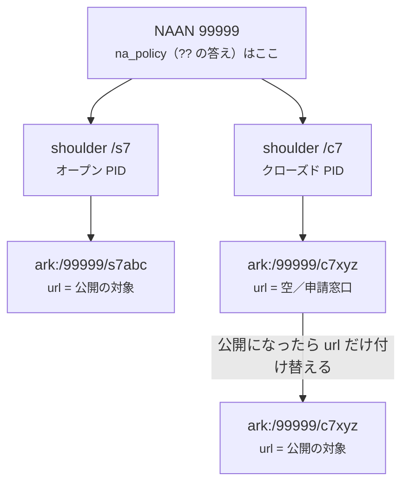

**右下の 2 つは同じ識別子である。** 行も、名前も、shoulder も変わっていない。変わったのは
行き先だけで、それは `ArkChange` に before/after が残る——**NR を宣言したまま公開に移せる**
のは、変えたのが名前ではないからである。

### 外から何が見えるか（3 段）

| 段 | 公開側の台帳が持つもの | 外から `ark:/…` を引くと | 使いどころ |
| --- | --- | --- | --- |
| **見せない** | 名前を持たない（[C-2](#c-arkhe)） | `303` 説明ページ | **存在すること自体が機微** |
| **記述だけ** | 名前と記述、`url` は空 | **`200` 記述を返す**（D6） | 目録は公開、実体は非公開 |
| **窓口つき** | 名前と記述、`url` = 申請ページ | `302` 申請ページ | 申請すれば使える |

**現場でいちばん多いのは 3 段目**である。DOI で「データは申請制」と書かれた着地先と同じ形で、
arkhe では **`url` を申請フォームに向けるだけ**で作れる——新しい機能を要さない。

2 段目（`url` が空）が成立するのは、リゾルバが**転送先の無い ARK に対して記述を返す**（D6）
から。これは tombstone と同じ経路で、**「対象に到達できなくても記述は参照できる」**という
FAIR A2 の形そのものである。制限公開は、この基盤にとって例外ではなく既定の一部にあたる。

### 段は上げられるが、下げても戻らない

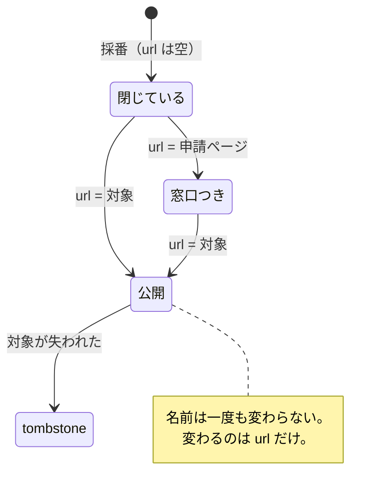

`url` を戻せば到達性は落とせるが、**一度公開した記述と行き先は取り消せない**。だから
**閉じている側から始める**——記述は後から足せるが、消せない。

### 実装イメージ

**A. 公開側で採番し、名前を閉域に払い出す**（[C-1](#c-arkhe)）。閉域から外向きの通信が要らず、
公開側が「その識別子は存在する」と言える。

```bash
# 台帳を組む（公開側の arkhe）
arkhe naan add 99999 "あなたの組織" --policy "NP | NR, OP, CC | 2026 | https://…/policy"
arkhe onboard 99999 "例示大学" --shoulder /s7          # オープン PID
arkhe shoulder add 99999 /c7 --manager 1 --note "クローズド PID（閉域の対象）"

# 採番する。url を入れない——リゾルバは転送ではなく記述を返す
curl -X POST https://ark.example.ac.jp/api/mint \
  -H 'Authorization: Bearer …' -H 'Content-Type: application/json' \
  -d '{"shoulder": "/c7",
       "what_title": "（外に出してよい範囲の題）",
       "commitment": "制限公開。利用には申請が要る",
       "url": ""}'
# → ark:/99999/c7xyz…

# 申請窓口を付ける（3 段目に上げる）
curl -X PUT …/api/update -d '{"ark": "ark:/99999/c7xyz…",
                              "url": "https://apply.example.ac.jp/dataset/…"}'

# 禁止期間が明けたら、実体へ向け替える。**識別子は変わらない**
curl -X PUT …/api/update -d '{"ark": "ark:/99999/c7xyz…",
                              "url": "https://repo.example.ac.jp/records/123"}'
```

閉域側は台帳を持たず、**払い出された名前と中の対象の対応だけ**を持つ。

**B. 閉域で採番する**（[C-2](#c-arkhe)）。閉域に arkhe を建て、公開側は `/c7` を `delegated` に
する。閉域が自律する代わりに、**公開側はその後の名前を知らない**——[外部で採番された ARK を
取り込む口が無い](#gaps)ためで、ここが現状のいちばん大きな制約である。

```bash
# 公開側: この名前空間では自分は採番しない、と台帳に刻む
arkhe shoulder status <id> delegated --minter https://ark.closed.example.ac.jp
# 解決の委譲は管理画面から: 303 https://ark.example.ac.jp/closed-namespace
#   （内部ホスト名を書かない。/.well-known/ark に載る）

# 閉域側: 同じ NAAN・同じ shoulder を、権威を持つ側として持つ
arkhe naan add 99999 "（上位と同じ NAAN）"
arkhe onboard 99999 "閉域の組織" --shoulder /c7
```

### arkhe がやらないこと

**アクセス制御はしない。** クローズド PID が「閉じている」のは**行き先が閉じているから**で
あって、arkhe が誰かを拒んでいるからではない。判定は対象側（リポジトリ）の仕事である。
ここに持ち込むと識別子基盤が認可基盤になり、**識別子は誰でも解決できるべき**という前提と
正面から衝突する——解決に認証を要さない設計は、そのために選んである。

**記述に何を書くかは運用が決める。** `?info` は認証を要さない公開の口なので、ERC の
who / what / when をそのまま入れると、**題名から中身が推測できる**ことがある。
**閉じた対象ほど、記述は短くする。**

**`??`（永続性宣言）は NAAN 単位である。** クローズドとオープンで別の約束を掲げることは
できない。組織ごとの水準は `arkhe manager commitment` で言い分けられるが、それは NAAN の
宣言を**狭める**方向にしか働かない。

## D. 何も繋がない {#d-n2t}

他所の NAAN を登録しない。未知の NAAN は `ARKHE_GLOBAL_RESOLVER`（既定 `https://n2t.net`）へ
`302` で取り次ぐ。**相手との関係を持たずに済む**のが利点で、相手のリゾルバが移っても
こちらに作業が発生しない。

代わりに、**未知 NAAN の `?info` は答えられない**（`404` を返す）。持っていない台帳の
記述を作り出すわけにはいかないため。

## 分散しても壊してはならないもの

これは方針ではなく、**分けた数だけ人が守ることになる**規則である。台帳が 1 つなら
コードが守っていたものが、分けた瞬間に運用の側に移る。

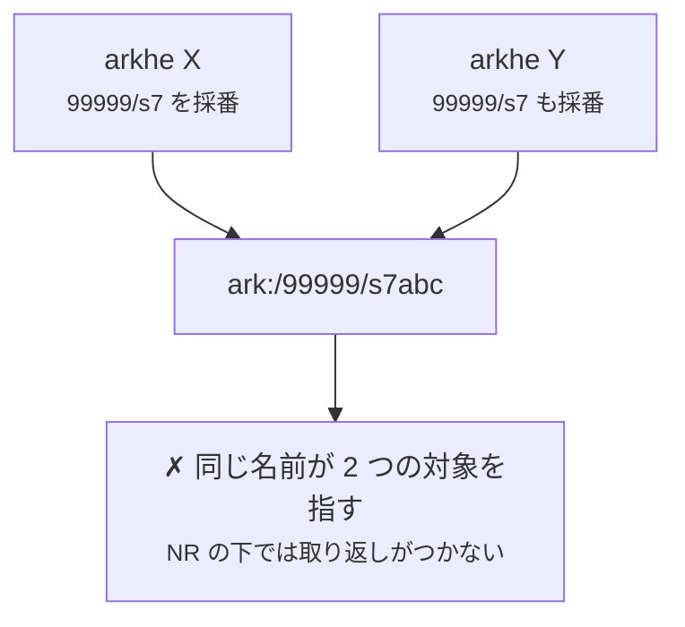

**これを防ぐ仕掛けは、分けた先には無い。** 1 つの台帳なら「採番が更新に化けない」は
コードが守っていたが、台帳が 2 つになると、**同じ shoulder を渡さない**という運用だけが
残る。

| | |
| --- | --- |
| **1 つの shoulder を採番する台帳は 1 つだけ** | 二重採番は同じ名前が別のものを指す最短経路。上位は委譲した shoulder を `delegated` にして、自分では採らない |
| **1 つの NAAN に権威を持つ台帳は 1 つだけ** | 「無い」と言えるのは 1 か所。2 か所が `is_authoritative` だと、片方が `404` と言い、もう片方が答える |
| **委譲は取り消せない** | `retired` に落とせても、下位が既に作った名前は消えない。解除が意味するのは**新規採番の停止**だけ |
| **下位の台帳も上位の責任範囲** | 下位が失われれば、その名前は上位からも解決できない。バックアップは拠点ごとに要り、**全体の可用性は最弱の拠点で決まる** |
| **循環を作らない** | ループは検知しない。深さ 2 まで |
| **監査は集めないと辿れない** | 各台帳は自分の操作しか記録しない |

## いま無いもの {#gaps}

**この構成を組むときに、無いと分かっていたほうがよいもの。** 隠して驚かせるより、
先に書く。

- **外部で採番された ARK を取り込む口。** 下位が採った名前を上位の台帳に載せる方法が
  ない（[C](#c-arkhe) の制約はここから来ている）。入れるなら、名前が委譲した shoulder の
  内側にあること・二重採番でないこと・検査桁が合っていることを、取り込みの時点で
  確かめる必要がある。
- **`shoulder.redirect` を設定する CLI。** 管理画面と `arkhe depart --resolver` からのみ。
  委譲の設定を自動化で組むなら、ここが引っかかる。
- **台帳をまたぐ一覧・監査・quota。** `/.well-known/ark` が公開するのは名前空間の割当までで、
  個々の ARK は含まない。
- **委譲先の健全性の監視。** 上位は下位が生きているかを知らない。委譲した shoulder の
  redirect 先を外形監視するのは運用の仕事になる。

## 組む前のチェックリスト

- [ ] **分けない構成で足りないことを確かめた**（読み負荷ならレプリカで済む）
- [ ] 分けた単位が**排他**である（同じ shoulder を 2 か所が採らない）
- [ ] `is_authoritative` を立てている台帳が、その NAAN について**1 つだけ**
- [ ] 委譲先が**検査桁つきの名前**を作る（arkhe 同士なら自動的に満たす）
- [ ] 上位から下位への `redirect` が**深さ 2 以内**で、循環していない
- [ ] `/.well-known/ark` に**出したくない URL が載っていない**（閉域なら特に）
- [ ] **各拠点でバックアップと復元を試した**——失った台帳は誰にも作り直せない
- [ ] 監査を集める手立てを決めた（少なくとも、どこに何が残るかを書いた）
