# Running several arkhe

Several arkhe instances sharing one identifier scheme. **What you may divide is the
namespace, never the authority over a single namespace.** The moment two ledgers can
mint the same name, the one promise this infrastructure keeps — **a name once handed
out never comes to mean something else** — is gone.

**Giving identifiers to data that cannot be published belongs here too.** How an arkhe
inside a closed network pairs with a publicly reachable one above it is written out as
ledgers and commands in [Closed PIDs and open PIDs](#pid).

arkhe does not coordinate across ledgers. There is no consensus and no multi-master
replication. **Distribution is built out of namespaces cut so they do not overlap.**
That is not laziness: a mis-cut namespace shows itself in the configuration, whereas a
failed agreement produces a silent double mint, and under NR silence is the expensive
failure.

## The four shapes

**See the whole landscape first**; each one is treated in turn below.

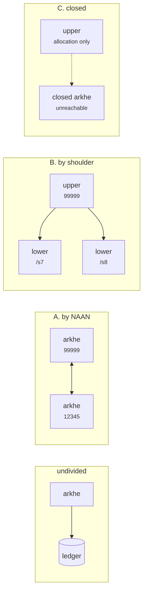

**Stacked (B, C) or side by side (A).** Stacking keeps a single NAAN but makes the upper
instance a single point of failure; side by side keeps the sites independent but the
identifiers look different per site. C is the stacked case where **the lower instance
cannot be reached**.

## Start from why you want to divide

| Reason | Configuration |
| --- | --- |
| Resolution read load | **Do not divide.** Add resolvers, point them at read replicas |
| Separate failure domains / separate operators | [A. by NAAN](#a-by-naan) — fully independent ledgers |
| Identifiers must look the same / no more NAANs available | [B. by shoulder](#b-by-shoulder-one-naan) |
| The network is closed (sensitive material) | [C. a closed arkhe underneath](#c-a-closed-arkhe-underneath) |
| No relationship with the other side | [D. connect nothing](#d-connect-nothing) — unknown NAANs go to n2t |

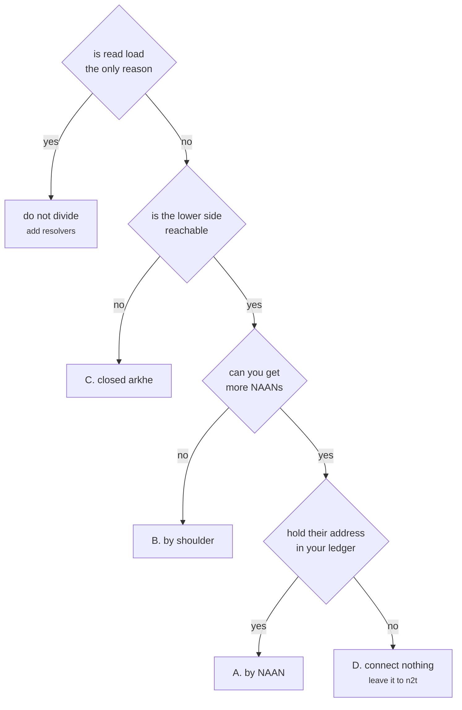

**First check whether you can avoid dividing at all.** With one ledger, listing,
auditing and `?info` are answered in one place. Divide, and they stay divided.

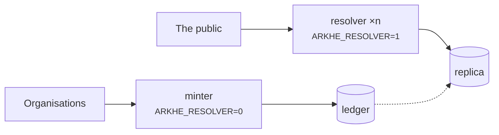

Read load is handled within [Deployment](deployment.md). What follows is about
**dividing who operates what**.

## A. Divide by NAAN {#a-by-naan}

Each site holds its own NAAN and is authoritative for it. Each registers the others as
NAANs it is *not* authoritative for.

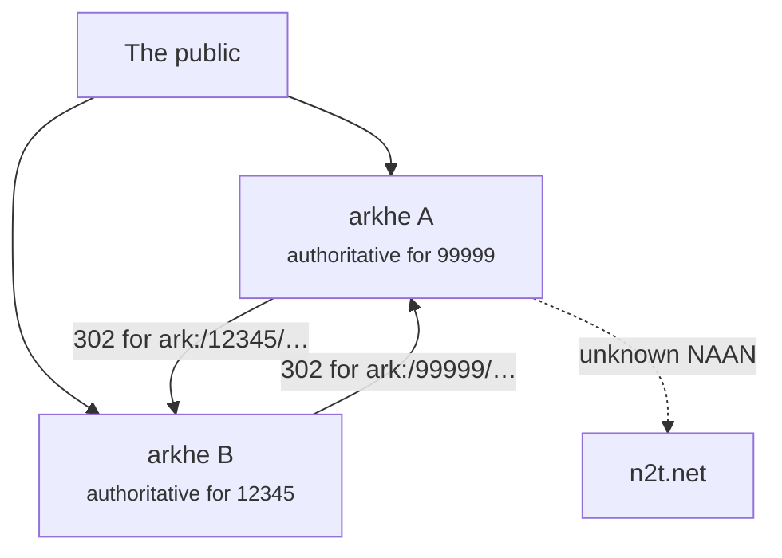

```bash
# On A: register B's NAAN as "not ours, but we know where it lives"
arkhe naan add 12345 "Site B" --no-authoritative --redirect https://ark.b.example.ac.jp
```

**What you gain.** Ledgers, permissions and failures separate completely. If the other
side goes down, your own NAAN keeps answering — only the target of a `302` is dead.

**What it costs.**

- **You need a NAAN.** That happens outside arkhe; see
  [Setting up for the first time](onboarding.md).
- **Identifiers look different per site**, and [succession cannot cross a
  NAAN](succession.md) — if an organisation moves from A to B, its existing ARKs stay
  under A's NAAN and A keeps resolving them. Moving between sites is not succession; it
  is a departure and an intake.
- **The other side's registration is maintained by hand.** If their resolver moves,
  someone has to edit your ledger. Not registering them at all ([D](#d-connect-nothing))
  is a legitimate choice; n2t then carries it.

## B. Divide by shoulder, one NAAN {#b-by-shoulder-one-naan}

**One NAAN, held above; shoulders cut out of it and handed to arkhe instances below.**
This is the delegation the system already has ([Delegation](../concepts/delegation.md)),
pointed at **another arkhe** rather than at an organisation.

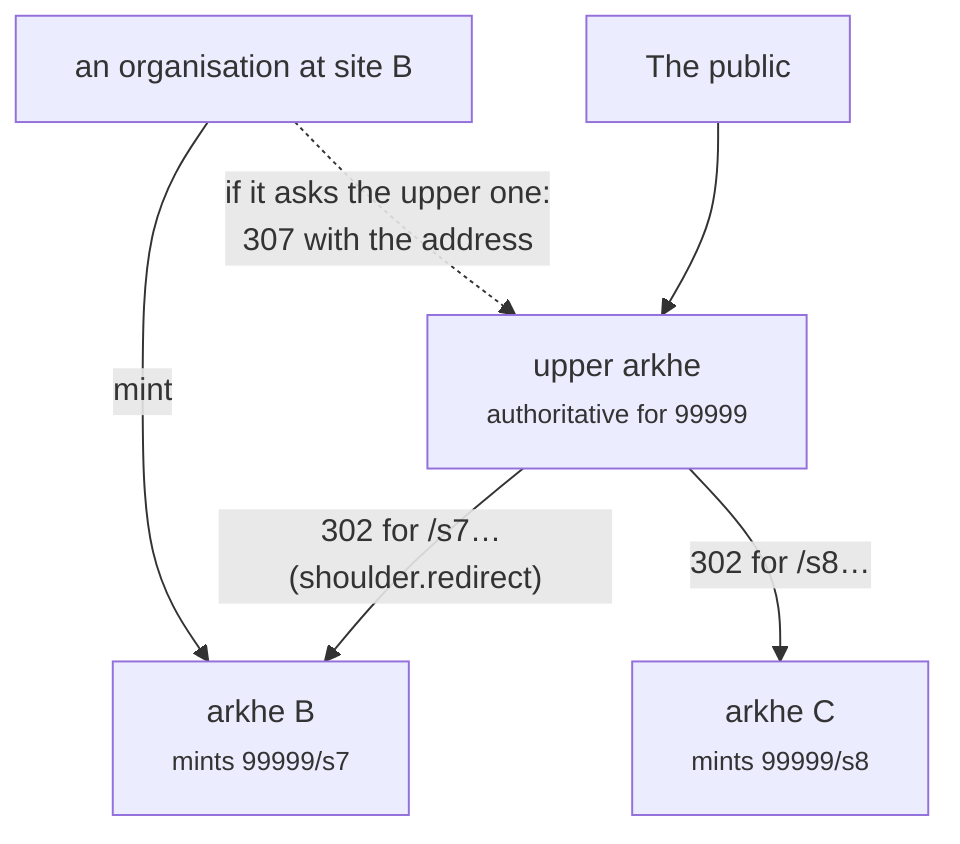

The upper ledger:

```bash
arkhe shoulder add 99999 /s7 --note "delegated to site B"
arkhe shoulder status <id> delegated --minter https://ark.b.example.ac.jp
# Resolution delegation (shoulder.redirect) is set from the admin interface;
# there is no CLI for it yet.
#   Ledger › shoulder › delegate resolution: 303 https://ark.b.example.ac.jp/ark:/$id
```

The lower ledger:

```bash
arkhe naan add 99999 "(the same NAAN as above)"     # registered as authoritative here
arkhe onboard 99999 "Site B organisation" --shoulder /s7
```

Minting and resolution differ in **how many hops they take**.

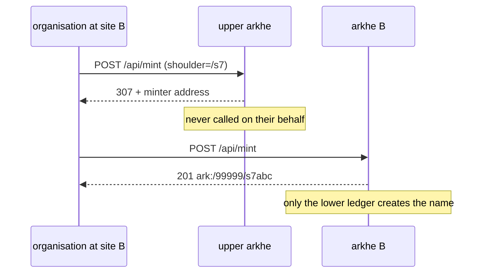

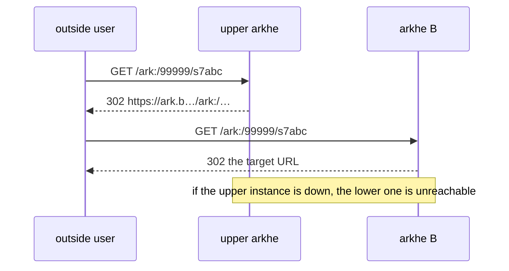

**Minting is never proxied.** A mint request that reaches the upper instance gets a
`307` and an address (`ShoulderDelegated`). Calling on someone's behalf means that a
lost response can leave **an ARK that neither ledger owns**. Under NR that cannot be
undone.

### Where resolution through the upper instance breaks

The upper resolver decides in [this order](../reference/data-model.md), and **the order
is what determines the outcome**, so it is worth reading before wiring a delegation.

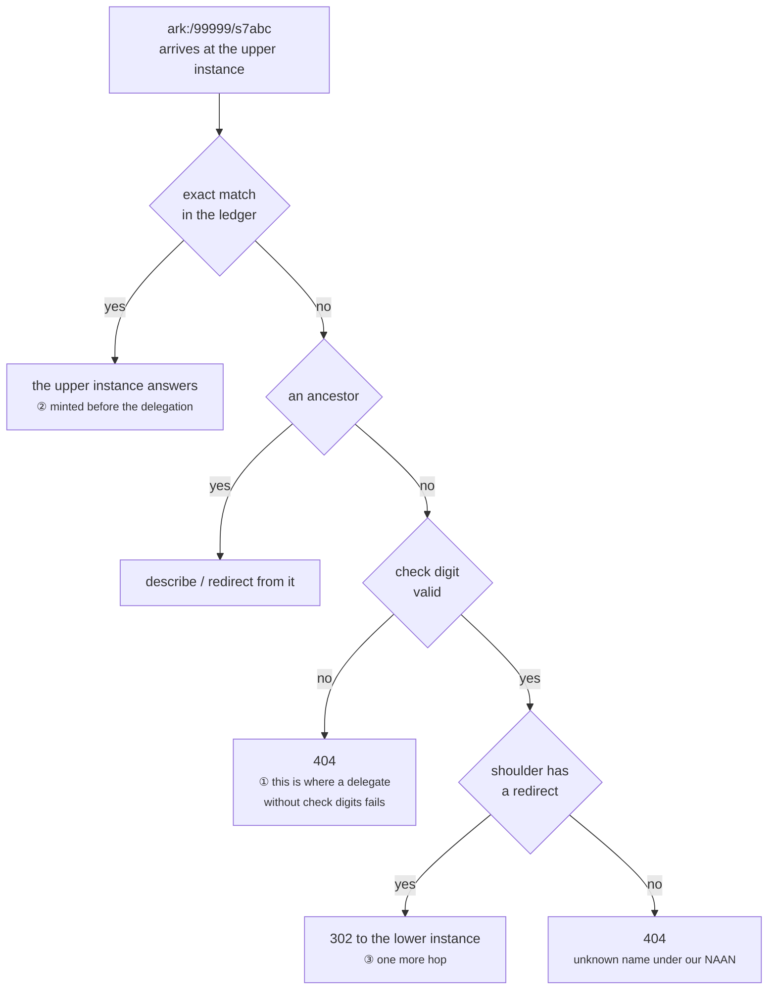

1. Exact match — **if the upper ledger has the name, the upper instance answers**
2. Ancestor passthrough
3. If `is_authoritative`, **verify the check digit**; a mismatch is `404`
4. If the shoulder has a `redirect`, `302` to the instance below
5. Otherwise `404` — an unknown name under our own NAAN can be said not to exist

Three consequences follow.

**① Whatever mints below must also produce check digits.** Step 3 precedes step 4, so a
name minted below without a NOID check digit **fails only through the upper instance**,
while requests that arrive at the lower one directly succeed — the hardest kind of
breakage to find. Two arkhe instances share the minting rule, so this is automatic
between them. It bites **only when delegating to another implementation**, and then
there are two options: make it produce check digits, or clear `is_authoritative` on the
NAAN above. The latter is a NAAN-wide attribute, so it **gives up saying "no such
identifier" for that whole NAAN** — it cannot be cleared per shoulder.

**② Delegating partway through splits the names across two ledgers.** Step 1 precedes
step 4: names minted above before the delegation are answered above, later ones flow
below. Resolution stays correct, but **listing and auditing split on that date**. Only
future names can be divided; names already handed out cannot be moved.

**③ There is one more hop.** If the upper instance is down, the lower one is
unreachable from outside even while healthy. **Keep the depth at two.** A→B→A is a
loop, and arkhe does not detect it.

### What stays above, what moves below

| | |
| --- | --- |
| The NAAN and `na_policy` (what `??` answers) | **Above.** The persistence statement is the NAAN holder's promise |
| Namespace allocation — which shoulder to whom | **Above.** Exclusivity can only be created here |
| Individual ARKs, targets, descriptions | **Below.** The upper ledger does not know them |
| Principals and credentials | **Per ledger.** Reach is a registration attribute, so it is not shared |
| Audit | **Per ledger.** Following the whole story means collecting it |

Not sharing principals is deliberate. If reach could be carried in from outside the
ledger, ["it does not widen on request"](../concepts/invariants.md) would no longer
hold. A shared authorization server can share **identity**; **reach** is still decided
by a registration in each ledger.

## C. A closed arkhe underneath {#c-a-closed-arkhe-underneath}

The lower arkhe sits inside a closed environment and cannot be reached from outside.
**What the upper instance holds is the namespace allocation and whatever target may be
shown publicly** — not the names inside, and not the objects.

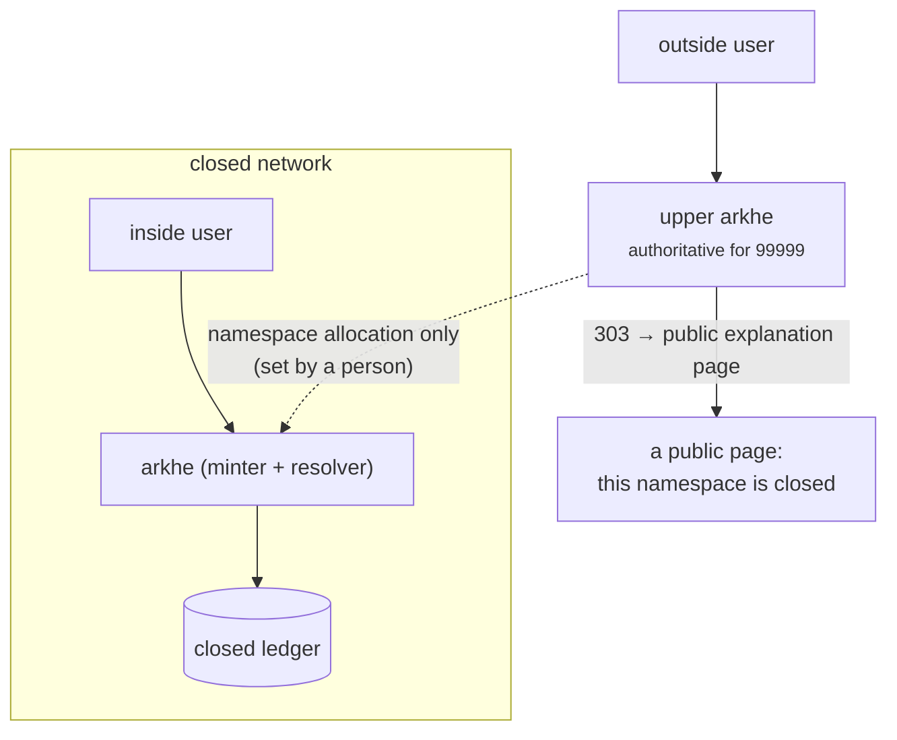

**In a closed setting the target itself can be confidential.** That is what makes this
pattern different from the others.

- **Do not put an internal URL in the upper `redirect`.** A `302` hands the internal
  hostname to people who cannot reach it. Point at a **public explanation page**
  instead — `shoulder.redirect` accepts a leading status code, e.g.
  `303 https://…/closed-namespace`.
- **`minter` is published too.** `/.well-known/ark` exposes delegated shoulders and
  their `minter` in machine-readable form. An internal minter URL written there leaves
  the closed network — and it is an address nobody outside can use anyway, so write the
  explanation page instead.
- **A `307` delegation from above does not work here**, because outside callers cannot
  reach the closed minter. Inside users call the closed arkhe directly. Marking the
  shoulder `delegated` above is still worth doing: it is what guarantees, in the ledger
  and in its constraints, that **the upper instance never mints in that namespace**.

### Can the upper instance say "this identifier exists"?

Only for names **it minted itself**. arkhe has **no endpoint for importing a name minted
elsewhere** — `/api/mint` generates the name (callers do not choose it) and
`/api/register` only adds a qualifier to an existing base. So there are two options.

**C-1. Mint above, hand the names down.** Mint on the upper instance and leave `url`
empty. The upper ledger then holds a name and a description but no target, and the
resolver **returns the description instead of redirecting** (D6). Being able to describe
what cannot be reached is the same shape as a tombstone, and as FAIR A2 — it expresses
**restricted access** directly. The closed side keeps no ledger, only the mapping from
the names it was given to the objects inside.

- What leaves the closed network is exactly **the description an operator chose to
  enter above**.
- Do not build an automatic sync upward. If you do, a confidential target will
  eventually appear in `?info`. **Having no path out is stronger than having a filter
  on the way out.**

**C-2. The upper instance does not know the names.** Delegate the whole shoulder; from
outside, nothing beyond "that namespace is closed" is visible. **All the upper ledger
holds is the fact of the allocation** — the least leaky arrangement. The cost is that
outsiders cannot tell a valid identifier from a typo; both land on the same page.

Pulling the same identifier from outside **returns different things**.

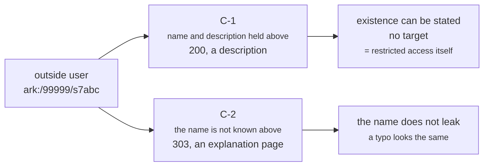

What crosses the boundary differs too. **In C-1 the only thing going up is a description
an operator typed in.**

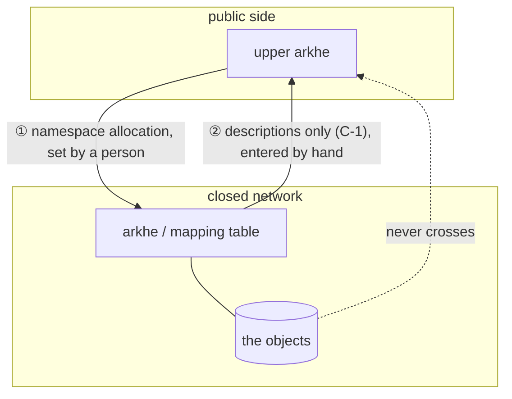

**If the sensitivity is in the object, C-1; if it extends to the existence of the name,
C-2.** When in doubt start at C-2 — you can move to C-1 later, but a description once
published cannot be withdrawn.

## Closed PIDs and open PIDs {#pid}

**Public and closed identifiers live side by side inside one NAAN.** What is divided is
the shoulder; **the shape of the identifier is not** — keeping it as `ark:/99999/…`
either way is the whole point of this arrangement.

### Why the shape must not differ

Sensitive data **becomes public eventually**: an embargo lifts, anonymisation finishes, a
paper comes out. If the identifier changes at that moment, **every reference handed out
while it was closed dies** — and it has already been written into applications, review
records and correspondence with collaborators.

If the shape is the same, publication is **one change of target**. When ARK says
persistence is a property of the service rather than of the string, this is the operation
it means.

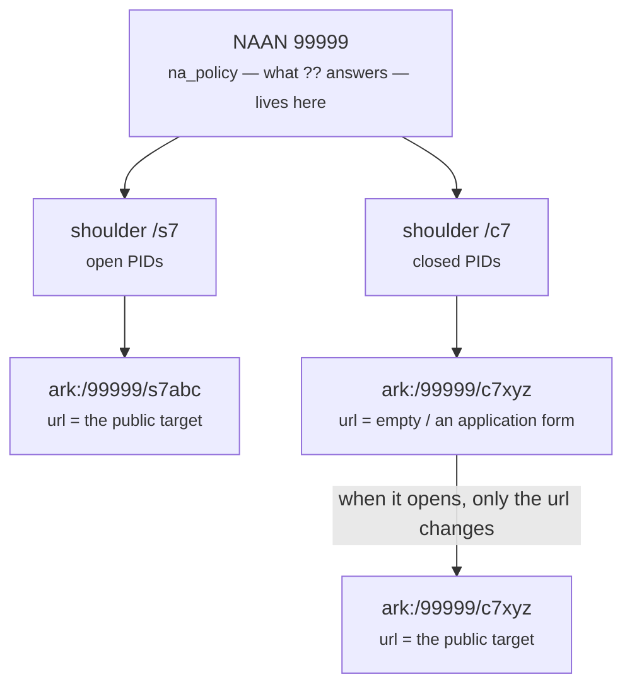

**The bottom two are the same identifier.** The row, the name and the shoulder are
untouched; only the target moved, and `ArkChange` keeps the before and after — **which is
why publication is compatible with a declaration of NR**: what changed was not the name.

### Three levels of what is visible

| Level | What the public ledger holds | Pulling `ark:/…` from outside | Where it fits |
| --- | --- | --- | --- |
| **Invisible** | no name at all ([C-2](#c-a-closed-arkhe-underneath)) | `303` to an explanation page | **existence itself is sensitive** |
| **Described** | name and description, `url` empty | **`200` and a description** (D6) | catalogue public, object not |
| **With a door** | name and description, `url` = application form | `302` to the form | available on request |

**The third is by far the most common in practice** — the same shape as a DOI landing on
"access on application" — and in arkhe it is built by **pointing `url` at the form**.
No new capability is involved.

The second works because the resolver **describes an ARK that has no target** (D6). That
is the same path a tombstone takes, and the same shape as FAIR A2: *metadata remains
referenceable when the data is not*. Restricted access is not an exception here; it is
part of the default behaviour.

### The level can be raised; lowering it does not undo anything

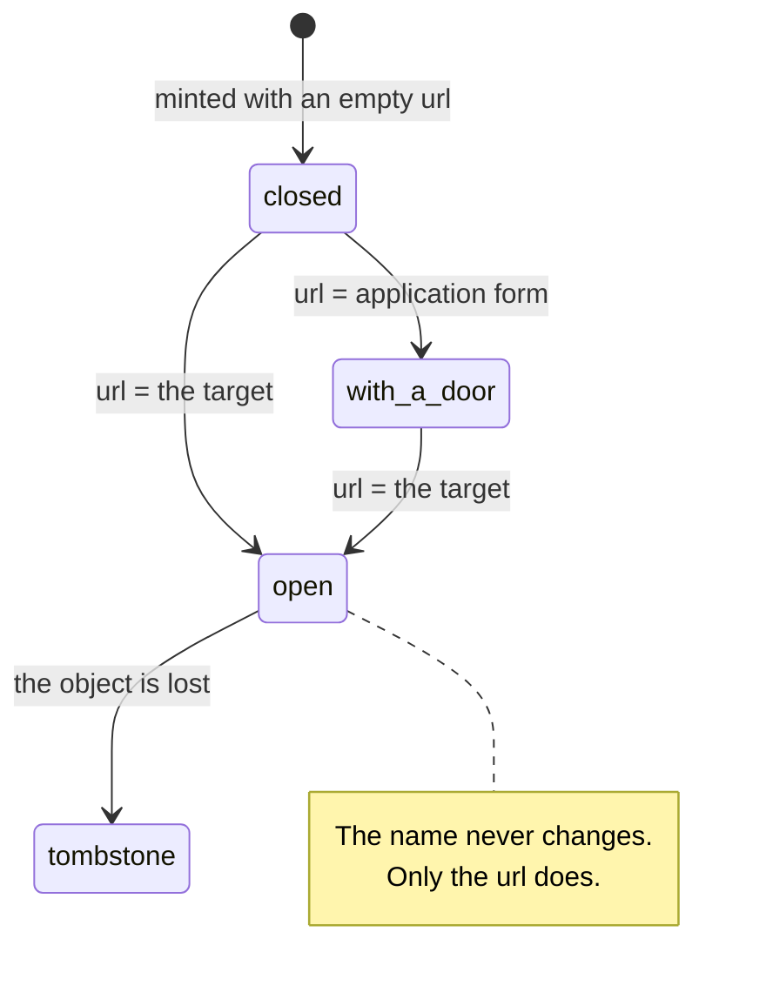

Clearing `url` removes reachability again, but **a description and a target once
published cannot be withdrawn**. So **start from the closed end**: descriptions can be
added later, never removed.

### What it looks like to build

**A. Mint on the public side and hand the names inward**
([C-1](#c-a-closed-arkhe-underneath)). No outbound connection is needed from the closed
network, and the public side can state that the identifier exists.

```bash
# Build the ledger (public arkhe)
arkhe naan add 99999 "Your organisation" --policy "NP | NR, OP, CC | 2026 | https://…/policy"
arkhe onboard 99999 "Example University" --shoulder /s7      # open PIDs
arkhe shoulder add 99999 /c7 --manager 1 --note "closed PIDs (objects inside)"

# Mint with no url — the resolver describes instead of redirecting
curl -X POST https://ark.example.ac.jp/api/mint \
  -H 'Authorization: Bearer …' -H 'Content-Type: application/json' \
  -d '{"shoulder": "/c7",
       "what_title": "(only what may leave the closed network)",
       "commitment": "Restricted access; use requires an application",
       "url": ""}'
# → ark:/99999/c7xyz…

# Add the door (raise it to the third level)
curl -X PUT …/api/update -d '{"ark": "ark:/99999/c7xyz…",
                              "url": "https://apply.example.ac.jp/dataset/…"}'

# When the embargo lifts, point it at the object. **The identifier does not change**
curl -X PUT …/api/update -d '{"ark": "ark:/99999/c7xyz…",
                              "url": "https://repo.example.ac.jp/records/123"}'
```

The closed side keeps no ledger — only the mapping from the names it was given to the
objects inside.

**B. Mint inside the closed network** ([C-2](#c-a-closed-arkhe-underneath)). Run an arkhe
there and mark `/c7` `delegated` on the public side. The closed side becomes autonomous,
but **the public side never learns the names that follow** — there is
[no endpoint for importing an ARK minted elsewhere](#what-does-not-exist-yet), which is
the largest constraint in this design today.

```bash
# Public side: record in the ledger that we do not mint in this namespace
arkhe shoulder status <id> delegated --minter https://ark.closed.example.ac.jp
# Resolution delegation, from the admin interface:
#   303 https://ark.example.ac.jp/closed-namespace
#   (not an internal hostname — it is published at /.well-known/ark)

# Closed side: the same NAAN and shoulder, held as authoritative here
arkhe naan add 99999 "(the same NAAN as above)"
arkhe onboard 99999 "The closed organisation" --shoulder /c7
```

### What arkhe does not do here

**It does not do access control.** A closed PID is closed **because its target is**, not
because arkhe turns anyone away. That judgement belongs to the repository holding the
object. Moving it here would turn an identifier service into an authorization service and
collide head-on with the premise that **anyone may resolve an identifier** — resolution
requires no authentication precisely so that this stays true.

**What goes into the description is an operational decision.** `?info` is a public
endpoint that needs no authentication, so ERC's who / what / when copied in verbatim can
**let the title give away the content**. The more closed the object, the shorter the
description.

**`??` is per NAAN.** Closed and open identifiers cannot advertise different promises.
Per-organisation levels exist (`arkhe manager commitment`), but they only ever **narrow**
the NAAN's declaration.

## D. Connect nothing {#d-connect-nothing}

Register no foreign NAANs. Unknown NAANs are forwarded with a `302` to
`ARKHE_GLOBAL_RESOLVER` (`https://n2t.net` by default). **You carry no relationship**:
when their resolver moves, nothing here needs editing.

In exchange, `?info` for an unknown NAAN cannot be answered — it returns `404`, because
inventing a description for a ledger you do not hold is not an option.

## What must not break once divided

These are not policy. **Each division moves them from the code into the hands of the
people operating it** — with one ledger, arkhe enforced them.

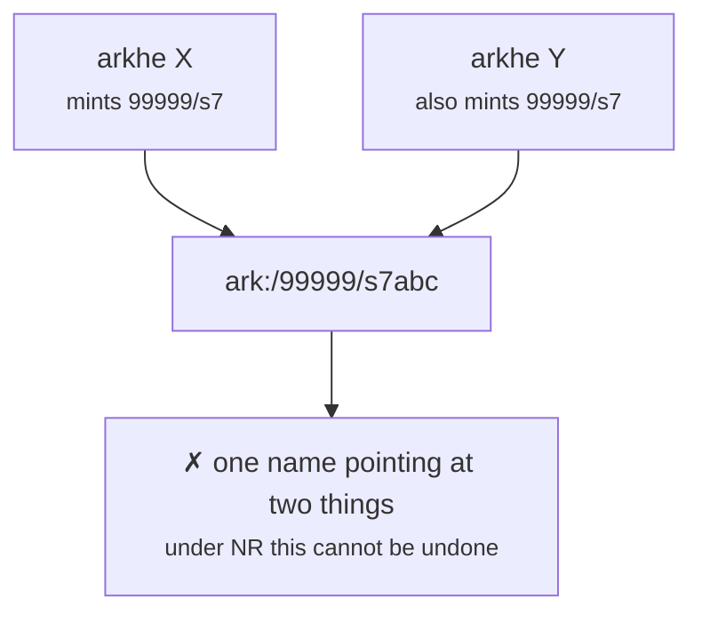

**Nothing on the far side of the split prevents this.** With one ledger, "minting never
becomes an update" was enforced by code; with two, all that remains is the operational
rule of **never handing the same shoulder out twice**.

| | |
| --- | --- |
| **Exactly one ledger mints a given shoulder** | Double minting is the shortest path to one name meaning two things. The upper instance marks a delegated shoulder `delegated` and then cannot mint in it |
| **Exactly one ledger is authoritative for a NAAN** | Only one place may say "no such identifier". With two, one answers `404` while the other answers |
| **Delegation cannot be taken back** | `retired` does not erase what was minted below. Undoing a delegation means only **no new minting** |
| **The lower ledger is your responsibility too** | Lose it and those names stop resolving through the upper instance as well. Every site needs backups, and **overall availability is that of the weakest site** |
| **No cycles** | Loops are not detected. Depth two |
| **Audit has to be collected** | Each ledger records only its own operations |

## What does not exist yet

**Things worth knowing before you build this**, rather than discovering them halfway.

- **An endpoint for importing an ARK minted elsewhere.** There is no way to put a name
  minted below into the upper ledger — that is where the constraint in
  [C](#c-a-closed-arkhe-underneath) comes from. Adding one means checking, at import
  time, that the name falls inside the delegated shoulder, that it is not a double mint,
  and that the check digit is correct.
- **A CLI for `shoulder.redirect`.** Only the admin interface and
  `arkhe depart --resolver` set it, which is where automating a delegation snags.
- **Cross-ledger listing, audit and quota.** `/.well-known/ark` publishes the namespace
  allocation, not the individual ARKs.
- **Health of the delegate.** The upper instance does not know whether the lower one is
  alive; monitoring a delegated shoulder's redirect from outside is an operational job.

## Checklist before building

- [ ] Confirmed that the undivided configuration is genuinely not enough (read load is
      solved by replicas)
- [ ] The unit of division is **exclusive** — no shoulder is minted in two places
- [ ] Exactly **one** ledger has `is_authoritative` for the NAAN
- [ ] Whatever mints below produces **check-digited names** (automatic between arkhe
      instances)
- [ ] The chain of redirects is **at most two deep** and has no cycle
- [ ] `/.well-known/ark` exposes **no URL you did not want published** — especially for
      a closed site
- [ ] **Backup and restore rehearsed at every site** — a lost ledger cannot be rebuilt
      by anyone
- [ ] Decided how audit is collected, or at least written down what is recorded where
