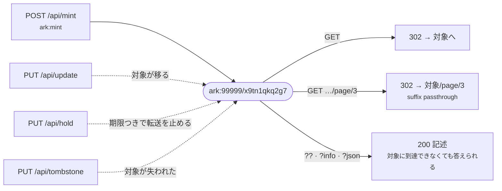

# curl で、採番から解決まで

識別子を 1 つ、採番した瞬間から、対象が失われるところまで追う。以下の応答は
すべて**動いているインスタンスから写したもの**である。

答えるのは 2 つのプロセスで、**互いの仕事はできない**。

| | | |
| --- | --- | --- |
| `$M` | `http://127.0.0.1:8110` | 採番と更新。**資格情報が要る** |
| `$R` | `http://127.0.0.1:8111` | 解決。**認証は要らず**、採番の口も持たない |

立ち上げ方は[クイックスタート](../quickstart.md)。以下は NAAN が 1 つ、shoulder
`/x9` を持つ組織が 1 つ、API キーが `$KEY` にある状態を前提にする。

## 1. 採番する

```bash
curl -X POST $M/api/mint \
  -H "Authorization: Bearer $KEY" -H 'Content-Type: application/json' \
  -d '{"url":   "https://repo.example.ac.jp/records/1",
       "title": "関東平野の降水量 1991-2020",
       "who":   "山田 太郎",
       "when":  "2026"}'
```

```json
{
  "ark": "ark:99999/x9tn1qkq2g7",
  "url": "https://repo.example.ac.jp/records/1",
  "title": "関東平野の降水量 1991-2020",
  "who": "山田 太郎",
  "when": "2026",
  "created_at": "2026-09-07T09:54:10.571278Z",
  "hold_until": null
}
```

`201`。この名前は**もう戻せない**。`x9` は組織に切り出した shoulder、`tn1qkq2g` は
乱数、末尾の `7` は[チェックディジット](../concepts/ark.md)である——**打ち間違えた
ARK と、ここに無いだけの ARK を区別できる**のはこの 1 文字による。

!!! tip "量を投入するなら `request_id` を付ける"
    ```bash
    -d '{"request_id": "ingest-2026-09-07-0001", "url": "…"}'
    ```
    同じ `request_id` で送り直すと、最初に採番した ARK が返る（`201` ではなく
    `200`）。1 万件の投入は途中で切れるほうが普通で、**誰も指していない ARK は
    回収できない**。

## 2. 解決する

解決に資格情報は要らない。プロセスを分けてあるのはそのためである。

```bash
curl -i $R/ark:99999/x9tn1qkq2g7
```

```http
HTTP/1.1 302 Found
location: https://repo.example.ac.jp/records/1
```

その対象の子には、識別子を振らなくてよい。名前より後ろはそのまま行き先に渡される
——**suffix passthrough**。

```console
$ curl -o /dev/null -w '%{http_code} %{redirect_url}\n' $R/ark:99999/x9tn1qkq2g7/page/3
302 https://repo.example.ac.jp/records/1/page/3
```

## 3. 追いかけずに、識別子について尋ねる

`??` を付けると、その名前について**リゾルバが何を約束しているか**を訊ける。返るのは
ERC/ANVL——ARK が 20 年答えてきた形式である。

```console
$ curl -i "$R/ark:99999/x9tn1qkq2g7??"
HTTP/1.1 200 OK
content-type: text/plain; charset=utf-8
thump-status: 0.6 200 OK
link: </ark:99999/x9tn1qkq2g7>; rel="describes"

erc:
who: 山田 太郎
what: 関東平野の降水量 1991-2020
when: 2026
where: ark:99999/x9tn1qkq2g7
redirect: https://repo.example.ac.jp/records/1
about: ark:99999/x9tn1qkq2g7
policy: (:unav)
commitment-level: permanent-dynamic
```

ここには立ち止まる価値のあるものが 3 つある。

**`where` は ARK であって、転送先ではない。** 仕様は「一時的な転送先ではなく長期的な
識別子」と定めている。だから**行き先を付け替えても `where` は動かない**。今どこに
あるかは kernel の外の `redirect` に出る。

**`(:unav)` は空欄ではない。** ERC は値を出せないとき理由を示す符号を置くよう定めて
いる。「名前空間の方針をまだ書いていない」と「そもそも無い」を混ぜないためで、
名前空間の方針は NAAN を登録するときに置く
（`arkhe naan add … --policy`、または管理画面の NAAN の編集）。

**`Link: …; rel="describes"`** は、inflection を知らない相手に「この応答は対象では
なく **ARK を記述したもの**だ」と伝える。

**答えは対象より長く残る**——それは 6 節で。

`?info` は**求められた媒体で答える**。中身は同じ記述で、content type だけが違う。

```console
$ curl -o /dev/null -w '%{content_type}\n' "$R/ark:99999/x9tn1qkq2g7?info"
text/html; charset=utf-8

$ curl -H 'Accept: application/json' "$R/ark:99999/x9tn1qkq2g7?info"   # ?json と同じ
$ curl -H 'Accept: text/plain'       "$R/ark:99999/x9tn1qkq2g7?info"   # ?? と同じ
```

ページ自体も翻訳される。**ここで `?lang=` は効かない**——クエリ文字列そのものが
inflection だから——ので、言語は `&` の後ろに書くか、`Accept-Language` で渡す。

```console
$ curl "$R/ark:99999/x9tn1qkq2g7?info&lang=en"
```

## 4. 一部だけ別の所在に向ける

一般の深い参照は suffix passthrough が賄う。**その 1 点だけ本当に別の場所にある**
とき——IIIF の canvas、別ストレージのサブツリー——はそこを登録する。

```bash
curl -X POST $M/api/register \
  -H "Authorization: Bearer $KEY" -H 'Content-Type: application/json' \
  -d '{"ark": "ark:99999/x9tn1qkq2g7", "qualifier": "/page/3",
       "url": "https://iiif.example.ac.jp/records/1/canvas/3"}'
```

```console
$ curl -o /dev/null -w '%{http_code} %{redirect_url}\n' $R/ark:99999/x9tn1qkq2g7/page/3
302 https://iiif.example.ac.jp/records/1/canvas/3
```

登録した行が祖先に優先し、それ以外は今までどおり通り抜ける。この口が要求するのは
`ark:update` ではなく **`ark:mint`** である——採番はしないが、**新しく解決できる
識別子が増える**から。

## 5. 対象が移る

```bash
curl -X PATCH $M/api/update \
  -H "Authorization: Bearer $KEY" -H 'Content-Type: application/json' \
  -d '{"ark": "ark:99999/x9tn1qkq2g7",
       "url": "https://newrepo.example.ac.jp/datasets/1"}'
```

```json
{
  "ark": "ark:99999/x9tn1qkq2g7",
  "url": "https://newrepo.example.ac.jp/datasets/1",
  "title": "関東平野の降水量 1991-2020",
  "who": "山田 太郎",
  "when": "2026"
}
```

```console
$ curl -o /dev/null -w '%{http_code} %{redirect_url}\n' $R/ark:99999/x9tn1qkq2g7
302 https://newrepo.example.ac.jp/datasets/1
```

**`PATCH` は送った項目だけを書き、ほかには触らない。** 対象が移ったときに要るのは
これである。空文字を**送れば**消えるので、値を消す手段も残っている——この 2 つを
区別できないと消せなくなる。

!!! warning "同じパスへの `PUT` はレコード全体の置き換え"
    `PUT /api/update` は置き換えなので、`ark` と `url` だけ送ると
    **`title` `who` `when` などが空になる**（省いた項目が既定値を運ぶ）。それが PUT
    の意味であり、「レコードはこの内容である」と言い切れるときには正しい動詞である。
    **行き先を付け替えるだけなら `PATCH`。**

## 6. 名前を殺さずに転送を止める

委譲先が落ちた、間違った行き先を配ってしまった——**今すぐ**止めたい。`404` は嘘
（その識別子は存在する）で、`503` は永続識別子が壊れて見える。保留は `200` と記述を
返す。

```bash
curl -X PUT $M/api/hold \
  -H "Authorization: Bearer $KEY" -H 'Content-Type: application/json' \
  -d '{"ark": "ark:99999/x9tn1qkq2g7", "until": "2026-09-14T00:00:00Z",
       "reason": "新しい行き先を確認中"}'
```

```console
$ curl "$R/ark:99999/x9tn1qkq2g7??"
erc:
where: ark:99999/x9tn1qkq2g7
redirect: https://newrepo.example.ac.jp/datasets/1
commitment-level: permanent-dynamic
hold: 新しい行き先を確認中
hold-until: 2026-09-14T00:00:00+00:00
```

**理由は公開の口に出る。** 人前で言わないことを書かない。`until` は必須で
`ARKHE_HOLD_MAX_DAYS` が上限——「一時的」を人の記憶に頼ると恒久化するからで、
期限が切れれば時計だけで戻る。前倒しで外すなら:

```bash
curl -X PUT $M/api/hold/release -H "Authorization: Bearer $KEY" \
  -H 'Content-Type: application/json' -d '{"ark": "ark:99999/x9tn1qkq2g7"}'
```

## 7. 対象が失われたとき

削除の口は無い。**もう無い**なら、そう述べる。

```bash
curl -X PUT $M/api/tombstone \
  -H "Authorization: Bearer $KEY" -H 'Content-Type: application/json' \
  -d '{"ark": "ark:99999/x9tn1qkq2g7",
       "commitment": "2026-09 に寄託者の申し出により取り下げ。"}'
```

```console
$ curl -o /dev/null -w '%{http_code}\n' $R/ark:99999/x9tn1qkq2g7
200

$ curl "$R/ark:99999/x9tn1qkq2g7??"
erc:
where: ark:99999/x9tn1qkq2g7
about: ark:99999/x9tn1qkq2g7
commitment: 2026-09 に寄託者の申し出により取り下げ。
commitment-level: permanent-dynamic
```

転送は消えたが、**識別子と記述は消えていない**。2026 年に書かれた引用は、いまも
「それが何であり、何が起きたか」を述べる場所に着く——[FAIR A2](../concepts/invariants.md)
が求めているのはこれで、`404` にはできないことである。

## 8. 誤ったとき

誤りには符号が付く。**文面ではなく符号で判定すること**——一覧は
[エラーの参照ページ](../reference/errors.md)にある。

```console
$ curl -X POST $M/api/mint -H 'Content-Type: application/json' -d '{}'
{"code": "ARKHE-1201", "message": "No credentials."}

$ curl -X PUT $M/api/update -H "Authorization: Bearer $KEY" \
       -H 'Content-Type: application/json' -d '{"ark": "not-an-ark", "url": "https://x/1"}'
{"code": "ARKHE-1001",
 "message": "Not readable as an ARK: missing name part",
 "detail": {"reason": "missing name part"}}
```

解決の口は text/plain で、符号を行頭に置く。

```console
$ curl $R/ark:99999/x9zzzzzzzz
ARKHE-1403 ark:99999/x9zzzzzzzz — Check digit mismatch: the identifier looks mistranscribed.
```

**これは「そんな ARK は無い」とは別の答えである。** 検査桁は「ここへ来る途中で
打ち間違えられた・写し間違えられた」と言っている——印刷された識別子とにらめっこ
している人に、伝える価値がある違いである。

このリゾルバが知らない NAAN は、拒まずに上へ渡す。

```console
$ curl -o /dev/null -w '%{http_code} %{redirect_url}\n' $R/ark:12345/abcde
302 https://n2t.net/ark:12345/abcde
```

## 9. リゾルバが自分について答えること

```console
$ curl $R/.well-known/ark
/
```

仕様が定めているのはこれ——**リゾルバのルートパス**で、ここに compact ARK を継ぎ足すと
解決の要求になる。arkhe 独自の在庫（預かっている名前空間、採番を外に委ねているなら
その案内先）は同じ URL の JSON 表現。

```console
$ curl -H 'Accept: application/json' $R/.well-known/ark
{"resolver_path": "/",
 "resolver": "arkhe",
 "global_resolver": "https://n2t.net",
 "naans": [{"naan": "99999", "authoritative": true,
            "redirect": null, "minter": null, "na_policy": null}],
 "delegated_shoulders": [],
 "held": []}
```

## 全体の形



点線はどれも、**名前がどこへ導くか**（あるいは導かないか）を変える。
**名前が何を意味するかは、どれも変えない。** そして、どれも取り消せない。

## つぎに

- [API リファレンス](../reference/api.md) — 全部の口と、解決が返すもの
- [エラー](../reference/errors.md) — 全部の符号
- [壊さないもの](../concepts/invariants.md) — なぜ削除の口が無いのか
