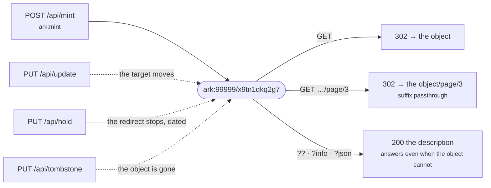

# From minting to resolving, with curl

One identifier, followed from the moment it is minted to the moment the object behind
it is gone. Every response below is a real one, copied from a running instance.

Two processes answer, and **neither can do the other's job**:

| | | |
| --- | --- | --- |
| `$M` | `http://127.0.0.1:8110` | minting and updating. **Needs a credential** |
| `$R` | `http://127.0.0.1:8111` | resolution. **Needs none**, and has no minting endpoint |

Standing them up is [the quickstart](../quickstart.md); the rest of this page assumes
a NAAN, an organisation with the shoulder `/x9`, and an API key in `$KEY`.

## 1. Mint

```bash
curl -X POST $M/api/mint \
  -H "Authorization: Bearer $KEY" -H 'Content-Type: application/json' \
  -d '{"url":   "https://repo.example.ac.jp/records/1",
       "title": "Rainfall in the Kanto plain, 1991-2020",
       "who":   "Yamada, Taro",
       "when":  "2026"}'
```

```json
{
  "ark": "ark:99999/x9tn1qkq2g7",
  "url": "https://repo.example.ac.jp/records/1",
  "title": "Rainfall in the Kanto plain, 1991-2020",
  "who": "Yamada, Taro",
  "when": "2026",
  "created_at": "2026-09-07T09:54:10.571278Z",
  "hold_until": null
}
```

`201`, and the name is now spoken for **for good**. `x9` is the shoulder the
organisation was given; `tn1qkq2g` came from a random minter; the final `7` is a
[check digit](../concepts/ark.md), which is why a mistyped ARK can be told apart from
an ARK that simply is not here.

!!! tip "Send a `request_id` for anything at scale"
    ```bash
    -d '{"request_id": "ingest-2026-09-07-0001", "url": "…"}'
    ```
    Resending the same `request_id` returns the ARK minted the first time (`200`
    instead of `201`) rather than minting a second one. A batch of ten thousand is
    interrupted more often than not, and **an ARK nobody points at cannot be taken
    back**.

## 2. Resolve

Resolution needs no credential — that is the whole point of the second process.

```bash
curl -i $R/ark:99999/x9tn1qkq2g7
```

```http
HTTP/1.1 302 Found
location: https://repo.example.ac.jp/records/1
```

A child of that object needs no identifier of its own. Anything after the name is
handed to the target — **suffix passthrough**:

```console
$ curl -o /dev/null -w '%{http_code} %{redirect_url}\n' $R/ark:99999/x9tn1qkq2g7/page/3
302 https://repo.example.ac.jp/records/1/page/3
```

!!! warning "The tail is appended to the target as it stands"
    It is a plain concatenation, so **a target that carries a query string ends up with
    the tail inside it**:

    ```
    target  https://repo.example.ac.jp/view?id=1
    request …/x9tn1qkq2g7/page/3
    result  https://repo.example.ac.jp/view?id=1/page/3   ← inside the query value
    ```

    A target ending in `/` likewise yields `//`, which most servers absorb. If the
    objects behind an ARK are addressed by query string, either point the ARK at a path
    form, or register the parts you need explicitly (next section) instead of relying on
    passthrough.

## 3. Ask about the identifier instead of following it

Appending `??` asks what the resolver *promises* about the name. The answer is
ERC/ANVL — the format ARK has answered in for twenty years.

```console
$ curl -i "$R/ark:99999/x9tn1qkq2g7??"
HTTP/1.1 200 OK
content-type: text/plain; charset=utf-8
thump-status: 0.6 200 OK
link: </ark:99999/x9tn1qkq2g7>; rel="describes"

erc:
who: Yamada, Taro
what: Rainfall in the Kanto plain, 1991-2020
when: 2026
where: ark:99999/x9tn1qkq2g7
redirect: https://repo.example.ac.jp/records/1
about: ark:99999/x9tn1qkq2g7
policy: (:unav)
commitment-level: permanent-dynamic
```

Three things in there are worth pausing on.

**`where` is the ARK, not the target.** The specification defines it as "the long-term
identifier as opposed to a transient redirect target", so repointing the ARK does not
change it. Where the object sits *today* is `redirect`, outside the kernel.

**`(:unav)` is not an empty field.** ERC requires a reason when a value cannot be
given, so "we have not recorded a namespace policy" and "there is no such thing" stay
distinguishable. A namespace policy is set when the NAAN is registered
(`arkhe naan add … --policy`, or the NAAN form in the admin interface).

**`Link: …; rel="describes"`** tells a client that knows nothing about inflections that
this response *describes* the ARK rather than being the thing itself.

**The answer survives the object** either way: section 6 comes back to that.

`?info` answers in whichever medium you ask for — the same description, a different
content type:

```console
$ curl -o /dev/null -w '%{content_type}\n' "$R/ark:99999/x9tn1qkq2g7?info"
text/html; charset=utf-8

$ curl -H 'Accept: application/json' "$R/ark:99999/x9tn1qkq2g7?info"   # same as ?json
$ curl -H 'Accept: text/plain'       "$R/ark:99999/x9tn1qkq2g7?info"   # same as ??
```

The page is translated too. **`?lang=` will not work here** — the query string *is* the
inflection — so the language goes after an `&`, or comes from `Accept-Language`:

```console
$ curl "$R/ark:99999/x9tn1qkq2g7?info&lang=en"
```

## 4. Point one part somewhere else

Suffix passthrough covers the general case. When one part genuinely lives elsewhere —
a IIIF canvas, a subtree in another store — register that one point:

```bash
curl -X POST $M/api/register \
  -H "Authorization: Bearer $KEY" -H 'Content-Type: application/json' \
  -d '{"ark": "ark:99999/x9tn1qkq2g7", "qualifier": "/page/3",
       "url": "https://iiif.example.ac.jp/records/1/canvas/3"}'
```

```console
$ curl -o /dev/null -w '%{http_code} %{redirect_url}\n' $R/ark:99999/x9tn1qkq2g7/page/3
302 https://iiif.example.ac.jp/records/1/canvas/3
```

The registered row wins over the ancestor; everything else under the name still passes
through. Note that this needs `ark:mint`, not `ark:update` — **a new resolvable
identifier appears**, even though nothing was minted.

## 5. Move the object

```bash
curl -X PATCH $M/api/update \
  -H "Authorization: Bearer $KEY" -H 'Content-Type: application/json' \
  -d '{"ark": "ark:99999/x9tn1qkq2g7",
       "url": "https://newrepo.example.ac.jp/datasets/1"}'
```

```json
{
  "ark": "ark:99999/x9tn1qkq2g7",
  "url": "https://newrepo.example.ac.jp/datasets/1",
  "title": "Rainfall in the Kanto plain, 1991-2020",
  "who": "Yamada, Taro",
  "when": "2026"
}
```

```console
$ curl -o /dev/null -w '%{http_code} %{redirect_url}\n' $R/ark:99999/x9tn1qkq2g7
302 https://newrepo.example.ac.jp/datasets/1
```

**`PATCH` writes what you sent and leaves the rest alone**, which is what moving an
object actually calls for. Sending a field as `""` clears it, so removing a value is
still possible — the two cases have to stay distinguishable.

!!! warning "`PUT` on the same path replaces the whole record"
    `PUT /api/update` is a replacement: send only `ark` and `url` and **`title`, `who`,
    `when` and the rest are emptied**, because every omitted field carries its default.
    That is what a PUT means, and it is the right verb when you can say "the record is
    now exactly this" — but for repointing an object, use `PATCH`.

## 6. Stop the redirect without killing the name

A delegate is down, or a wrong target went out, and you need it to stop **now**. `404`
would be a lie — the identifier exists — and `503` makes a permanent identifier look
broken. A hold answers `200` with the description instead:

```bash
curl -X PUT $M/api/hold \
  -H "Authorization: Bearer $KEY" -H 'Content-Type: application/json' \
  -d '{"ark": "ark:99999/x9tn1qkq2g7", "until": "2026-09-14T00:00:00Z",
       "reason": "verifying the new target"}'
```

```console
$ curl "$R/ark:99999/x9tn1qkq2g7??"
erc:
where: ark:99999/x9tn1qkq2g7
redirect: https://newrepo.example.ac.jp/datasets/1
commitment-level: permanent-dynamic
hold: verifying the new target
hold-until: 2026-09-14T00:00:00+00:00
```

**The reason is published**, so do not put anything in it you would not say in public.
`until` is required and capped by `ARKHE_HOLD_MAX_DAYS`: "temporary" left to memory
becomes permanent, and an expired hold lifts itself by the clock alone. To lift it
early:

```bash
curl -X PUT $M/api/hold/release -H "Authorization: Bearer $KEY" \
  -H 'Content-Type: application/json' -d '{"ark": "ark:99999/x9tn1qkq2g7"}'
```

## 7. When the object is gone

There is no delete. When the thing itself is gone, say so:

```bash
curl -X PUT $M/api/tombstone \
  -H "Authorization: Bearer $KEY" -H 'Content-Type: application/json' \
  -d '{"ark": "ark:99999/x9tn1qkq2g7",
       "commitment": "The dataset was withdrawn by the depositor in 2026-09."}'
```

```console
$ curl -o /dev/null -w '%{http_code}\n' $R/ark:99999/x9tn1qkq2g7
200

$ curl "$R/ark:99999/x9tn1qkq2g7??"
erc:
where: ark:99999/x9tn1qkq2g7
about: ark:99999/x9tn1qkq2g7
commitment: The dataset was withdrawn by the depositor in 2026-09.
commitment-level: permanent-dynamic
```

The redirect is gone; **the identifier and the record are not**. A citation written in
2026 still leads somewhere that says what the thing was and what happened to it, which
is what [FAIR A2](../concepts/invariants.md) asks for and what a `404` cannot do.

## 8. When something is wrong

Errors carry a code. **Match on the code, not on the wording** — the full list is
[the errors reference](../reference/errors.md).

```console
$ curl -X POST $M/api/mint -H 'Content-Type: application/json' -d '{}'
{"code": "ARKHE-1201", "message": "No credentials."}

$ curl -X PUT $M/api/update -H "Authorization: Bearer $KEY" \
       -H 'Content-Type: application/json' -d '{"ark": "not-an-ark", "url": "https://x/1"}'
{"code": "ARKHE-1001",
 "message": "Not readable as an ARK: missing name part",
 "detail": {"reason": "missing name part"}}
```

Resolution answers in plain text, with the code first:

```console
$ curl $R/ark:99999/x9zzzzzzzz
ARKHE-1403 ark:99999/x9zzzzzzzz — Check digit mismatch: the identifier looks mistranscribed.
```

**That is a different answer from "no such ARK".** The check digit says the string was
mistyped or mis-transcribed on its way here, which is worth telling a person who is
staring at a printed identifier.

A NAAN this resolver knows nothing about is handed upwards rather than refused:

```console
$ curl -o /dev/null -w '%{http_code} %{redirect_url}\n' $R/ark:12345/abcde
302 https://n2t.net/ark:12345/abcde
```

## 9. What the resolver says about itself

```console
$ curl $R/.well-known/ark
/
```

That is the specification's own answer: the resolver's root path, so that appending a
compact ARK to it gives a resolution request. arkhe's own inventory — the namespaces it
holds, and where minting happens when it happens elsewhere — is the JSON representation
of the same URL:

```console
$ curl -H 'Accept: application/json' $R/.well-known/ark
{"resolver_path": "/",
 "resolver": "arkhe",
 "global_resolver": "https://n2t.net",
 "naans": [{"naan": "99999", "authoritative": true,
            "redirect": null, "minter": null, "na_policy": null}],
 "delegated_shoulders": [],
 "held": []}
```

## 10. A closed ledger, published later

Everything above was one ledger. The case this design exists for has two: a closed arkhe
inside a network that cannot be reached, and a public one that answers the world. **The
identifier is the same on both sides** — that is the whole point, because a name handed
out while the object was closed has to keep working when it opens.

| | | |
| --- | --- | --- |
| `$C` | closed minter | inside the network. Authoritative for `/c7` |
| `$P` | public minter | the shoulder `/c7` is marked `delegated` here |
| `$PR` | public resolver | what the world asks |

### Mint inside

```console
$ curl -X POST $C/api/mint -H "Authorization: Bearer $CK" \
       -d '{"url": "https://inside.closed.example/dataset/42",
            "title": "(a title that only exists inside)"}'
{"ark": "ark:99999/c7j89qtb3fc", …}
```

From outside, that name says nothing yet. The delegated shoulder answers with a page
explaining that the namespace is closed — **not with the internal address**, which
nobody outside could reach anyway:

```console
$ curl -o /dev/null -w '%{http_code} %{redirect_url}\n' $PR/ark:99999/c7j89qtb3fc
303 https://ark.example.ac.jp/closed-namespace
```

A typo lands on the same page, which is the point of this level: **the names do not
leak**.

### Hand it over, description only

```console
$ curl -X POST $P/api/import -H "Authorization: Bearer $PK" \
       -d '{"ark":   "ark:99999/c7j89qtb3fc",
            "title": "Soil moisture, Kanto plain (restricted)",
            "who":   "Yamada, Taro",
            "when":  "2026",
            "commitment": "Restricted access; use requires an application"}'
{"ark": "ark:99999/c7j89qtb3fc", "url": "", …}
```

**`url` stays empty**, and that is not an omission — it is the statement. The public
resolver now describes an identifier it cannot send anyone to:

```console
$ curl -H 'Accept: text/plain' "$PR/ark:99999/c7j89qtb3fc?info"
erc:
who: Yamada, Taro
what: Soil moisture, Kanto plain (restricted)
when: 2026
where: ark:99999/c7j89qtb3fc
about: ark:99999/c7j89qtb3fc
policy: NP | NR, OP, CC | 2026
commitment: Restricted access; use requires an application
commitment-level: permanent-dynamic
```

**What crossed the boundary is exactly what an operator typed into that request.** Do not
build an automatic sync upward: a confidential title will eventually arrive in `?info`,
and having no path out is stronger than having a filter on the way out.

### Raise it when you can

```console
$ curl -X PATCH $P/api/update -d '{"ark": "…c7j89qtb3fc",
                                   "url": "https://apply.example.ac.jp/dataset/42"}'
→ 302 https://apply.example.ac.jp/dataset/42          # available on application

$ curl -X PATCH $P/api/update -d '{"ark": "…c7j89qtb3fc",
                                   "url": "https://repo.example.ac.jp/records/42"}'
→ 302 https://repo.example.ac.jp/records/42           # the embargo lifts
```

The description survives both moves (`what` and `who` are still there), and **the name
was identical at every step**:

```
ark:99999/c7j89qtb3fc
```

Use `PATCH`, not `PUT` — [as in section 5](#5-move-the-object), the description is
exactly what you do not want to lose here.

### A whole namespace at once

```console
$ curl -X POST $P/api/import/bulk -H "Authorization: Bearer $PK" \
       -d '{"data": [{"ark": "ark:99999/c7xk7vtb226", "title": "batch 1"},
                     {"ark": "ark:99999/c7zjft7mcxq", "title": "batch 2"}]}'
{"count": 2, "imported": [...]}
```

**One row that fails any check and nothing is created.** Names that did land cannot be
taken back, so a half-imported namespace is worse than none.

### What gets refused

```console
$ curl -X POST $P/api/import -d '{"ark": "ark:99999/s7abc1234"}'      # not delegated
ARKHE-1307  Shoulder /s7 has status=active; only a delegated shoulder can be imported into.

$ curl -X POST $P/api/import -d '{"ark": "ark:99999/c7j89qtb3fz"}'    # check digit
ARKHE-1012  Check digit mismatch: ark:99999/c7j89qtb3fz was not minted by a NOID minter, or was mistyped.

$ curl -X POST $P/api/import -d '{"ark": "ark:99999/c7j89qtb3fc"}'    # already here
ARKHE-1005  ark:99999/c7j89qtb3fc is already registered.
```

The check digit is the only evidence a public ledger has that a name arriving from
outside was not mistyped, which is why it cannot be waived. Reach follows the usual rule
— **higher authority covers lower** — and the NAAN must be one this ledger is
authoritative for; taking custody of names in a namespace you merely forward would be
claiming to be its keeper.


## The shape of it



Every dotted arrow changes where the name leads, or whether it leads anywhere at all.
**None of them changes what the name means**, and none of them can take it back.

## Next

- [The API reference](../reference/api.md) — every endpoint, and what resolution answers
- [Errors](../reference/errors.md) — every code
- [Invariants](../concepts/invariants.md) — why there is no delete
- [Running several arkhe](federation.md) — the closed/public arrangement of section 10 in full
