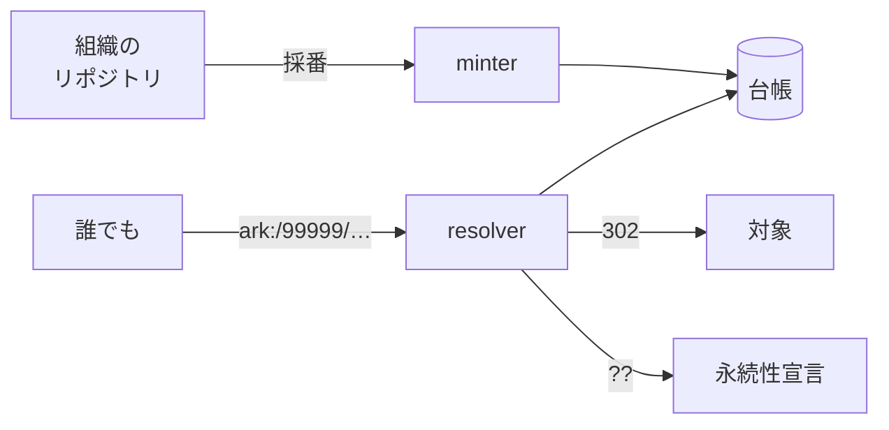

# arkhe

**ARK** 識別子の基盤。採番と解決を別プロセスで動かす。

ARK は DOI / Handle と違い、有償の登録組織と中央基盤を前提としない識別子体系で、
**永続性は文字列の性質ではなく、サービスの問題**という立場を取る。arkhe はその立場の
まま、組織へ名前空間を委譲し、永続性の水準を各組織が自己申告できる形で運用するための
実装。

名前の由来はギリシャ語 ἀρχή（始原・原理）。参照が始まる点、という意味。

## できること

- 組織に委譲した名前空間で **ARK を採番**し、**二度と振り直さない**。
- `?` / `??` / `?info` / `?json` の inflection つきで**解決**する。**対象が失われても
  記述は答えられる**。
- **委譲する**。NAAN の保有者が shoulder を切り出して組織に渡し、採番や解決を
  さらに外へ委ねることもできる。
- **組織の改編に耐える**。組織が統合しても分割しても離脱しても、識別子は解決し続ける。

## 意図的にやらないこと

- **リポジトリではない。** 識別子と行き先を持つだけで、対象そのものは持たない。
- **認可サーバにならない。** トークンは検証する。自前で発行するのは機械向けの 1 種類
  だけで、認可コードフローは持たない。
- **メタデータの器ではない。** 対象に到達できないときに記述を返せるよう、ERC の
  kernel と少数の Dublin Core 項目だけを持つ。

## どこから読むか

-   :material-rocket-launch: **[クイックスタート](quickstart.md)**

    数分で立ち上げて、最初の ARK を採番する。

-   :material-lightbulb: **[考え方](concepts/ark.md)**

    ARK が何を約束しているのか。なぜコードが削除を拒むのか。

-   :material-cog: **[設定](reference/configuration.md)**

    全項目と、**意図的に既定値を持たせていない**もの。

-   :material-api: **[API](reference/api.md)**

    実装から生成した REST 仕様。

## 現状

FastAPI / SQLAlchemy 2.0 / PostgreSQL。`arkspec/`（ARK 仕様の純関数層）と
`domain/resolution.py` は **stdlib しか使わない**ので、仕様適合に関わる部分は
何もインストールせずに読めるし試せる。

`arkspec/` の一部は Internet Archive の
[arklet](https://github.com/internetarchive/arklet)（MIT）から派生している。
[NOTICE](https://github.com/RCOSDP/arkhe/blob/main/NOTICE) を参照。
