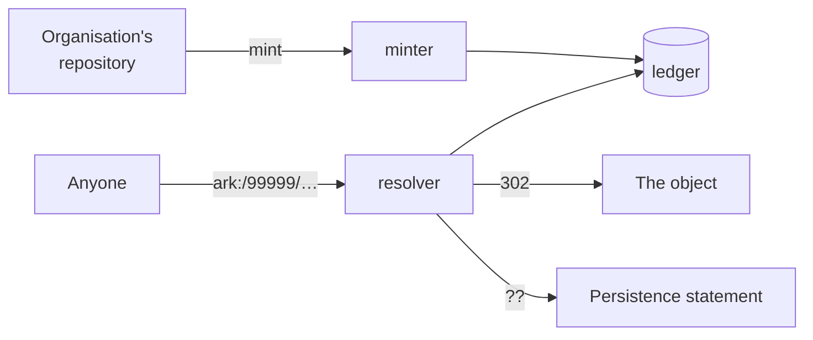

# arkhe

Infrastructure for **ARK** identifiers. Minting and resolution run as separate
processes.

Unlike DOI and Handle, ARK presumes no paid registration agency and no central
infrastructure. It holds that **persistence is not a property of the string but a
matter of service**. arkhe implements that position: it delegates namespaces to
organisations and lets each of them declare, for itself, the level of commitment it is
prepared to keep.

The name is the Greek ἀρχή — beginning, first principle. The point at which a
reference starts.

## What it does

- **Mints** ARKs into a namespace delegated to an organisation, and never re-assigns one.
- **Resolves** them, with the `?`, `??`, `?info` and `?json` inflections — and answers
  even when the object itself is gone.
- **Delegates**: a NAAN holder carves out shoulders, hands them to organisations, and
  can hand minting or resolution onward to a third party.
- **Survives reorganisation**: organisations merge, split and leave, and the
  identifiers keep resolving.

## What it deliberately is not

- **Not a repository.** It holds identifiers and where they point, not the objects.
- **Not an authorization server.** It validates tokens; it can issue its own only for
  machine-to-machine use, and never runs an authorization code flow of its own.
- **Not a metadata store.** It carries the ERC kernel and a few Dublin Core fields so
  that a description can be returned when the object cannot — no more.

## Where to start

-   :material-rocket-launch: **[Quickstart](quickstart.md)**

    Stand it up and mint your first ARK in a few minutes.

-   :material-lightbulb: **[Concepts](concepts/ark.md)**

    What ARK actually promises, and why the code refuses to delete things.

-   :material-cog: **[Configuration](reference/configuration.md)**

    Every setting, and which ones have no default on purpose.

-   :material-api: **[API](reference/api.md)**

    The REST surface, generated from the implementation.

## Status

Targets **InvenioRDM-era Python**: FastAPI, SQLAlchemy 2.0, PostgreSQL.
`arkspec/` (the ARK specification as pure functions) and `domain/resolution.py`
depend on nothing but the standard library, so the parts that matter for
specification conformance can be read and tested without installing anything.

Part of `arkspec/` derives from the Internet Archive's
[arklet](https://github.com/internetarchive/arklet) (MIT); see
[NOTICE](https://github.com/RCOSDP/arkhe/blob/main/NOTICE).
