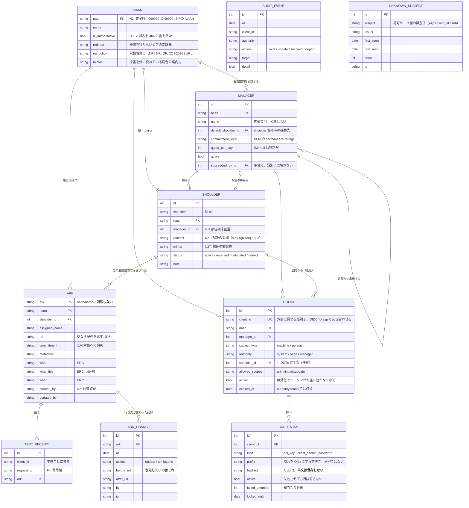

# データモデル

`Naan → Manager → Shoulder → Ark` の 1 本で全 NAAN を扱う。**個別 NAAN を持つ組織でも
shoulder を必ず使う**——使わないと NAAN ごとにモデルが分岐し、first-digit 規約が NAAN に
よって成立したりしなかったりする。



`UNKNOWN_SUBJECT` は、**認可サーバのトークンは正しいのに台帳に登録の無かった主体**
である。`client_id` の綴りが 1 文字違うだけで 401 になるが、弾いた時点で arkhe は
正しい文字列を手に持っている——`azp` はもう署名検証を通っている。捨てずに残せば、
運用者は打ち直さずに登録できる。**登録が済めば一覧から自動的に消える**（照合は
問い合わせのたびに行うので、消す操作が要らない）。

他の表と外部キーで結ばない。**どの組織のものかは分からない**からで、推測もしない
——だから見えるのは NAAN 以上に届く主体だけにしてある。

`ARK_CHANGE` は **ARK の行き先が変わった記録**で、監査ログとは別に持つ。監査は
NAAN 単位以上の操作しか残さないが、**採番も付け替えも組織が行う**ので、監査だけ
では肝心の変更が落ちる。`NR` を宣言する体系で「この識別子は変わらない」と言う
なら、変えたのは何でいつ誰が変えたのかを示せなければならない——さもないと、
**約束を検証する手段が利用者の側に無い。**

`AUDIT_EVENT` は他の表と外部キーで結ばない。**記録は対象が消えても残るべき**もので、
参照整合性で縛ると「消せないから記録も消す」という逆の力が働く。

## 図に描けないこと

ER 図は形しか示さない。**arkhe の設計の中身は制約のほうにある。**

| | |
| --- | --- |
| **ARK は削除できない** | 行を消すと解決が止まる＝識別子が壊れる。`before_delete` で拒否する。対象が失われたら tombstone にするか `url` を空にして記述を返す |
| **shoulder も削除できない** | 乱数割当が同じ文字列を再び当てうる＝NR 違反の芽。`status=retired` にする |
| **retired からは戻せない** | 引退した名前空間の再開は、その間に外部が同じ名前を使った可能性を否定できない |
| **採番は UPDATE に化けない** | 主キー衝突は必ず失敗させる。arklet で最重大の欠陥がこれだった |
| **到達範囲は登録属性** | `authority` / `manager_id` / `shoulder_id` / `allowed_scopes` はクライアント登録の属性で、リクエストやトークン要求では広がらない |
| **人と機械を分ける** | `subject_type=machine` は外部ログインで名乗れず、`person` は API キーを持てない |
| **循環参照** | `manager.default_shoulder_id ⇄ shoulder.manager_id`。PostgreSQL は CREATE TABLE の時点で参照先を要求するので、`use_alter` で後付けにしてある |

## 容量について

**子リソースは採番しない。** `ark:99999/x9abc/page/3` のような深い参照は suffix
passthrough が賄うので、**1 レコード 1 採番**で足りる。ここが容量設計でいちばん効く。

容量には二つある——**名前がいくつ作れるか**と、**台帳がどれだけ太るか**。前者は桁数
だけで決まり、後者は採番数で決まる。

### 名前空間の容量

**shoulder の桁数が、1 つの NAAN から切り出せる名前空間の数を決める。** first-digit
規約により shoulder は子音の並び＋末尾の数字 1 桁で、子音は betanumeric から母音と
`l` を除いた 19 種、末尾は 0-9 の 10 種。スラッシュを除いた文字数を桁数とすれば

```
shoulder 数 ＝ 19^(桁数 − 1) × 10
```

| shoulder の桁数 | 例 | 切り出せる数 |
| --- | --- | --- |
| 2 | `/x9` | 190 |
| 3（既定） | `/bc7` | **3,610** |
| 4 | `/bcd7` | 68,590 |

3,610 は**800 組織に対して使用率 22.2%**——4.5 倍の余裕がある。ただし shoulder は
乱数で採る（連番にすると**加入順が漏れる**）ので実際には手前で衝突が始まり、
`retired` にした分は二度と使えない。**余裕は使い切る前提で見ない。**

**blade の桁数が、1 つの shoulder で採れる ARK の数を決める。** arkhe は blade を
betanumeric 29 文字から 8 桁の乱数で採り、末尾に検査桁を 1 桁足す——1 shoulder
あたり 29⁸ ＝ **約 5,002 億**。

**この上限が先に来ることは、実際には無い。** 1 億件で台帳は約 40 GB（次節）で、
名前が尽きるよりずっと手前に台帳の大きさが効く。桁数は上限としてではなく**衝突率**
として現れる——`mint` は衝突を握りつぶさず数えて採り直し（10 回で失敗）、その率の
上昇が名前空間の枯渇を知らせる唯一の合図になる（採番 API はいまこの回数を返していない）。

### 1 行の実寸

PostgreSQL 17、100 万件、表と索引をすべて含めた実測。

| | ARK 1 件あたり |
| --- | --- |
| `url` ＋ `title` ＋ `who` ＋ `when` | **362 バイト** |
| `url` だけ（記述なし） | **158 バイト**（表のみ） |
| `ark_change` 1 行（行き先を変えた記録） | **258 バイト** |

線形である——10 万件でも 100 万件でも 362 B/件。したがって

```
台帳 ≒ 採番数 × 400 B ＋ 付け替え回数 × 260 B ＋ 監査
```

そして**掛ける相手が参照ではなく対象の数**なので、

| 採番数 | 台帳 |
| --- | --- |
| 100 万 | 約 0.4 GB |
| 1,000 万 | 約 4 GB |
| 1 億 | 約 40 GB |

**1 億件でも、ふつうの PostgreSQL 1 台に収まる。** 文書ストアと同じ勘定で見積もるのが
よくある取り違えで、arkhe が持つのは**名前とその行き先**であって、対象そのものではない。

### 自分の台帳で測る

```sql
-- 実寸と、ここでの 1 件あたり
select pg_size_pretty(pg_total_relation_size('ark')) as total,
       round(pg_total_relation_size('ark')::numeric / count(*), 0) as bytes_per_ark
from ark;

-- 索引ごと——メモリに載っていてほしいのは主キー
select indexrelname, pg_size_pretty(pg_relation_size(indexrelid))
from pg_stat_user_indexes where relname = 'ark'
order by pg_relation_size(indexrelid) desc;
```

**記述をどれだけ持つかで 2 倍以上変わる**（158 B 対 362 B）ので、一般論より自分の
台帳を測るほうが確かである。処理量と構成は[デプロイ](../guides/deployment.md#規模の見積もり)にある。

### 列の幅は仕様から決まる

このうち 2 つは我々が選べる値ではない。`draft-kunze-ark-42` は**受け取る側**に
**NAAN 16 オクテット以上**（§2.3）と **Base Name ＋ Qualifier 255 オクテット以上**
（§3.1）への対応を義務づけている。したがって `naan.naan` は `varchar(16)`、
`ark.assigned_name` は `varchar(255)`、台帳の鍵 `ark.ark`（`<naan>/<name>`）は
`varchar(272)`。NAAN や ARK を入れる列はすべてこれに揃えてある——**経路によって
入る値と入らない値が変わる**ほうが、どこでも入らないより悪い。

これを超える名前は DB のエラーではなく、上限を示した `400` で断る。索引できない
のは我々の事情であり、仕様も「長い文字列を作る側は、受け取る実装が扱えないかも
しれないと理解すべき」と書いている。
