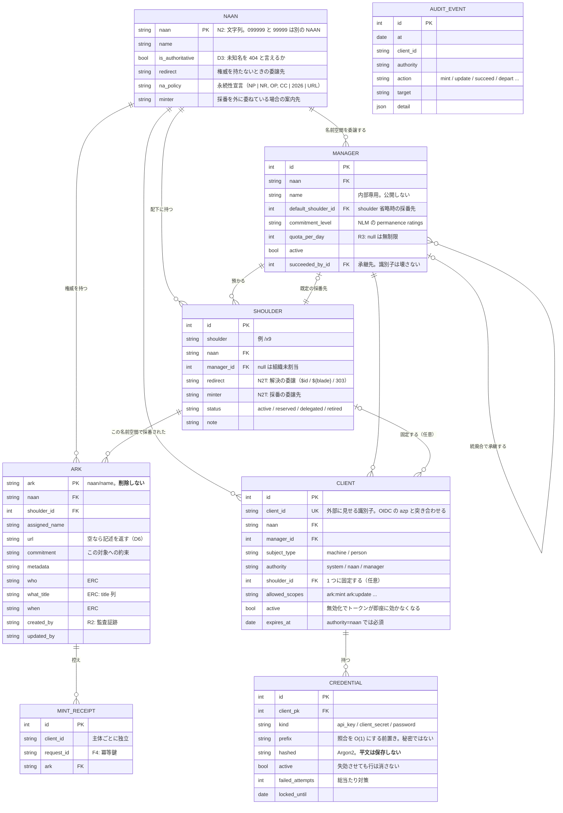

# データモデル

`Naan → Manager → Shoulder → Ark` の 1 本で全 NAAN を扱う。**個別 NAAN を持つ組織でも
shoulder を必ず使う**——使わないと NAAN ごとにモデルが分岐し、first-digit 規約が NAAN に
よって成立したりしなかったりする。

`AUDIT_EVENT` は他の表と外部キーで結ばない。**記録は対象が消えても残るべき**もので、
参照整合性で縛ると「消せないから記録も消す」という逆の力が働く。

## 図に描けないこと

ER 図は形しか示さない。**arkhe の設計の中身は制約のほうにある。**

| | |
| --- | --- |
| **ARK は削除できない** | 行を消すと解決が止まる＝識別子が壊れる。`before_delete` で拒否する。対象が失われたら tombstone にするか `url` を空にして記述を返す |
| **shoulder も削除できない** | 乱数割当が同じ文字列を再び当てうる＝NR 違反の芽。`status=retired` にする |
| **retired からは戻せない** | 引退した名前空間の再開は、その間に外部が同じ名前を使った可能性を否定できない |
| **採番は UPDATE に化けない** | 主キー衝突は必ず失敗させる。arklet で最重大の欠陥がこれだった |
| **到達範囲は登録属性** | `authority` / `manager_id` / `shoulder_id` / `allowed_scopes` はクライアント登録の属性で、リクエストやトークン要求では広がらない |
| **人と機械を分ける** | `subject_type=machine` は外部ログインで名乗れず、`person` は API キーを持てない |
| **循環参照** | `manager.default_shoulder_id ⇄ shoulder.manager_id`。PostgreSQL は CREATE TABLE の時点で参照先を要求するので、`use_alter` で後付けにしてある |

## 容量について

**子リソースは採番しない。** `ark:/99999/x9abc/page/3` のような深い参照は suffix
passthrough が賄うので、**1 レコード 1 採番**で足りる。ここが容量設計でいちばん効く。
