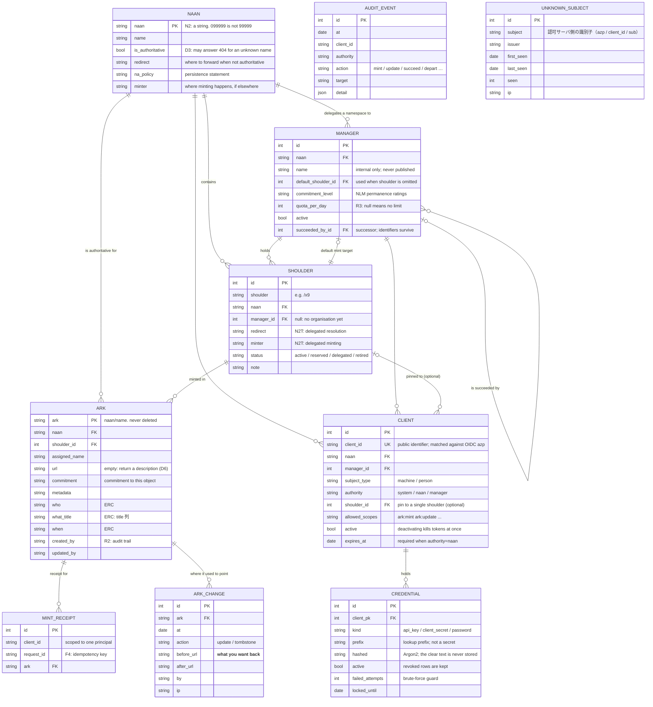

# Data model

One chain — `Naan → Manager → Shoulder → Ark` — carries every NAAN. **Even an
organisation with a NAAN of its own goes through a shoulder.** Skip that and the model
forks per NAAN, and the first-digit convention holds for some NAANs and not others.



`UNKNOWN_SUBJECT` holds **subjects whose token verified but who were not in the
ledger**. One wrong character in a `client_id` produces a 401, and at the moment of
rejection arkhe already holds the right string — `azp` has passed signature
verification by then. Keeping it lets an operator register without retyping, and the
row **disappears from the list once registered** (the match is made per query, so
nothing has to be cleaned up).

It has no foreign keys: **which organisation it belongs to is unknowable** from the
token, and arkhe does not guess — which is why only NAAN-wide principals see the list.

`ARK_CHANGE` records **where an ARK used to point**, separately from the audit log.
The audit log keeps only what reaches NAAN scope or wider, but **minting and
repointing are done by organisations**, so the audit log alone loses exactly the
changes that matter. Declaring `NR` and saying the identifier does not change means
being able to show what changed, when and by whom — otherwise the promise cannot be
checked from outside.

`AUDIT_EVENT` has no foreign keys into the rest. **A record should outlive what it
describes**, and referential integrity would push the other way: it makes deleting the
record the easy way out.

## What the diagram cannot show

An ER diagram shows shape. **In arkhe the design lives in the constraints.**

| | |
| --- | --- |
| **An ARK is never deleted** | Deleting the row stops resolution — the identifier breaks. `before_delete` refuses. When a target is lost you tombstone it, or empty `url` so a description is returned |
| **A shoulder is never deleted either** | Random assignment could hand out the same string again — the seed of an NR violation. Set `status=retired` |
| **`retired` is one-way** | Reviving a retired namespace cannot rule out that something outside used the name meanwhile |
| **Minting never becomes an update** | A primary key collision must fail. This was the worst defect in arklet |
| **Reach is a registration attribute** | `authority`, `manager_id`, `shoulder_id` and `allowed_scopes` come from the client registration; no request or token grant widens them |
| **People and machines are separate** | `machine` subjects cannot be named through external login; `person` subjects cannot hold API keys |
| **A circular reference** | `manager.default_shoulder_id ⇄ shoulder.manager_id`. PostgreSQL wants the target to exist at `CREATE TABLE`, so the constraint is added afterwards with `use_alter` |

## On capacity

**Child resources are never minted.** Suffix passthrough covers a reference of any
depth — `ark:99999/x9abc/page/3` needs no row of its own — so **one record per
minting** is enough. Nothing else matters as much for capacity.

Capacity has two axes — **how many names can exist** and **how large the ledger
gets**. The first follows from the number of characters, the second from the number
of mintings.

### Namespace capacity

**The length of a shoulder fixes how many namespaces one NAAN can carve out.** Under
the first-digit convention a shoulder is a run of consonants ending in a single digit:
19 consonants (betanumeric less the vowels and `l`) and 10 digits. Counting the
characters after the slash,

```
shoulders = 19^(length − 1) × 10
```

| shoulder length | example | shoulders |
| --- | --- | --- |
| 2 | `/x9` | 190 |
| 3 (default) | `/bc7` | **3,610** |
| 4 | `/bcd7` | 68,590 |

3,610 is **22.2% used at 800 organisations** — 4.5× headroom. Shoulders are drawn at
random, though (a sequence would **leak the order organisations joined**), so
collisions begin before the ceiling, and a `retired` shoulder never comes back.
**The headroom is not there to be spent to the last one.**

**The length of the blade fixes how many ARKs one shoulder can mint.** arkhe draws a
blade of 8 characters from the 29 betanumeric ones and appends a check digit — 29⁸ =
**about 500 billion** per shoulder.

**Neither ceiling arrives first in practice.** A hundred million ARKs is a ledger of
about 40 GB (below); size binds long before names run out. Length shows up as a
**collision rate** rather than as a ceiling — `mint` counts collisions instead of
swallowing them and draws again (giving up after ten), and a rising rate is the only
signal that a namespace is filling up (the minting API does not return that count
today).

### What a row costs

Measured on PostgreSQL 17, a million rows, table and every index included:

| | bytes per ARK |
| --- | --- |
| `url` + `title` + `who` + `when` | **362** |
| `url` only, no description | **158** (table alone) |
| one entry in `ark_change` (a target moved) | **258** |

It is linear: 362 B per row at a hundred thousand and at a million alike. So

```
ledger ≈ mintings × 400 B  +  repointings × 260 B  +  audit
```

and, because **the multiplier is objects rather than references**:

| ARKs minted | ledger |
| --- | --- |
| 1 million | ~0.4 GB |
| 10 million | ~4 GB |
| 100 million | ~40 GB |

A hundred million identifiers fit on one ordinary PostgreSQL host. Sizing this like a
document store is the usual mistake — arkhe stores names and where they point, not the
things.

### Measuring your own

```sql
-- The real size, and what one ARK costs here
select pg_size_pretty(pg_total_relation_size('ark')) as total,
       round(pg_total_relation_size('ark')::numeric / count(*), 0) as bytes_per_ark
from ark;

-- Index by index — the primary key is the one that wants to stay in memory
select indexrelname, pg_size_pretty(pg_relation_size(indexrelid))
from pg_stat_user_indexes where relname = 'ark'
order by pg_relation_size(indexrelid) desc;
```

**How much description you keep more than doubles it** (158 B against 362 B), so a
measurement of your own ledger beats any general figure. Throughput and what to run is
in [Deployment](../guides/deployment.md#sizing).

### Field widths come from the specification

Two of them are not ours to choose. `draft-kunze-ark-42` obliges a *receiving*
implementation to support **a NAAN of at least 16 octets** (§2.3) and **at least 255
octets of Base Name plus Qualifier** (§3.1), so `naan.naan` is `varchar(16)`,
`ark.assigned_name` is `varchar(255)`, and the ledger key `ark.ark` — `<naan>/<name>` —
is `varchar(272)`. Every column that holds a NAAN or an ARK follows those, because a
value that fits on one path and not another is worse than a value that never fits.

A longer name is refused with a `400` naming the limit, not with a database error:
being unable to index it is our constraint, and the specification already warns anyone
generating such strings that receivers may not handle them.
