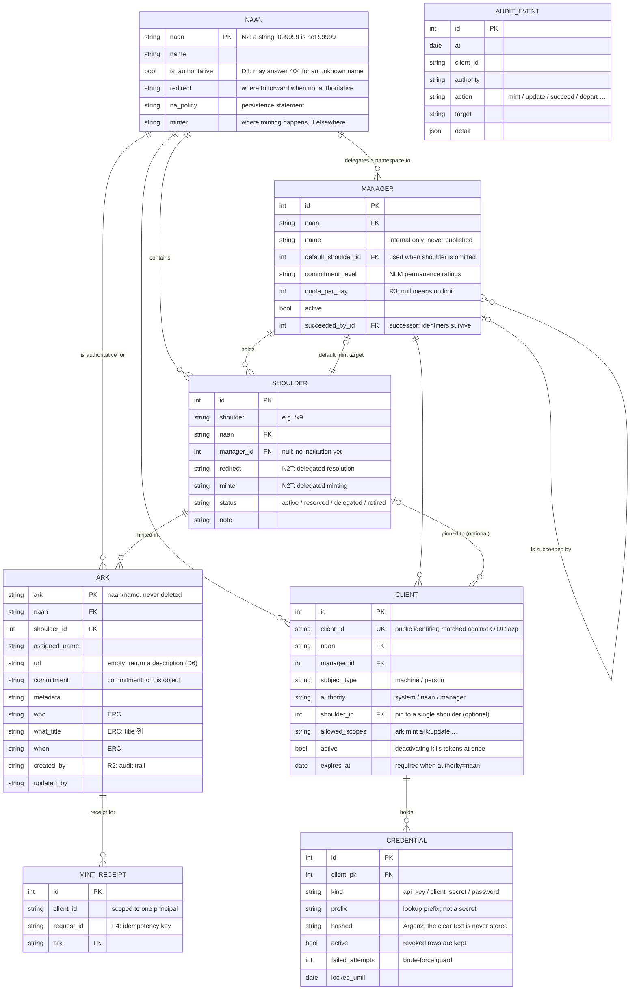

# Data model

One chain — `Naan → Manager → Shoulder → Ark` — carries every NAAN. **Even an
institution with a NAAN of its own goes through a shoulder.** Skip that and the model
forks per NAAN, and the first-digit convention holds for some NAANs and not others.

`AUDIT_EVENT` has no foreign keys into the rest. **A record should outlive what it
describes**, and referential integrity would push the other way: it makes deleting the
record the easy way out.

## What the diagram cannot show

An ER diagram shows shape. **In arkhe the design lives in the constraints.**

| | |
| --- | --- |
| **An ARK is never deleted** | Deleting the row stops resolution — the identifier breaks. `before_delete` refuses. When a target is lost you tombstone it, or empty `url` so a description is returned |
| **A shoulder is never deleted either** | Random assignment could hand out the same string again — the seed of an NR violation. Set `status=retired` |
| **`retired` is one-way** | Reviving a retired namespace cannot rule out that something outside used the name meanwhile |
| **Minting never becomes an update** | A primary key collision must fail. This was the worst defect in arklet |
| **Reach is a registration attribute** | `authority`, `manager_id`, `shoulder_id` and `allowed_scopes` come from the client registration; no request or token grant widens them |
| **People and machines are separate** | `machine` subjects cannot be named through external login; `person` subjects cannot hold API keys |
| **A circular reference** | `manager.default_shoulder_id ⇄ shoulder.manager_id`. PostgreSQL wants the target to exist at `CREATE TABLE`, so the constraint is added afterwards with `use_alter` |

## On capacity

**Child resources are never minted.** Suffix passthrough covers a reference of any
depth — `ark:/99999/x9abc/page/3` needs no row of its own — so **one record per
minting** is enough. Nothing else matters as much for capacity.
